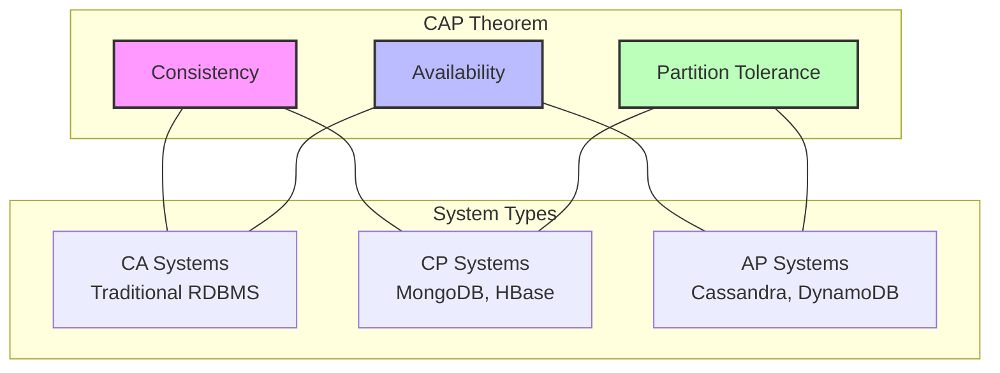

# CAP Theorem in Distributed Systems

The CAP theorem states that a distributed data store can only provide two out of three guarantees: Consistency, Availability, and Partition tolerance. This fundamental principle guides architectural decisions in distributed systems, helping engineers make appropriate trade-offs.

## Key Concepts

- **Consistency (C)**: All nodes see the same data at the same time. A read operation returns the most recent write.
- **Availability (A)**: The system responds to every request, even during failures (though it may not be the most recent data).
- **Partition Tolerance (P)**: The system continues to operate despite network failures or message loss between nodes.

## CAP Trade-offs

## System Design Examples

| System Type | Examples | Prioritizes | Use Cases |
|-------------|----------|-------------|-----------|
| **CA** | Single-node databases, Traditional RDBMS | Consistency & Availability | Banking, reservations |
| **CP** | MongoDB, HBase, Zookeeper | Consistency & Partition Tolerance | Financial data, configuration management |
| **AP** | Cassandra, Amazon DynamoDB, CouchDB | Availability & Partition Tolerance | Social media, content delivery |

## Real-world Implementation Patterns

### 1. Strong Consistency (CP)

- **Pattern**: Two-phase commit, Paxos, Raft consensus
- **Behavior**: Blocks until all replicas confirm updates
- **Trade-off**: May become unavailable during network partitions
- **Example**: A banking system that prioritizes accurate balances over system availability

### 2. Eventual Consistency (AP)

- **Pattern**: Conflict resolution, vector clocks, gossip protocol
- **Behavior**: Accepts writes during partitions, resolves conflicts later
- **Trade-off**: Might return stale data during convergence period
- **Example**: Social media news feed where immediate consistency isn't critical

### 3. Hybrid Approaches

- **Pattern**: Tunable consistency, PACELC theorem considerations
- **Behavior**: Different consistency levels for different operations
- **Trade-off**: Added complexity in implementation
- **Example**: E-commerce platform with strong consistency for inventory but eventual consistency for product reviews

## System Design Considerations

When designing distributed systems, consider these factors to make appropriate CAP trade-offs:

- **Business requirements**: What matters more—accuracy or uptime?
- **Failure modes**: How will the system behave during network failures?
- **Data characteristics**: Is the data read-heavy or write-heavy?
- **Geographic distribution**: Are users and data centers globally distributed?
- **Latency requirements**: What response time is acceptable to users?

## Explanation

In reality, partition tolerance isn't optional in distributed systems—network failures will happen. Therefore, the real choice is between consistency and availability during partitions:

- **CP systems** refuse writes when they can't reach all nodes, ensuring consistency but sacrificing availability
- **AP systems** accept writes on all available nodes, ensuring availability but allowing temporary inconsistency

Most modern distributed databases offer configurable consistency levels, allowing developers to make fine-grained decisions based on their specific requirements. The PACELC theorem extends CAP by considering latency trade-offs even when the system is functioning normally (no partitions).

Remember: There is no "best" choice—only the most appropriate trade-off for your specific use case and business requirements.