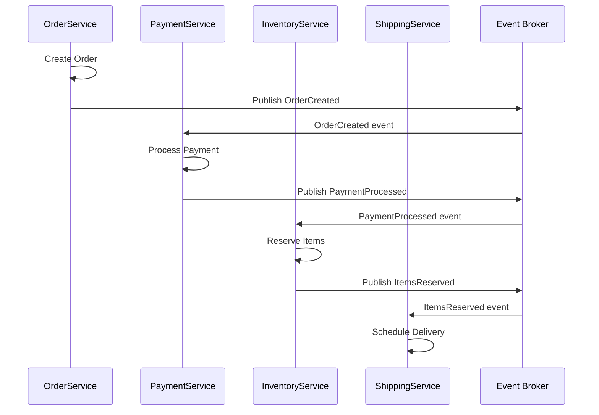
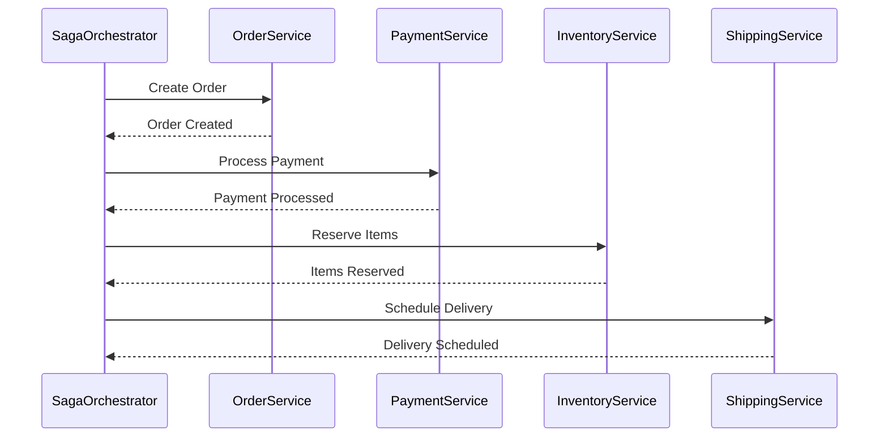

# Saga Pattern in Microservices

The Saga pattern helps maintain data consistency across multiple services in a distributed transaction without tight coupling. It breaks a distributed transaction into a sequence of local transactions, with each service publishing events or being coordinated by a central orchestrator.

## Key Concepts

- **Distributed Transaction**: Operation spanning multiple services that must succeed or fail as a unit.
- **Local Transaction**: Operation within a single service.
- **Compensating Transaction**: Reverses the effects of a previously successful transaction.
- **Choreography**: Services react to events from other services independently.
- **Orchestration**: A central coordinator manages the transaction flow.

## Choreography-Based Saga

In choreography, services publish domain events after completing local transactions, and other services subscribe to these events to trigger their own transactions.

### Visual Flow



### Key Characteristics

- **Decentralized**: No central coordinator.
- **Event-Driven**: Services communicate via events.
- **Loose Coupling**: Services don't directly call each other.
- **Complexity**: Distributed across services; harder to track.
- **Scalability**: Highly scalable as services operate independently.

### Simple Example

```go
// OrderService
func createOrder(order Order) {
    // Local transaction: save order
    db.Save(order)
    
    // Publish event
    eventBus.Publish("order.created", order)
}

// PaymentService
func handleOrderCreated(event OrderCreatedEvent) {
    // Process payment
    paymentResult := processPayment(event.Order)
    
    if paymentResult.Success {
        eventBus.Publish("payment.processed", paymentResult)
    } else {
        eventBus.Publish("payment.failed", paymentResult)
    }
}

// Compensation example in InventoryService
func handlePaymentFailed(event PaymentFailedEvent) {
    // Compensating transaction: return reserved inventory
    releaseInventory(event.OrderID)
    eventBus.Publish("inventory.released", event.OrderID)
}
```

## Orchestration-Based Saga

In orchestration, a central coordinator (orchestrator) manages the transaction flow by directly invoking participants and handling failures.

### Visual Flow



### Key Characteristics

- **Centralized**: One component controls the flow.
- **Synchronous/Asynchronous**: Can use either communication style.
- **Clear Visibility**: Transaction state in one place.
- **Single Point of Failure**: Orchestrator must be highly available.
- **Complexity**: Concentrated in the orchestrator.

### Simple Example

```go
// SagaOrchestrator
func processOrder(order Order) {
    // Step 1: Create order
    orderResult := orderService.CreateOrder(order)
    if !orderResult.Success {
        return handleFailure("Order creation failed", order, nil)
    }
    
    // Step 2: Process payment
    paymentResult := paymentService.ProcessPayment(order)
    if !paymentResult.Success {
        return handleFailure("Payment failed", order, 
            func() { orderService.CancelOrder(order.ID) })
    }
    
    // Step 3: Reserve inventory
    inventoryResult := inventoryService.ReserveItems(order)
    if !inventoryResult.Success {
        return handleFailure("Inventory reservation failed", order, 
            func() {
                paymentService.RefundPayment(paymentResult.ID)
                orderService.CancelOrder(order.ID)
            })
    }
    
    // Step 4: Schedule shipping
    shippingService.ScheduleDelivery(order)
}

func handleFailure(reason string, order Order, compensation func()) {
    log.Printf("Saga failed: %s for order %s", reason, order.ID)
    if compensation != nil {
        compensation()
    }
    return SagaResult{Success: false, Reason: reason}
}
```

## Comparison

| Aspect | Choreography | Orchestration |
|--------|--------------|--------------|
| **Design Complexity** | Distributed across services | Centralized in orchestrator |
| **Runtime Coupling** | Loose coupling | Tighter coupling |
| **Transaction Visibility** | Harder to track | Clear view in orchestrator |
| **Failure Recovery** | Each service handles compensation | Orchestrator coordinates recovery |
| **Scalability** | Highly scalable | Potential bottleneck at orchestrator |
| **Implementation Complexity** | Higher (distributed logic) | Lower (centralized logic) |

## Implementation Considerations

### For Choreography

1. **Event Reliability**: Use reliable messaging systems (Kafka, RabbitMQ).
2. **Idempotency**: Ensure operations can be repeated safely.
3. **Observability**: Add correlation IDs to trace transactions across services.
4. **Error Handling**: Each service must handle its own compensation logic.

### For Orchestration

1. **Stateful Orchestrator**: Store saga state for recovery.
2. **High Availability**: Ensure orchestrator is resilient.
3. **Versioning**: Plan for evolving service contracts.
4. **Command Timeout**: Handle unresponsive services.

## When to Use Each Pattern

### Choose Choreography When:

- Services are highly decoupled
- Business process is simple
- Services naturally react to each other's events
- Team autonomy is prioritized

### Choose Orchestration When:

- Complex transaction logic with many steps
- Clear visibility into transaction state is required
- Centralized error handling is preferred
- Process flow changes frequently

## Best Practices

1. **Design for Failure**: Always implement compensating transactions.
2. **Idempotency**: Ensure operations can be safely retried.
3. **Monitoring**: Implement comprehensive tracing and monitoring.
4. **Timeouts**: Handle services that don't respond.
5. **Versioning**: Plan for service evolution.

## Real-world Application

For an e-commerce platform:
- **Choreography**: Good for simple flows (e.g., order updates triggering notifications).
- **Orchestration**: Better for complex flows (e.g., checkout process with payment validation, inventory checks, and shipping coordination).

A hybrid approach combining both patterns may provide the optimal solution for complex systems, with orchestration handling critical paths and choreography for simpler, loosely coupled interactions.