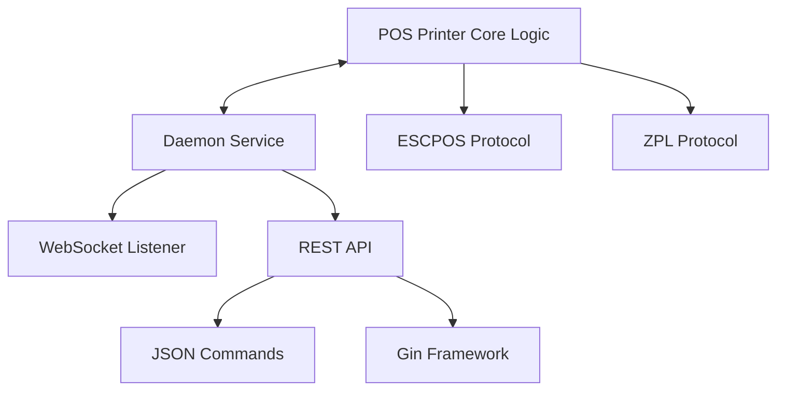

# 🏢 RED2000 Development Journal
>
> **Learning Progress & Project Evolution**

---

## 📅 Timeline Overview

**August 2025** ████████████████████████████████████████ **100%**

```
Week 1: Setup    │ Week 2: Refactor │ Week 3: Arch     │ Week 4: Testing
```

**September 2025** ██████████░░░░░░░░░░░░░░░░░░░░░░░░░░░░░░░░ **25%**

```
Week 1: Testing │ Week 2:          │ Week 3:          │ Week 4:
```

---

## 🗓️ **WEEK 5: Foundation & Setup**

**Period:** August 4-8, 2025

### 🏢 RED2000 Work Progress

#### 🏗️ Repository Infrastructure

| Component                   | Status      | Description                           |
|-----------------------------|-------------|---------------------------------------|
| ✅ Issue Templates           | Complete    | Bug reports, features, general issues |
| ✅ Bug Report Templates      | Complete    | Structured bug reporting              |
| ✅ Feature Request Templates | Complete    | Feature proposal format               |
| ⏳ Multi-OS Testing          | In Progress | CI across Windows, Linux, macOS       |
| ⏳ Linter Integration        | Planned     | Code quality automation               |
| ⏳ Conventional Commits      | Planned     | Commit message standards              |
| ⏳ Stale PR Auto-closer      | Planned     | Automatic cleanup                     |

#### 🔧 Automation Goals

- **Dependabot**: Periodic update checks, automerge to `dev` with PR review
- **PR Tagging**: File-based automatic labeling and size-based tagging
- **Release Automation**: Commit-type driven releases with PR descriptions
- **Greeting System**: Welcome comments for new PR authors

#### 🏛️ Architecture Vision: PosPrinter and Daemon Separation

**Repository Structure Decision:**

- Split repository: create new repo for core logic
- Microservices approach: at least two services (Printing + Daemon)

**Service Implementation Strategy:**



**Key Architectural Decisions:**

- ✅ JSON for ticket data instead of constructors
- ✅ REST API for protocol-agnostic, lightweight local use
- 🔄 gRPC evaluation for inter-service communication
- 🔄 Assess containerization impact on connectors

#### 🛠️ Development Tasks

- **Codepage Investigation**: Suspect printer issues, test with disk reader (firmware update needed?)
- **ESCPOS Functions**: Integrate documented commands, separate responsibilities
- **Code Refactoring**: Use Copilot suggestions, review TODOs and FIXMEs

#### 📋 Pending GitHub Tasks

- Translate `pr-template`
- Investigate `renovate.json`
- Update `README.md`

### 📚 Personal Learning

- **Documentation & Code Quality**: Commit instructions for better messages and Copilot usage
- **Linter Setup**: Commit message linter, code linters for GoLand and GH Actions
- **Documentation Creation**: Contribution guide, code of conduct, setup instructions

---

## 🗓️ **WEEK 6: Code Quality & Architecture**

**Period:** August 11-15, 2025

### 🏢 RED2000 Work Progress

#### 🔍 Codebase Health Analysis

**Issues Identified:**

- 📊 **TODOs Found:** ~15 items (mostly unfinished ESCPOS command implementations)
- 🐛 **FIXMEs Found:** ~8 items (many require specific types to validate inputs)
- 🧪 **Testing Strategy:** Develop testing for commands without physical printer (`os.stdout` as `io.writer`)

#### 🎯 Quality Improvements

- **Modularity**: Separate protocol modules (ESCPOS, ZPL) as Go packages within same repository
- **Visibility**: Proper public/private function declarations
- **Architecture**: Registry pattern to handle multiple printers and abstract POS concept
- **Middleware**: Reduce command boilerplate code

### 📚 Personal Learning

- **Protocol Architecture**: Review differences between protocols (ESCPOS vs ZPL command equivalents)
- **Code Organization**: Improve modularity and separation of concerns

---

## 🗓️ **WEEK 7: Implementation & Learning**

**Period:** August 18-22, 2025

### 🏢 RED2000 Work Progress

#### 📦 Module Architecture Implementation

```
pos-printer/
├── escpos/
│   ├── standard/     ✅ Implemented
│   └── pagemode/     ⏳ Postponed (can be handled by same codebase with different configs)
├── zpl/              ⏳ Planned
└── registry/         ⏳ In Progress
```

#### 🚀 Implementation Progress

- **Barcode Support**: Improved implementation
- **ESCPOS Basic Commands**: Started text and formatting commands
- **Second Layer Planning**:
  - Auto-formatting to active charset for printer code page
  - Improved error handling with specific error types

#### 📋 Project Management

- Set up PRs and issues in pos-printer repository for tracking
- Need to generate documentation for each protocol module
- Move diary tasks into GitHub project backlog items
- Review GitHub project management best practices

#### 🏗️ Architecture Progress

**ESCPOS Implementation Status:**

| Command Type     | Implementation | Tests     | Notes             |
|------------------|----------------|-----------|-------------------|
| Basic Printing   | ✅ Complete     | ✅ Tested  | Production ready  |
| Line Spacing     | ✅ Complete     | ✅ Tested  | Production ready  |
| Barcode Support  | 🔄 In Progress | ⏳ Pending | Under development |
| Character Format | 🔄 In Progress | ⏳ Pending | Under development |

### 📚 Personal Learning

- **Go Concurrency**: Deepened knowledge of channels and goroutines
- **Memory Management**: Learning about stack, heap, and garbage collection in Golang
- **Go Migration**: Slowly migrating to Go 1.25

---

## 🗓️ **WEEK 8: Testing Excellence**

**Period:** August 25-29, 2025

### 🏢 RED2000 Work Progress

#### 🧪 Testing Strategy Implementation

- **Command Testing**: Planning to replicate testing approach for all commands
- **Alternative Delivery**: Investigating PDF/image generation as additional protocol option for receipt delivery
- **Prototype Focus**: Delivering working prototype ASAP
- **Process Improvement**: Established weekly policy to push to remote branches with open PRs every Friday

#### 📋 Project Management

- Need to consolidate backlog items from laptop notes to GitHub Project

### 📚 Personal Learning

#### 🎯 Testing Patterns Mastered

**1. Dependency Injection Testing**
> **Purpose**: Verify that your code works with any implementation of an interface

- Tests flexibility and substitutability
- Ensures loose coupling
- Validates the Liskov Substitution Principle

**2. Fake Implementation Testing**
> **Purpose**: Test behavior with stateful simulations

- Tracks accumulated state over multiple operations
- Simulates real-world behavior without real hardware
- Useful for integration testing

**3. Interface Composition Testing**
> **Purpose**: Verify that composite interfaces work correctly

- Tests that a type implements multiple interfaces
- Validates interface embedding
- Ensures polymorphic behavior

**4. Mock Testing**
> **Purpose**: Verify interactions and behavior

- Tracks method calls
- Controls return values
- Simulates error conditions

#### 🔧 Testing Implementation Notes

- Working on tests with simple fixes and better structure
- Ensuring comprehensive and maintainable tests
- Created guide for future contributors
- Working on Character and Position commands (declaring base commands and interfaces)
- Refactored methods and tests of Printing commands

#### 📚 Advanced Topics Explored

- **Backpressure and Exponential Backoff**: Reviewed and created simple examples
- **Database Internals**: Planning to look at optimization for our use case
- **Custom DBMS**: Probably will implement a DBMS from scratch

---

## 🗓️ **WEEK 9: Advanced Patterns & API Design**

**Period:** September 1-5, 2025

### 🏢 RED2000 Work Progress

#### 🧪 Character Commands Testing Achievement

- Created unit tests for character commands to ensure they work as expected
- Used table-driven tests to cover various input scenarios
- Implemented mocks for dependencies to isolate tests
- Verified that all tests pass and provide meaningful coverage

### 📚 Personal Learning

#### 🌐 REST API Learning with Gin Framework

- Reviewed very basic implementation of REST API with Gin
- Simple guide was written for future reference

**Basic Endpoint Structure:**

```http
GET  /api/v1/printers    # List available printers
POST /api/v1/print       # Send print job
GET  /api/v1/status      # Check printer status
```

**Focus Areas:**

- ⚡ Performance optimization
- 🪶 Lightweight design principles

#### 🧪 Testing Patterns in Go

- Learned about different testing patterns in Go
- Created a guide for future reference

**New entries to journal:**

- I have to review how golang errors behave during testing. I added a mini-guide on error handling in Go. Values can be programmed, and since errors are values, errors can be programmed.
- I achieved a lot of new testing patterns. Tests around Print, Character and Position commands are almost complete. Few fixes and refactoring are still needed. I have completed with success the tests for Print, Character and Line Spacing commands. They merged correctly and passed every check in Github.

- I have advanced a lot in Position Printing commands. Tests are missing still, but I have a clear plan for their implementation.
- I refactored and improved casting around uint16 data types for commands that use little endian representation(`qrcode.go`, `image.go`).
- I probably will need to redo this journal, as I want to include more details about the testing process and the challenges faced. Also, I will need checkboxes for tracking progress as i didn't finish certain ideas or task mentioned before.
- I have checked database internal concepts and their implications for our use case. Mainly, the difference between in-memory and on-disk storage. From DSA perpective i will check B+ trees and Log-Structured Merge-trees (LSM).

- I checked the CAP theorem and its implications for distributed systems. I created a simple example in Go to illustrate the concepts of Consistency, Availability, and Partition Tolerance.
- I have been very focused on test patterns and their implementation in Go. I should check Test-Driven Development (TDD) practices to further enhance my testing skills. Search for books on TDD in Go.
- Character commands so they tests ASCII inputs. I need to ensure that all edge cases are covered.

- Today i refactored certain commands, i focused on type safety and proper error handling. I created types based on values used and indicated in the ESCPOS documentation. I also created specific error types for better error management.

- I created helpers, builders and assertions for tests. These utilities streamline the testing process and improve code readability. Also, type safety was improved by using specific types instead of generic ones. This encourages the use of constants as parameters in final implementation.
- I found a [guide](https://forums.adafruit.com/viewtopic.php?t=32217) for better understanding about User-Defined character in ESCPOS. Maybe at least leave the maps for `áéíóúü`, `ÁÉÍÓÚÜ` and `ñÑ` characters. The thing is not every printers need this implementation, so this should be optional at capabilities level.
- I will need a function that auto turns on and off the User-Defined character mode. This function will be implemented in Text() level, it will apply a formatting similar to the swap between `\n` and `LF`.

---

## 🗓️ **WEEK 10: TBD**

**Period:** September 8-12, 2025

- The PR around the Position commands is finally merged. Tests were successfully implemented and passed. I need to review the code and ensure everything is in order.
- I have planned the workaround for the User-Defined characters. I will implement a function that automatically enables and disables this mode when printing text. This will be done at the Text() command level.
- The new paper for the printer is pretty bad, it has a lot of noise and the print quality is very poor. I will need to get better paper to properly test the printing quality.
- I read about interfaces and structs in Go. I need to ensure that I am using them correctly and efficiently.

- Insane [guide](https://refactoring.guru/es) to understand design patterns in many languages, including Go and Python. Worth checking it out and adding it to the resorces repository.
- I learned about design patterns in Go and how interfaces and structs can be used to implement them. I will need to review the patterns and see how they can be applied to our project.
- I learned about stack and heap memory management, i want to go deeper into garbage colletion in Go. Just as general knowledge, i want to understand how memory is managed in Go and how it affects performance.
- I am starting a side project about microservices in Go. I found a book called "gRPC Microservices in Go" that seems pretty good. I am really interested in another but related to REST API with Gin framework.

- For now i will be working on Protobuf definitions and the basics of the Saga pattern.
- Among other distributed system concepts i reviewed the CAP theorem and the PACELC theorem, and added a guide.
- Also, i checked the main concepts of system design and scaling.
- I checked SQL Injection countermeasures.

- I added a guide on Saga patterns, including Choreography and Orchestration.
- I continued with service discovery patterns in microservices. I added a simple graph for client-side and server-side discovery.
- I am ready to start with the implementation of a simple microservice using gRPC and Protobuf. I will start with simple tasks that do not have any business logic, only isolated tasks with each technology/pattern involved just to get familiar with the tools and the workflow.

- I am learning about ACID vs BASE properties in databases. i am most familiar with ACID, so i will need to review BASE properties and how they apply to NoSQL databases.
- I am seriusly thinking on learning Kafka, PySpark and data pipelines. Retaking the Data Engineering path i left years ago.
- I reviewed the history of Go and its main features. I want to understand why Go was created and how it differs from other languages.
- I learned about backpropagation algorithm in neural networks and machine learning concepts. If i am that into DevOps, probably MLOps is a good path to follow.

## 🗓️ **WEEK 11: TBD**

**Period:** September 15-19, 2025

- I have worked on CI/CD pipelines and their refactoring for the pos-printer repository. I ensured that dependabot is properly configured and that PRs are automatically tagged based on file changes and size. Automerge should work correctly now.
- I will focus this week in the PDF generation as an alternative output for receipts. I will research libraries and tools that can help with this task. Maroto seems a good option. As soon as i have a working prototype, i will create a PR for the image printing commands.
- I studied more about techniques and patterns for caching, message queues and API styles and architectures.

- 16 september was a holiday in my country, so i had the day off. Only checked for AWS courses and identified system desing homologies.

- I will continue with API design patterns and architectures.
- Also, i will create guides for the topics from the monday and based on the guides i found online.
- I finished a demo implementation around Channels and Goroutines. It managed channels, goroutines and backpressure, and simulated a simple but concurrent task. I added it to `go-examples` repository.

- I have been exploring different API styles and architectures. I will work on a practice to implement gRPC and Protobuf in a simple microservice.
- Built a multi-goroutine system demonstrating channel-based communication. Features exponential backoff with jitter for retry logic, fan-in pattern, dead letter queue for failed messages, and timeout-based race conditions using select.

- Today i will read about Database Internals from Alex Petrov. I want to understand how databases work under the hood and how to optimize them for our use case.
- I continued an implementation around a database from scratch in Go. I finished Chapter 1 and created a github repository for it, `go-databases`. I will continue with it as a side project.
- I checked panic, recover and graceful shutdown in Go. I added a simple example to `go-examples` repository.

## 🗓️ **WEEK 12: TBD**

**Period:** September 22-26, 2025

- I got wise tooth removal surgery, so i will be out of commission for today, monday.

- Checked Github Fundamentals course.
- *Inside Cyber Warfare: Mapping the Cyber Underworld* by **Jeffrey Caruso** is a really good book about cyber warfare and cyber security.
- Continued the database from scratch implementation. I finished Chapter 2 and started Chapter 3.

- Copilot wasn't working properly yesterday, so i will check today and continue ESCPOS commands implementation. Barcode command are being done and tested.
- I did some investigation for a friend about the 2025 Stackoverflow Developer Survey results, AWS most important services and Docker Containers vs Virtual Machines.

- I'm working on a simple CRUD example with FastAPI and SQLModel with PostgreSQL as the database.

- I will continue the Python API example. Thus, Github Codespaces will be used for development and testing. I did a lot of tests with Docker containers and Codespaces.
- I set up a container running PostgreSQL with a persistent volume. I created a simple FastAPI application with SQLModel to interact with the database.

## 🗓️ **WEEK 13: TBD**

**Period:** September 29 - October 03, 2025

- Repaired my pc, it wasn't turning on. Due to a USB overcurrent issue, one of the ports was damaged. I did many tests, at the end i managed to enter BIOS and disable the faulty port. Now everything is working fine.
- I was looking for a good book and tutorial. tutorial will be around MERN stack, the book is about boostrapping microservices with JavaScript, using Terraform, Github Actions, Docker and Kubernetes.

- I will squeeze the Copilot premium request as i have half of them left, i have just one day to use them. For it, i will create a personal website with Hugo and its templates. I am thinking in a website that can be used as a portfolio, blog, docs and tutorials.
- I checked cloud computing core concepts and AWS services.

- I will start the MERN stack tutorial, i will use WebStorm. I will keep an eye on the microservices book around Golang and gRPC. I got all dependencies through Docker containers.
- I started a simple project with AWS Lambda, API Gateway and DynamoDB. I will use the AWS SDK for Go to create a simple serverless CRUD.
- I dived into IAM user and roles, policies and best practices. I created a simple user with programmatic access and attached the `AWSLambdaFullAccess` policy for testing purposes.

- I am studying Frontend Fundamentals. I will continue with the MERN stack tutorial later. For now, i will focus on HTML, CSS and JavaScript basics.
- I have to upgrade to Windows 11, i will check BIOS settings and do a clean installation. Looks like CPU has the TPM 2.0 module, so i will enable it in BIOS.
- I will return to the ESC/POS commands implementation after finishing the Windows 11 installation. An USB will be bought for later.
- I ended diving into Containerization with Docker and Compose. I want to do a project where no local installation is needed, everything will be done through containers. Imagine getting rid of mocks tests and use a container with a test postgresql database. not mock anymore, just testing against a containerized database. Nice Docker [Cheatsheet](https://dockerlabs.collabnix.com/docker/cheatsheet/) and [Commands](https://kapeli.com/cheat_sheets/Dockerfile.docset/Contents/Resources/Documents/index).
- I really need to dive into Testcontainers. Looks like game changer for integration testing and DevOps.
- I will look for cheatsheets for technology i am interested in. Look for the n8n repository, it has a lot of useful resources and workflows.

- I still working in MERN stack tutorial. I have dependencies through Docker containers, thay are part of my Dev Containers setup. I worked again on Dev Containers and Codespaces. It was a day about containers, docker and docker-compose.

## 🗓️ **WEEK 14: TBD**

**Period:** October 06 - October 10, 2025

- I keep working on the MERN stack tutorial. I have setup the container of each service, now i will work on the code. As for now, i have a "Hello, World!" implementation for each service.
- I will check how a Js Promise would look like in Go. I know there are goroutines and channels, but i want to see a simple example that mimics the behavior of Promises in JavaScript.

- Worked on to finally finish the Barcode commands implementation. They are finally done and tested. they are already merged into main branch.
- I will check about VPS providers and prices. I have the idea of setting up a Dokploy instance with Terraform and Ansible. I will check the Dokploy repository for guides and documentation.
- I will check all the Docker and Docker Compose posibilities with Github Actions. I want to create a workflow that builds and tests the code in a containerized environment. Maybe the Dokploy VPS can be used for it.

- *Web Application Security: Exploitation and Countermeasures for Modern Web Applications by Andrew Hoffman* looks like a very hands-on book about web security. I will check it out.
- I will check which VPS providers are the best for my needs. To ensure a smooth experience with Dokploy, my server should have at least 2GB of RAM and 30GB of disk space. I am diving more into VPS and Cloud providers.
- Nice [ebook](https://astaxie.gitbooks.io/build-web-application-with-golang/content/en/) about building web applications with Go.
- I reformated, refactored ESCPOS commands package and integrated the Barcode commands. I also added a simple example that shows how to use the package. I translated comments to latin spanish for better understanding.
- i will check the main differences between Docker Swarm and Kubernetes. I want to understand the pros and cons of each one and see which one fits better for my needs.

- I wil setup Dokploy in my VPS. I have a DigitalOcean droplet with Ubuntu 24.04 LTS.
- Also, i will add the mechanim control command to the ESC/POS package. they are used to cut paper and open cash drawer.
- I started to work in a minimal daemon to get data from a weight scale. I will use it later for testing purposes with the pos-printer package. As first task, i wil review the code.

- Once daemon was done, i started to work on a TUI in a `BSInstaller.exe` to manage installation, uninstallation and monitoring of the daemon. I will use ***Bubble Tea*** package for it. The idea is to have everything embedded in a single binary, and install it with mininal user technical knowledge. I will check this article about [Bubble Tea](https://penchev.com/posts/create-tui-with-go/) for later.
- I will check the following [article](https://harishd.hashnode.dev/go-import-side-effect-or-blank-import) about importing only side effects (`_ "import/pkg"`) in Go. I want to understand how it works and how to use it properly.
- I worked on a `Taskfile.yml` for the `BSInstaller.exe`, this will help the developer side. It is a Go alteranative to Makefile. the file will help to build, test and run the `BSInstaller.exe`.

## 🗓️ **WEEK 15: TBD**

**Period:** October 13 - October 17, 2025

- I was tasked to improve the security of the Weight Scale Daemon. Not everyone should be able to access the scale data.
- Make the changes in the installer to accept arguments and passes them to the service executable.
  - Among them is the `--secure` flag to enable secure mode. I need to allow only certain clients to access the scale data in the websocket.
  - The `--url` flag to change the default URL (<http://localhost:8080>). Default will be `http://localhost:8080`.
- I set up alerts and monitoring for the VPS. A container with n8n is being monitored and RAM usage is being tracked. DigitalOcean will trigger an alert if RAM usage exceeds 75% for more than 5 minutes or if n8n crashes.
- The VPS was built with DigitalOcean. It leverages on containers for each service, because of this Traefik is being used as a reverse proxy, load balancer and SSL termination. It is also running a n8n container for workflow automation.
- I will create replicas at least for the n8n container and setup Watchtower for automatic updates with zero downtime. I will check Dokploy today in case a database is needed as external service for n8n.
- I need to design tests against failure scenarios in the Weight Scale Daemon. I will check how to simulate a crash and how the service behaves in that situation. Even from physical disconnection of the scale.

- I made breaking changes in the Weight Scale Daemon. Service and installer have now two versions: local and remote. Local version is for local use only, it does not expose any network interface. Remote version exposes a WebSocket interface for remote clients to connect and get scale data. I designed a better HTML to interact with the WebSocket server, it receives initial configuration data, and changes can be made through the WebSocket connection without reloading as it has a button to send new configuration data. As for the installer, a flag is used to select which service binary to embed. For its TUI i used Bubble Tea and its components, it is interactive and user-friendly, it has a local version which is clearly different in colors from the production one.
- Documentation was written for the Weight Scale Daemon and its installer. It includes installation instructions, configuration options, and usage examples. Has 2 main parts, the Dev Guide and the User Guide.

- Today i will make a combination of the websocket-serial service, but instead of a weight scale, it will be a POS printer. I will start from the lastest version of pos-printer package, so i have a clean start. From here, i will need:
- The tech stack
  - Frontend: HTML, (minimal) CSS, JavaScript. Simple, no frameworks. Textbox to write text, button to send it. As page is reloaded when connecting, initial configuration data will be sent through a form, and will have the option to be changed through the websocket connection. Very similar to `service.go` in the weight scale daemon.
  - WebSocket server: Go, Gorilla WebSocket package. Simple, and very similar to the weight scale daemon. It will receive text from the frontend and send it to the printer through the pos-printer package(most basic commands, print and cut at most). Finally, it will return an acknowledgment to the frontend. No complex additional logic, just like the one in `service.go`, just a simple echo server with printing capabilities. No extra consideration with printing timeouts or buffering, as it is a prototype.
  - POS printer: pos-printer package, based on the `windows.go` example. It will use the latest version of the package, with recently mechanical control commands. It will be a simple implementation that uses the `escpos.print.Text()` and `escpos.mechanical.Cut()` commands.
  - An extra prototype feature inside a there will be a button to that triggers and endpoint to get the devices in COM ports. This will be useful for the user to know which port to use for the printer. And just for show purposes, the endpoint will return a JSON with the list of COM ports. The frontend will display them in a simple list.
- I worked in the last implementations, i started with the frontend, then the websocket server and finally the pos-printer usage as handlers. First, i will communicate HTML textboxes to server logs.
- Check Grafana, useSend, Portainer, Watchtower, Evolution API, GOWA, Minio, BookStack.

- I achieved printing from the WebSocket server to a POS printer. The frontend sends text to the server, which uses the pos-printer package to print it. My test was from a remote LAN computer, so it is working as expected.
- Tomorrow i will work on the COM ports listing endpoint and its frontend integration. Also, i will try to implement a printing queue with buffered channels to avoid message loss if multiple print requests are sent in a short time. Same for timeouts, failure and concurrent scenarios, this is to be similar as the weight scale daemon.
- I set up a new printer and it worked with the pos-printer package without issues, only minimal adptations were needed for the codepage. I will continue adding.

## 🗓️ **WEEK 16: TBD**

**Period:** October 20 - October 24, 2025

- I helped to setup some radio equipment for a server in a local hotel. It was a long day, but everything went fine.
- I installed Grafana and Prometheus in the VPS. I will use them to monitor the containers and services running in the server. I will create dashboards and alerts for important metrics.
- I advanced in the WebSocket POS printer daemon. I created the static files to represent the ticket template, data and configuration. For now, i will print in terminal that data through the local network into my console plus the simple printer test with fewer data and returning and acknowledgment to the client.
- Printing queue is still pending, also the COM ports listing endpoint and other concurrent scenarios handling.

- Today i worked on a pending chore about refactoring the ESCPOS package. I was around refactoring the commands and ensuring standardization across the package, and proper english in comments and documentation.
- I will finish the mechanism control commands implementation. They are used to cut paper and open cash drawer.

- I am solving some issues related to linters and code formatters. I want to ensure that the codebase is clean and follows best practices.
- I finished the mechanism control commands implementation. They are now part of the ESCPOS package and can be used to cut paper. The tests were also added.
- I started the documentation for the ESCPOS bit image commands. They are used to print images and graphics. I will continue the implementation and testing tomorrow.
- I assigned a name for the ESCPOS package: `POSTER`. It stands for `Postergeist`, due to the daemon nature of the package. Maybe later i will define the scope of the package and its features, since i want an all-in-one solution but not only for ESCPOS, also for ZPL and scale, any POS device that can be used.

- I will continue with the bit image commands implementation. They are a bit complex, but i will try to finish them as soon as possible.
- I worked on the bit image commands implementation. I finished the structure and added table-driven tests and integration ones. They are now part of the ESCPOS package.
- I am learning about bash scripting. I want to create scripts to automate tasks and improve my workflow and other DevOps processes.

- I worked on documentation for my previous projects. I want to ensure that they are well documented and easy to understand for future reference.
- I was about to integrate the websocket communication that receives the ticket models. i had some problems with the communication, so i will need to debug it further, but at least i have the models, parsers and flex types ready.
- I checked some GPUs were still working properly after time being idle.

## 🗓️ **WEEK 17: TBD**

**Period:** October 27 - October 31, 2025

- I continued working with the POS printer daemon. I finally setup the correct models, parsers and types to receive ticket data through the WebSocket connection. I created tests to ensure that the data is correctly parsed and validated.
- I corrected the backend to properly receive and parse the ticket data, i was having some problems so it was easier to restart incrementally. Now i can receive the data, parse it and print data, template and config in console correctly.
- I will focus on integrating the POS printer package to print the received ticket data. Some adjustments related to refactoring and code organization will be needed.
- I did some modification on the static files to show every field of the ticket models. Every field is now editable and can be sent to the backend for printing.
- I helped with a [guide](https://github.com/adcondev/n8n-local) to setup n8n locally and expose it to the internet using Ngrok. It was for a friend who wanted to test some workflows without setting up a full server. Also, removing the random public URL that Ngrok provides each time it starts.

- For now, i will work on the simplest commands like Printing, Mechanism control and Print position. The trick is they will be part of a new architecture, the idea is slowly migrate to a new architecture that supports multiple protocols (ESCPOS, ZPL, etc) as packages inside the same repository.
- I also worked with the rearchitecture of the pos-printer package. I minimal version was done, now i will need to migrate the existing commands to the new architecture. It will take some time, but it will be worth it in the long run.
- I finished a minimal version of the ticket printing through the WebSocket POS printer daemon. It uses the pos-printer package to print, format and cut the ticket. It used the configuration and template received from the frontend. I will show it tomorrow.

- I showed the minimal working prototype of the POS printer daemon. The tickets printed were well received and formatted correctly.
- Now i have two options to integrate the functionality with the system:
  1. Make a translator or processor that converts a JSON with embedded commands that my system could translate into its respective ESCPOS commands and print the ticket. (Extremely flexible, but with more changes and more complicated). I would need to create a new package that handles this translation. Also, frontend and backend changes would be needed. (More work, not mine but my companion's)
  2. Continue the way it works, with a fixed template hardcoded in Go, setup a daemon that could update only a printer service so it receives data from a main service that handler the update of the printer binaries. (Less flexible, but apparently easier to implement). This reminds me of Watchtower docker container.
- I will start with Option 1, as it is more flexible and could be used in the future for other projects. I will leave the actual repo as it is, in any case it will be for Option 2. The `escpos-json` package will be created for Option 1, just as proof of concept, then i would want to integrate it to ESCPOS Package.
- I am still doing in-depth research about Option 1. I will need to check how to design the JSON structure, commands, and how to implement the translation package. Also, i will need to check how to integrate it with the existing frontend and backend.

- I will refactor some ESCPOS package code. I want to ensure that it is clean and follows best practices. I engineered a new way to structure the ESCPOS commands library. Heavy refactoring is still needed.
- In my head this library becomes better than the actual ones that exists in Go as the other have many flaws and anttipatterns.
- I gathered some ideas about the approach on the remote printing through a JSON, my translator is still in design but i have an experimental idea of how it could work with Go structs.

- I will try to fix my Github activity graph, since i changed my username and emails some contributions are not being counted. I could not find a way to fix it, so i will contact Github support for help.
- I have the first version of the model to be used as input for the JSON ticket representation. I will start with simple Text and Image blocks to be represented and printed. I will need to create the parser and the translator package.
- I did even more breaking changes in the `pos-printer` repository. I big one will be that i am renaming the repo to `pos-tergeist`, as it will be the main package for POS services solutions. Also, i have moved and renamed many packages and files to better represent the new architecture. Finally, it would be easier to just cherry pick the packages into `pos-tergeist` but i want to mantain the history as it is.
- I pushed the changes to the remote feature branch. Changes still need to be reviewed and tested. I will create a PR when everything is ready.

## 🗓️ **WEEK 18: TBD**

**Period:** November 3 - November 7, 2025

- I started the week working in a new image printing engine for the ESCPOS package. It will be based on the bit image commands already implemented, but with a better architecture, simpler and more features.
- I managed to print a simple image using the new engine. Some details need to be fixed(small fix in dithering and function call), but the basic functionality is working.

- I finished the last details of the image printing engine. It is now part of the ESCPOS package and can be used to print images and graphics. Tests are still missing, but i will add them later.
- I will continue the work with QR and other Two-Dimensional codes printing commands. They are similar to image printing, but with some differences in the data format and encoding.
- I am still deciding about the ordering, layers and architecture of the package, at least i have a first new reorder. I want to ensure that it is clean and easy to use. I merged the breaking changes into main branch through a PR and a rebase.
- Learned about WaitGroups in Go. They are used to wait for a collection of goroutines to finish.
- Finally, i added some improvements to the Github related files. Like the issue and PR templates, workflows and actions. I want to ensure that the repository is well maintained and follows best practices.

- First, i worked on CI and Automatic Releases workflows. I want to ensure that the code is tested and released automatically. Also, i updated Github related files like issue and PR templates.
- I now have a clear idea about the architecture of the ESCPOS package. I will need to refactor some code and ensure that everything is in order. Then, i will setup some examples and documentation. I had a nice start and i have a much better idea of how the package should look like. I can't loose attention on what is missing from other libraries.
- I also solved the problem of syncing the code table in the printer and in the package. I assigned that features to profiles package, so each profile will have its own code table and now the printer knows it and adapt the encoding accordingly. Then, this code table in profile is updated when the user changes it through the ESCPOS commands.
- Finally, i setup the image engine to be able to print images with dithering and resizing, plus from base64 strings. I created an example that shows how to use the engine. Tests are still pending, but i will add them later.

- I continued working on the encoding and code table management in the ESCPOS package. I merged correctly the code table management into profiles, so each profile has its own code table and the printer adapts accordingly. It fallbacks to Windows-1252 if the code table has no supported encoding in Go. To avoid inconsistencies, when a new code table is selected, it also checks if the encoding is supported, otherwise it fallbacks to Windows-1252.
- I tryhard to finish the JSON ticket representation package. I created the basic structure and types for the JSON representation. The translator, handlers and tests are still pending.
- The JSON ticket representation package evolved very into something more complex than expected.

- I worked on heavy refactoring and settled the architecture of the ESCPOS package. I want to ensure that it is clean and easy to use. I also added some examples and documentation.
- The JSON ticket representation package is still pending QR and table commands. I will continue working on it next week. I updated the documentation related to the ESCPOS package and JSON ticket representation package.
- The changes in ESCPOS package were merged into main branch through a PR, they have a breaking change due to the architecture refactor.
- Finally, i added new features and refactores the github, copilot and ci/cd related files. I want to ensure that the repository is well maintained and follows best practices.
- I pushed all the changes to the master branch. Changelog is now updated with the latest changes. No change are still pending on other branches.

## 🗓️ **WEEK 19: TBD**

**Period:** November 10 - November 14, 2025

- First, i resolved some PR from Dependabot and improved the CI and Release workflows, then i make sure it could automatically merge small changes like dependencies updates, and create the PRs with the proper labels and scopes. Enhanced auto-merge workflow with timeout and success criteria. I did some light refactoring on codebase just to add some TODOs and comments for future improvements.
- I will implement QR and table commands in the JSON ticket representation package. They are similar to text and image commands, but with some differences in the data format and encoding. I will work on both direct ESCPOS QR commands and image-based QR codes.
- I checked first some approaches for the Table representation. I am considering a library called `text/tablewriter`. What i would look for is to decorate the functionality to embedd ESCPOS commands but escape them with the `0xFF` value from the library, this is because if not escaped, the table writer would count them as characters and the table would be misaligned. I will check how to do it. This is a very basic standalone implementation, so i will need to adapt it to the JSON ticket representation subpackage from Poster (the main ESCPOS package).
- Regenerated `LEARNING.md` to provide a detailed technical summary of the project's DevOps aspects for CV purposes. Updated `README.md` with a new "DevOps and CI/CD" section to give a public-facing overview of the project's infrastructure.

- I kept researching more approaches for the Table representation. I found that `text/tablewriter` is not flexible enough for my needs, so I will create a custom implementation around it. I will add my own features for better ESCPOS integration. Now, I have some ideas, I will start with a standalone implementation and then adapt it to the JSON ticket representation subpackage from Poster.
- I worked on the QR code commands implementation in the JSON ticket representation package. I created the basic structure and types for the QR code representation. I discovered a more complete package called `yeqown/go-qrcode`, which has more QR customization from the style perspective. The translator, handlers and tests are still pending.
- Things with the QR went from obvious to complex, I will need to check how to implement it properly. It is fine right now, I am very close to a MVP about the feature, but heavy refactoring and separation of concerns is still needed. For now it has many more features than expected, but they are worth it.
- I refactored some documentation related to `Poster`. I modified the `README.md` to include and link some documentation files about the tabular data representation approaches and areas of opportunity for this package.
- I am still thinking in a smart way to version the JSON ticket representation package. I have the identifier `version` field in the main JSON structure, but I want to ensure that it is flexible and easy to use. I will check some approaches and decide later.
- A error impedes me to continue with the QR code commands implementation. The error is related to the `yeqown/go-qrcode` package.

- I believe i have a first minimal viable implementation of QR code commands in the JSON ticket representation package. It does many more things that expected. the problem was QR size in pixels, was very dependant on module size and error correction level. I create a way to calculate it automatically wheter it would be printed as image or direct QR command. I prepared extensive tests as JSON samples, but units tests are still pending. I integrated the Qr functionality with handlers and graphics engine. I have to modify the converter to get the Qr details to JSON representation. I added many validations through the QR generation to catch possible errors.
- I will focus on testing tomorrow or start todey if everything goes fine with the QR code commands implementation.
- I really want to implement a logging middleware as many process happens behind the scenes and it would be useful to debug possible issues. If there is a problem, it would probably be fallbacked or corrected silently, so a logging middleware would be very useful.
- As the last point, a better error handling mechanism would be useful. Right now, errors are returned as is, but a better approach would be to create custom error types and handlers. This would help to identify and handle errors more effectively.
- Sadly, circular shape QR wasn't taht very useful as they are not recognized by scanners. I just discovered that it workds only if QR Code is big enough, pixel wise, i just have to put that disclaimer. In the other hand, the standard QR with a logo in the center worked very well, so i will keep it.
- Right now, the center logo implementation is very basic, it takes the image from a file path, so i will need to improve it to accept base64 strings or byte slices. Also, i will need to add more tests and examples.
- I opened a PR for the QR code commands implementation in the JSON ticket representation package. Fist, i will run builds, tests and linters. Then, i will review the code and documentation. Finally, i will merge it into main branch.

- I keep having problems with halftone QR generation, i am debugging it further. For now i have introduced functions to calculate optimal pixel width and data area size, there was a problem where if i configures a 576px QR output, because of safe zone of the QR, the actual image to print was bigger than 576px, so it wasn't printed correctly. I will need to check more edge cases and do more tests.
- It was a very simple but hard to find bug, now halftone QR codes are working properly. Tests are still pending, but i will add them later. With this the QR code commands implementation in the JSON ticket representation package is finished.
- I will continue with the Table commands implementation tomorrow. I have some ideas, but i will need to research more and decide later.
- For now, i will open a PR for the QR code commands implementation in the JSON ticket representation package. First, i will run builds, tests and linters. Then, i will review the code and documentation. Finally, i will merge it into main branch.

- I will continue with QR features before merging as i think is better to get the images for logo and halftone in base64 strings or byte slices instead of file paths. Also, i will check if some refactoring is needed.
- I finally finished the QR code commands implementation in the JSON ticket representation package. I added support for base64 strings. I removed halftone and added an autosize calculation if logo is used, this is determined by error correction level and logo size. Tests and examples were added. I opened a PR for the changes. Many more bugs were fixed and improvements were added, same for validations to ensure i cover every scenario. Heavy testing and refactoring is still needed.

## 🗓️ **WEEK 20: TBD**

**Period:** November 18 - November 21, 2025

- First, i fixed some PRs around Dependabot and improved the CI and Release workflows by adding a dependency autosubmission workflow.  I resolved some conflicts in the PR, `feat/qr` and `master`. QR code commands implementation in the JSON ticket representation are integrated with the latest changes from main branch.
- I started the week working on the Table commands implementation in the JSON ticket representation package. I created the basic structure and types for the Table representation. I researched more approaches and decided to create a custom implementation around `text/tablewriter`. I will add my own features for better ESCPOS integration.
- I almost finished the Table commands implementation in the JSON ticket representation package. I created a custom table writer that escapes ESCPOS commands with `0xFF` value to avoid misalignment. I added support for basic table features like headers, padding, and alignment. Tests and examples are still pending. The escape mechanism was discarded, as it was causing more problems than benefits. Instead, i created a custom table writer that handles ESCPOS commands properly.
- I will make some ticket templates to integrate all the features implemented in the JSON ticket representation package. This will help to showcase the capabilities of the package and provide examples for users.

- Today i will showcase the progress made in the JSON ticket representation package. I will show some ticket templates that use text, image, QR code, and table commands. I will also demonstrate how to use the package to print tickets and generate JSON representations.
- Implement a ordering mechanism for ticket elements. This will allow users to control the order in which elements are printed. This is for later.
- I replicated a well-known ticket template that uses text, image, QR code, and table commands. It was a good exercise to test the capabilities of the JSON ticket representation package. I will create more templates later.
- I integreated the table commands implementation in the JSON ticket representation package with the latest changes from main branch. I resolved some conflicts in the PR, `feat/table` and `master`.
- I did minimal fixes, improvements and refactoring in `poster` repository. I want to ensure that the codebase is clean and follows best practices. I also added some TODOs and comments for future improvements.
- I received a nice approval for the JSON ticket representation package PR. It will be merged into main branch after some final reviews and tests. Only non-functional requirements are pending, like logging middleware and better error handling mechanism.

- I am reafactoring and making some last improvements in the JSON ticket representation package before merging it into main branch. I wanted to make a better JSON schema representation, so i created a new structure that is more flexible and easier to use. I am still adding more options for formatting and customization.
- I worked on some unit testing for missing packages of the Poster repository. I want to ensure that the codebase is well tested and follows best practices. For now, i focused on the `profiles`, `connection` and `graphics` packages, as for now i am not modifying them so no danger of conflicts.
- I saw it convenient to facilitate testing by refactoring the packages. Added `TODOs` and `FIXMEs` to highlight nitpicks and areas for future improvement. `testify` package was used for assertions and mocking, enhancing test reliability and readability.
- I keep doing heavy refactoring in the JSON ticket representation package before merging it into main branch. I want to ensure that the codebase is clean and follows best practices. I also added some TODOs and comments for future improvements.

- I will resolve TODOs and FIXMEs in the JSON ticket representation package before merging it into main branch. I will focus on the minimal ones first, then the more complex ones.
- I worked on the documentation for the JSON ticket representation package. The server and frontend side will check it to determine where the JSONs will be generated and consumed. - I want to ensure that it is well documented and easy to understand for users. For now i created a JSON schema representation and a markdown documentation file. Thisll will be added to the repository later.

## 🗓️ **WEEK 21: TBD**

**Period:** November 24 - November 28, 2025

- I will wait for the comments and reviews in the JSON ticket representation package, I will wait in case they require changes or discuss about the implementation. They will think about how to integrate in the actual system. I will be ready to help them if needed.
- For now, I will work on the barcode commands implementation in the JSON ticket representation package. They are similar to QR code commands, but with some differences in the data format and encoding. No need to fallback as image, as is extremely rare to have printers without barcode support.
- Some of the changes were around the QR generation given the parameters in the JSON. In this case i added a structure to obtain the default parameters in the handler.
- I managed to print barcodes using the JSON ticket representation package. I created a test suit as an example of how to use the package to print barcodes. I will add more tests and examples later.
- What will be pending is a panic triggered in test suite, it is about nil pointer dereference, i will need to debug it further.

- I added some robustness to the error and nil pointer checks, same for Close() methods that are called, so i can recover and log the panic or error properly.
- I am still working on catchig that nil pointer dereference panic, i will need to debug it further.
- I have added some tests to other branches for `graphics` and `connection` packages. The thing is i have made some light changes in the codebase, so i will need to resolve some conflicts.
- The unit tests for `graphics`, `connection` and `profile` packages were merged into main branch. Minimal conflict resolution was needed.
- I will partially do the `miscellaneous` ESCPOS commands, i will focus on the `beeper` pure commands for now. I will try to deliver up to the JSON ticket representation package.
- I set up CodeQL for static analysis of the codebase. I will try to catch some bugs and security vulnerabilities. As expected, there were some vulterabilities around some github actions that were fixed.
- I will pause the `beeper` pure commands implementation in the `miscellaneous` ESCPOS commands, i will focus to `raw` command JSON ticket representation package. This is because i can test any command i want without any dependency or making the entire definition from ESCPOS pure commands to JSON handler. It is also a way for other developers or users to test any command they want.

- I will continue working on the `raw` command JSON ticket representation package. I will try to deliver up to the JSON ticket representation package. There are nice posibilities and opportunities to make it more flexible and easier to use. It can be integrated nicely with the Ticket Builder. It would allow us to test any command i want without any dependency or making the entire definition from ESCPOS pure commands to JSON handler. It is also a way for other developers or users to test any command they want.
- I developed a simple hadcoded example to test the beeper command with a direct write to the printer. It simulated a kitchen scenario where the beeper is used to alert the kitchen staff. From now and on, i will try to keep every example updated and working.
- What i discover is there are some commands used by generic ESCPOS printers that are not defined in the EPSON standard. The beeper one is a clear example of this. I will need to check if there are other generic commands that can be useful.
- I will order the Poster documentation as i have created a Gem in Gemini, a type of AI that can help other to understand the codebase and generate scripts around it. I will check how to share this Gem with other users.

- Until i resolve some doubts and concerns about macros in key trigger mode, i will not allow the user to use it.
- I will do the last checks on `raw` command JSON ticket representation package. Then, i will merge it into main branch.
- What i interested on are the conditional commands. I will try to implement it in the JSON ticket representation package. I will try to make it as flexible as possible.
- I just planned the `loop` and `conditional` JSON commands but i read and think about it a lot, tomorrow i will start working on it.
- I will test the entire `poster` on a 58mm printer since every test done before was on a 80mm printer.
- I will do more tests on the `poster` packages for each module, i will start with unit tests.

- I will continue with the planning of the `loop` and `conditional` JSON commands. They doesn't look that easy as i expected. Major changes are needed in other areas of the codebase. So, i will look for more approaches to implement it, starting with the `loop` and `conditional` commands, with their standalone solutions.
- I worked in a massive refactoring in the `document` package, the observation was this package has 2 main concerns: building JSON commands programatically and parsing the JSON commands into printer commands. Now, there is a package called `builder` which follows a command builder pattern, and `executor` package with the responsible of parsing the JSON commands into physical printing.
- I worked on testing the mini printer `PT-210`, the main problem is the codepage, as nothing worked, so i will return to the user defined characters.
- I pushed the refactoring of the `document` and testing to a PR. I will merge it into main branch.

## 🗓️ **WEEK 22: TBD**

**Period:** December 1 - December 5, 2025

- I centralized every types and default values in `poster` (mainly, for `document` package) in a new package called `constants`. It will be easier to modify default values across the scripts.
- Because of package `constants`, i did a lot of refactoring around using it in the codebase.
- I did research about serial communication, i will try to implement it in the `poster` package. Whether is by Bluetooth or USB, i will try to make it interchangeable with the actual windows spoler implementation.
- `PT-210` is locked to page code 936, the workaround needed look tough. What i will try is to substitute the special characters that can't be printed on the printer, if `Á` appears `A` will be printed, and so on. the user defined character that i really need in a kind of `Ñ`.
- I will try by using raw commands if priting speed can be modified in the printer.
- I worked on some study guides about Go language and system design.

- I keep working on setting up the `constants` package in `poster`. I want to ensure a single source of truth for default values and types. I finished the centralization of default values in `poster`. Now i have to integrate it into the codebase. It took me more time than expected.
- I reviewed the topic around `Functional Options Pattern` in Go. It is useful to avoid constructor overloading and make the code more readable. I will try to implement it in the `poster` package where order doesn't matter.

- I keep integrating the `constants` package into the codebase. It took me more time than expected. It is totally worth since it will be consistent with the schema of the JSON ticket representation package. I did the setup of the constants package in `qr_handler.go` and `text_handler.go`.
- I updated some documentation of repositories done in RED2000. I will try to update the rest of the documentation.

- I integrated the constants package into `barcode_handler.go` and `qr_handler.go`. Then, i merged the changes and resolved some conflicts into the master branch.
- I will work in a UART and Bluetooth serial communication for the printer. I will try to implement it in the `poster` package.
- I did a deep research about the areas of opportunity for the `poster` package around an emulator for the printer, this could save a lot of paper and testing. Also, it will completly solver the problem for any printer around character codepages. So, any printer that have the graphics capabilities will be able to print the ticket. My only concern is the performance and the maximum buffer size of the printer. What is nice is since my library works with raw commands, the core communication protocol about `package document` will be the same. My concern would be around embedding into the ticket the QR Codes, generating barcodes as image and embedding them, and the automatic codepage selection (i think i would need to support UTF-8).

- I am working on the planning of a features based on the automatic calculation of maximun printable width in pixels and characters. Limits are taken in count for other packages likes `tables` and `images`. I am starting with the implementation.
- I was planning the new `emulator` that will help `poster` to print in very generic printers and emulate printer. Also, it will help to make instantaneus digital tikets to be sended throgh mail or other means. I identified the `gg` package which is a graphics rendering library for Go. It is a good candidate for the emulator.

## 🗓️ **WEEK 23: TBD**

**Period:** December 8 - December 12, 2025

- I will continue working on the emulator for the printer. I will try to implement it in the `poster` package. I have nice first implementation, it is not perfect but it works. For now the `package emulator` is capable of creating a PNG image with some ticket data. It looks like zoomed in letters, i had to check if it is related to the font embedding, i have to make sure the `.tff` files are being embedded into the binary. What i will try tomorrow is to make it work with the JSON ticket representation package, by adding a flag called `"render": "emulator" or "printer"`. I will review a descriptive name for the flag. So far, so good.
- I also created a repo called `personal-vps`, i did work on Terraform, Ansible and Docker Compose to replicate my actual VPS. I docuemented the scripts and learnings in the repo.

- I will continue working on the emulator for the printer. Fow today, I will solve the problem around the fonts being loaded but not displayed. At least, fallback characters works fine and are enough for a MVP for the feature. Before continuing with anything else, i will make sure `package emulator` workds by its own.
- I was able to print with the `58mm PT-210` printer. I added many characters that were imposible to see under regular ESCPOS printing. I sended the image generated into the `package graphics` and `package service` to print the ticket. I was finally able to see `áéíóúüÁÉÍÓÚÜ` and `ñÑ`. For now, the letters look tiny, nothing unreadable, but i will try to make it better since they are smaller than the native ones. Also, i will check the rest of the styles of the letters, i could only check the bold style. Also, i will review the Size style since, when used it uses the fallback letters, i just try a little since i looks completly fine to me.
- Maybe i integrate the `text`, `separator`, `feed` into the JSON ticket representation package. I will try to make it work with the emulator.
- Migrated from `github.com/golang/freetype` (deprecated, fails on Variable Fonts) to `golang.org/x/image/font/opentype`. The new library correctly parses modern font tables, enabling TrueType rendering instead of always falling back to bitmap.
- Extended `basic_example.go` to demonstrate full workflow: generate receipt image with emulator → load PNG → process through graphics pipeline → print to physical PT-210 thermal printer using Windows Spooler API.

- I am planning a guide: `Interviews: Panic and Recover`. Just a markdown with some experiences on failed interviews. What for me was useful or definetly not helpful. It would be a nice farewell gift for a friend of mine. Maybe she can succed faster where I couldn't (yet).
- I worked on reafactoring and integrating the `constants` package into the `emulator` one. I also updated the documentation of the `emulator` package.
- Unified scattered constants into `pkg/constants/defaults.go`. Added emulator-specific constants: paper and font sizes, canvas limits, scale bounds, cut rendering parameters, and helper functions.
- Separated concerns: bitmap patterns to `fallback.go`, and configuration to `config.go`. Added comprehensive package documentation in `doc.go`.

- I will begin the day with a refactor on `package executor` and `package builder`. I want to ensure a 1:1 match of commands, then i will try to make it work with the emulator. I defined testing across both packages. `builder` was almost finished, i just made minimal improvements and added tests. `executor` is a bit more complex, since it need a mock for the `service` printer it uses. I defined the mock and the interface it uses. I keep working on the `executor` test on the handlers for each JSON command.
- Conducted a comprehensive review of command parity between the `builder` and `executor` packages. Identified that `pulse` and `beep` commands existed in the `builder` (via raw ESC/POS bytes) but lacked proper handler registration in the `executor`.
- Identified the main testability barrier: handlers directly depend on `*service.Printer` which requires real connections. Introduced a `PrinterActions` interface to enable mock-based testing.
- A PR will be opened tomorrow for the changes on `package executor` and `package builder`.

- I keep working with the testing of `executor` and `builder` packages. I defined the mock for the `service` printer it uses. I merged the changes into the `adcondev/poster` repository.
- I focused on standardizing the test suite across all executor handlers in the `adcondev/poster` repository. The goal was to ensure consistent, non-excessive testing coverage for each command handler (text, barcode, QR, image, table, raw, feed, cut, separator, pulse, beep).

## 🗓️ **WEEK 24: TBD**

**Period:** December 15 - December 19, 2025

- I will sinthetize some note on work I've done so far. I will create a list of major projects, my main work and some side projects. I will mention the technologies I used and the main learnings I got from them.
- I was discussing with a friend about a landing page for a group of dancers. I will gather ideas about the design and the content.
- A guide about 12-factor app was created. I wasn't familiar with the concept, but I found it interesting and I will try to apply it to my future work.
- I did some study in Go language. I was learning about it in `study mode` in Gemini.

- Today, i begun with a new feature, it is about integrating a more complete rendering paackage, it is called `fogleman/gg` for the Poster `emulator package`. I will try to make it work with the emulator. In theory, it is just a refactoring, just replaces the functionality with the homologous from `fogleman/gg`. If it gets complex very quick, i will switch to integrate the `table` and `graphics` engines to `emulator`. As i suspected, it is getting complex very quick. `fogleman/gg` have few but heavy limitations, due to this it is discarded.
- I better started with the integration of `graphics` engine into the `emulator` package. I will add the barcode generation as image, i don't think it is needed for regular physical printing, but is a must for the emulator.
- I was able to print some images into a physical ticket, but i need to do some tests to ensure it works as expected. Another thing solved in the way, was the correct usage of the Truetype font loaded. Now, when we increase the font size, the text is rendered correctly. Fallback character are no longer used.
- I will create enough test for the chages realted to graphics and font usage. Tomorrow, i continue with the table engine integration.

- Today, I hard tested the emulator with the new graphics engine. I tested emulator image methods, the rendering of image, the processing helper functions and added. Also, I did minimal refactor related to text rendering due to changes of yesterday.
- I merged the changes into the `adcondev/poster` repository. Plus, i adequated some documentation in `doc.go` files and overall `README.md`.
- I planned one more modification for `tables` packages. It consists on generalizing for 38 characters per line, instead of 48. It won't affect emulator since it works with the same amount of characters per line.

- The current `tables` codebase lacks enforcement of paper width limits, allowing malformed JSON definitions to produce corrupted printer output. Currently, the library allows users to define tables with column widths that exceed the physical paper width, causing corrupted output on thermal printers. I added a validation gate that calculates the hardware limit based on paper size and font, then rejects any table definition that exceeds it before rendering.
- For now, it stops the table rendering process and returns an error.
- I did heavy testing of the changes and everything works as expected in a 58mm printer.
- I worked on a method to autoreduce the table columns to fit the paper width. It is `reduceFromLongest`, it is a helper function that reduces the columns widths depending on the longest column. I will merge the changes into the `adcondev/poster` repository.
- Pending refactoring will be needed for the `tables` package. It will be needed to handler the autoreduction of columns widths.

- Started the day with a refactoring the `executor` handler for `table` command. Main function has became very complex and it is not easy to test. I will try to break it down into smaller functions.
- I updated tests and documentation of the recent changes to the table handler and autoreduction of columns widths. Same for the `builder` package, now it generates JSON table commands with autoreduce option.
- I opened a PR for the `adcondev/poster` repository. As soon i merge the changes to master i will start a (better) proper planning to integrate the `table` package to the `emulator` one. They were successfully merged.
- I will do some improvements in the entire `.github/workflows` folder. I will try to improve clarity and organization of the workflows.

## 🗓️ **WEEK 25: TBD**

**Period:** December 22 - December 24, 2025

- I worked in personal documentation of my work so far in RED2000 as year ends.

- Very slow pace days in the office as year ends.
- I am continuing the improvements and refactoring for certain github actions workflows. `codeql.yml` was created, main workflows like `ci.yml`, `release.yml` and `dependabot_automerge.yml` were greatly improved.
- I am improving the `README.md` file by addign badged and a LICENSE file.
- Configuration and setupt for `codecov` was done. It will help to measure the code coverage of the project.
- Very heavy improvements in the section of the codebase related to CI/CD, Github Templates and Documentation. Any file related to DX (Developer Experience) was improved.
- Heavy renaming across the codebase since old name `pos-printer` was not so good. `poster` is now the official name and it has consistency across the codebase.

- I need to setup some agents to schedule mini-improvements of the codebase across refactoring, performance and security.

## 🗓️ **WEEK 26: TBD**

**Period:** December 29 - December 31

- Back to work after holidays.
- I am continuing the fix of the CI and Release.

- Keep the refactoring of the codebase.

- Small fixes in Release workflow.

## 🗓️ **WEEK 27: TBD**

**Period:** January 5 - January 9, 2026

- Back in business. Today was a day for urgencies. The scale daemon was tested in a semi-production environment. It was tested in the store of a client and in the office, several connection to thw websocket were established. Minimal mistakes were done (around configuration and typos), the main one was about the browser used (Brave). I did a quick fix for the issue, and documented the nitpicks and blindspots. For now, a live logs feature will be added tomorrow.

- I will continue the work around the scale daemon related to the installer and live logging.
- I designed several plans for feture implementation related to: live logging with multiple options, serial port scan and diagnosis, and TUI UI/UX Installer improvements.

- I finally integrated the log menu into the installer. It is a simple menu that allows the user to select the log level and the log format.
- The thing is i have a bug where i can display for a moment the 100 last logs in live, but suddenly they disappear and show an error in the connection. For the rest of options, it works as expected. It opens the log file correctly, it flushes them and log detail toggling works fine.
- I have an idea(it happened while testing) since the first message the service sends for a first connection is a configuration, which the TUI tries to read as a log. Then, `Error leyendo respuesta` and `Error enviando solicitud` are showing.
- More details with the TUI:
  - `Tamaño` for the log file in only showing 0 B.
  - In log menu, `Abriendo archivo de logs...` is showing always.
  - I will try to initiate the Test version without test data.
  - I need to distinguish between `local` and `remote` instead of `prod` and `dev`.
  - I need do the manual flush through the TUI, without the websocket.
  - `Ver Estado` should be like a heartbeat, it needs to be more detailed.
- Further debugging is needed to find the root cause of the issue.

- For now i will pause the modifications for the `scale-daemon` logging and TUI. MVP is done and woking so, no need for urgency.
- Being more important, i will work in the fist main `poster` usage, which corresponds to `ticket-daemon`. This new repo is the first production usage of `poster`. A daemon that waits for printing jobs and sends them to the printer, working in pair with the scale daemon.
- I have the planning ready, this work is based on `poster v4.3.0`, `printer-daemon v1.0.0` and `scale-daemon v1.1.0`.
- I expect a functional MVP by tomorrow. both daemons are about to be deployed in "La Morena" store.
- The implementation is around 75% done.

- I finished the first version of ticket-daemon. It is a daemon that waits for printing jobs and sends them to the printer, working in pair with the scale daemon.
- I did development for the `Taskfile.yml` to improve Developer Experience. I prepared a fitting `README.md` file.
- The dashboard of ticket-daemon is a complete monitoring tool were test are easy to do and results are easy to read. It is ready to be merged.
- Minimal translation and comments will be added to the HTML interface. Comments will help any frontend dev to implement the UI/UX and how to work with responses and how to send the JSON ticket.

## 🗓️ **WEEK 28: TBD**

**Period:** January 12 - January 16, 2026

- I will check some ideas i had, the main one is about the changes needed for the service to run in MAC too. From my perspective, those changes are not that needed, i would prefer to improve usability, installation and standarization between daemons that are already working.
- For today i will wait for specific orders to do the changes. Meanwhile, i will improve the testing interfaces as HTMLs and embedd them into the services.

- I did a lot of improvements for the HTML testing interface of `ticket-daemon`. Now, it is a complete monitoring tool were test are easy to do and results are easy to read. This needed a better logging and more explicit RESULT and ERROR messages in the backend.
- For now, TUI installer is pending. At least a very minimal one will be done.
- I will discuss the MAC development considerations or if i should just continue with the windows version and do the test myself in the main POS system.
- I have to think about a setup to make the entire building, testing and deployment process in MAC. Since in Red2000 we use a lot of MAC and Windows, i need to make sure the process is as simple as possible.

- I have created abinary anyone with windows can run without installing go. This with help with testing and deployment. I will wait for comments, issues and changes.
- I will continue with the TUI installer.
- A good idea for personal usage would be a Poster format generator. It could be a nice GOAT simple stack project. It would help me a lot to test the `builder package`.

- I started the day creating documentation around the API of the `ticket-daemon`, now it's clear about the responses and the expected data.
- For now, i will implement a printer discovery feature in the `ticket-daemon`. It will allow the user to select the printer from a list of available printers witout knowing them a priori. the only condition is they have to be installed to be recognized. I need to think about how to discriminate between regular ones and thermal printers.
- Last feature will be included in `poster v.4.4.0` and it will lead to a new version of `ticket-daemon v1.1.0`.
- Actually, this is a good demonstration on how modular `poster` is since only `package connection` will be neede to solve this issue.

- I will continue with the printer discovery feature in the `ticket-daemon`.
- The changes in the backend were done. They were about implementing the printer discovery feature with the low level Windows API. It receives a new type of message `get_printers`, then it returns the list of installed printers.
- I modifed the dashboard to include a new section for printer discovery. Then i updated the documentation to include the new feature.
- I released `ticket-daemon v1.1.0` and `poster v4.4.0`. they are now in the Google Drive folder and in the repo.

## 🗓️ **WEEK 29: TBD**

**Period:** January 19 - January 23, 2026

- Today's changes addressed the broken automatic release pipeline by restoring critical functionality that was lost during the workflow "improvements." These changes essentially roll back the problematic "improvements" while keeping the cosmetic enhancements like emojis and better formatting.
- Today I tackled a bunch of Go linter warnings across my poster project - mostly staticcheck nil pointer dereference issues in tests, prealloc suggestions for byte slices, and gosec warnings for unsafe.
- I also integrated the new printer discovery functionality into the CLI, adding `--list`, `--list-thermal`, and `--list-physical` flags, updated the `README.md` to reflect these changes.

- In continued with the fix of the release pipeline. It found a way to fix it manuelly but more in-depth analysis is needed to fully restore the automatic release pipeline.
- I did a review and viability of the scenarios of different type of connections for `poster`. For now network should be fine if printer is installed and configured to work with it.

- I am still fixing the release pipeline. I am implementing old workflow to restore the automatic release pipeline. I am also very interested in developing a Github App that works as a bot todo many things in `poster` repo.
- In theory, it is fixed but i am missing a permission in Github. I just can't find it, i will brute force into any option.

- Improved documentation across all `poster` packages. Dedicate a section for the CI/CD pipeline in `CONTRIBUTING.md`.
- I cleared some doubts for my companions about the tables in `poster`. The minimal problems were solved.
- There is a bug inside the QR autosizing logic. It is not critical but it is annoying. When printing as native QR in different pixel size, it prints the same QR and size. In QR printing as image, i am still not sure if it's bugged or not but, it prints the same QR but scaled. I will investigate more. The logic goes like this:
  1. We calculate the QR grid size based on the content and the correction level asked. Then we define a module size. Minimal (21+4)x(21+4) at 3 module size + 4 modules x 3 module size because of the quiet zone. Min = 87px.
  2. Once we have the grid size and pixel size, we have to aproximate the module size such grid_size * module_size <= pixel_size. So if the original QR is 21x21 in grid size and the pixel size is 87px, the module size is 3. So the final QR is 63x63. Another scenario is we have as result this exact same QR but we need it to be 174x174px, as image it should be no problem, it just scales, the problem i see is that if you have a original QR 256x256px because high EC Level plus long string, you should not be able to reduce it, and it does it if you as for a smaller size, thus the QR loses legibility.
  3. About the native, we do the same process calculating module size based on grid and size, resulting in scaling done by the module size, which is not hapening since 300px or 100px QRs are identical.

- I will continue with the QR autosizing logic. I will try to find a way to fix it. It looks partially fix i have some annotations to continue it later:
  - Native Printing: It have a clear issue with the EC Level since the same string with different EC Level gives the same result. Also, it looks like it really tries to resize through grid size, but module size stills the same leading to a resize that is only visible in larger px step sizes.
  - Image Printing: Looks fine, doesn't look it downscale minimal QR sizes. It just scales up. The only problem i see right now is it should respect the maximum dots per line value depending on paper width.
- I will continue with the test of network printing. Theorically, is should be as simple as the regular USB printing. I will document my process and results. I set up a printer in the local network and printing was successful. I will retake QR fix.

## 🗓️ **WEEK 30: TBD**

**Period:** January 26 - January 30, 2026

- I continued with the QR autosizing logic.
  - Image Printing: Looks that it respects the maximum dots per line value depending on paper width. It looks like the most stable version so far. It identifies if the minimum QR size based on data, EC Level and grid size if greater than the requested pixel size, it will bypass it and not force the scaling, so readability is preserved. Module size is not a problem here since if we use 3 always, it is enough to scale the minimum QR size to the requested pixel size.
  - Native Printing: EC Level is respected, but module size adjusment to fit pixel width request is not working. Here module size is the only way to scale the QR, but not sure if it is working since, for me, it looks that if you request 100px QR, it will try to be at least 100px, so if module size = 3 brings you to 99px, it will jump to 4 and result in 101px (just an example). I think it should take the 3 module size and printed pixel size should be 99px. Being bigger could break the QR since it could exceed the maximum dots per line value depending on paper width.
  - What i see is like i can't end up with the same QR in exact same configurations between both modes. Native is bigger (i guess because of the quiet zone too) and module size is not being adjusted correctly, it looks it uses 4 as minimum module size.
  - While ESPCOS can use module size 1 or 2, is not recommended since it can break the QR. So using 3 as minimum module or default is a good idea. Which i expect to be respected by both modes.
  - Also, i am not sure if module size 3 in image mode is really 3, if we consider quiet zone and scale to expected pixel size, it should be smaller than native mode but also module size look like between 2 and 3.
- I still have to find a way to fix the QR autosizing logic. I will continue with it later, tomorrow i will create a single TUI for both daemons, scale and ticket printing.

- I will plan and review the features and changes needed to merge both daemons into a single TUI Installer. For now ticket-daemon is my standard for structure and build logic. I have to do several changes into scale-daemon to make it compatible with the planned TUI. I will continue with it tomorrow.

- I will continue with the TUI Installer. I will try to make it as user-friendly as possible for both services.
- I did a showcase for both services to the team, at least they have really solid services to test.
- Some notes around QR behavior through `poster` library:
  - About QR size: Minimum original QR pixel size is not the same as the final QR pixel size. Original size could be bigger, depending on EC Level and data length.
  - QR Generation in printers: Some printers just can't changes module size, which works but if more control is needed, image mode is the way to go.
- Add security layer in ticket-daemon to prevent unauthorized access. At least a simple login with username and password. Add a configuration file for the daemon, so it has a password for dashboard and a password for JSON API.
- Structured `scale-daemon` so it can be similar and adequate to final TUI installer.

- I continued the refactoring of the scale-daemon to make it compatible with the planned TUI installer. It has a more robust but less complicated `Taskfile.yml`. It generate service, installer and console files. It has now  abtter and easier build process with `ldflags` injection.
- I will continue with a heavy refactoring of the `main.go` file to make it more maintainable and easier to understand.
- Tomorrow i will finish the last details of `scale-daemon` and i will start with the TUI installer.

- Both daemons are ready to be integrated into a single TUI Installer. They have a very similar look-like and structure. `scale-daemon` is polished and its dashboard is very complete.
- I created a merged `Taskfile.yml` for the `poster-tuis` repo, its responsibility is to generate the installer and console files for both daemons, plus service management for remote daemons.
- I uploaded the console version of the services. I won't finish the finall TUI installer, but i will left them installed as daemons.
- Documentation is still missing for the `scale-daemon`, i need to clarify the API and JSON schema to the team.

## 🗓️ **WEEK 31: TBD**

**Period:** February 2 - February 6, 2026

- Today i checked minimal things on dashboard of scale-daemon, and i found a few things to fix.
- I checked a printer that was not working properly with the main POS, it was printing scaled up ticket. Learned about CUPS on MacOS and how to fix it. The printer issues were only around driver configuration and not about the daemon itself.
- I will continue with the TUI Installer, i will try to make it as user-friendly as possible for both services.

- I will plan the ultimate TUI installer, it will be simplier than the previous one, and it will be more user-friendly. It will be a single file, and it will be able to install both services on both modes, so it will embed at least 4 binary files, plus the TUI itself.
- I did needed refactoring and minor changes to make `scale-daemon` compatible with the TUI installer.
- I will setup core linters for both daemons and TUI installer. I will continue with it tomorrow.

- First, i am generating an executive plan for the TUI installer, then i will start with the implementation.
- The first version of the TUI installer is ready, it is a single file, and it is able to install both services on both modes. proper testing is still needed.

---

## 🎯 **Current Focus Areas**

### 🔬 Active Research & Development

| Area                          | Tool/Technology       | Status                   |
|-------------------------------|-----------------------|--------------------------|
| 📄 JSON Ticket Representation | Parzibyte tools       | Investigating            |
| 🔌 Communication Protocol     | WebSocket vs REST API | Feasibility analysis     |
| 📟 Hardware Issues            | Codepage problems     | Firmware updates needed? |
| 🐳 Deployment                 | Containerization      | Impact on connectors     |

### 🛠️ Technical Debt Management

**High Priority:**

- Complete ESCPOS commands
- Implement input validation
- Reduce boilerplate code

**Medium Priority:**

- Documentation generation
- Error handling improvements
- Performance optimization

---

## 📈 **Learning Trajectory**

### 🧠 Skills Developed

- **Go Programming**: From basics to advanced patterns
- **Testing Mastery**: Multiple testing strategies and patterns
- **Architecture Design**: Microservices & API design principles
- **DevOps Practices**: CI/CD, automation, project management

### 🏆 Key Achievements

- ✅ Robust testing framework established
- ✅ Clean architecture principles applied
- ✅ Comprehensive documentation approach
- ✅ Sustainable development practices

---

## 🔮 **Future Roadmap**

### 📋 Next Milestones

1. **Complete ESCPOS Implementation**
2. **ZPL Protocol Integration**
3. **REST API Prototype**
4. **Hardware Testing Phase**
5. **Performance Benchmarking**

### 🎯 Success Metrics

- [ ] 100% Command Coverage
- [ ] Sub-100ms Response Times
- [ ] Zero Hardware Dependencies for Testing
- [ ] Comprehensive Documentation
- [ ] Production-Ready Prototype

---

> 💡 **Project Mission**  
> *"Building robust, testable, and maintainable POS printing solutions"*  
> **— Adrián Constante, RED2000**
