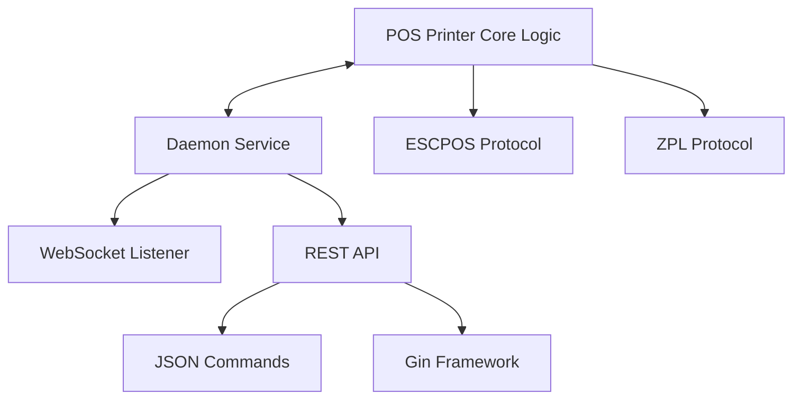

# 🏢 RED2000 Development Journal
>
> **Learning Progress & Project Evolution**

---

## 📅 Timeline Overview

**August 2025** ████████████████████████████████████████ **100%**

```
Week 1: Setup    │ Week 2: Refactor │ Week 3: Arch     │ Week 4: Testing
```

**September 2025** ██████████░░░░░░░░░░░░░░░░░░░░░░░░░░░░░░░░ **25%**

```
Week 1: Testing │ Week 2:          │ Week 3:          │ Week 4:
```

---

## 🗓️ **WEEK 1: Foundation & Setup**

**Period:** August 4-8, 2025

### 🏢 RED2000 Work Progress

#### 🏗️ Repository Infrastructure

| Component | Status | Description |
|-----------|--------|-------------|
| ✅ Issue Templates | Complete | Bug reports, features, general issues |
| ✅ Bug Report Templates | Complete | Structured bug reporting |
| ✅ Feature Request Templates | Complete | Feature proposal format |
| ⏳ Multi-OS Testing | In Progress | CI across Windows, Linux, macOS |
| ⏳ Linter Integration | Planned | Code quality automation |
| ⏳ Conventional Commits | Planned | Commit message standards |
| ⏳ Stale PR Auto-closer | Planned | Automatic cleanup |

#### 🔧 Automation Goals

- **Dependabot**: Periodic update checks, automerge to `dev` with PR review
- **PR Tagging**: File-based automatic labeling and size-based tagging
- **Release Automation**: Commit-type driven releases with PR descriptions
- **Greeting System**: Welcome comments for new PR authors

#### 🏛️ Architecture Vision: PosPrinter and Daemon Separation

**Repository Structure Decision:**

- Split repository: create new repo for core logic
- Microservices approach: at least two services (Printing + Daemon)

**Service Implementation Strategy:**



**Key Architectural Decisions:**

- ✅ JSON for ticket data instead of constructors
- ✅ REST API for protocol-agnostic, lightweight local use
- 🔄 gRPC evaluation for inter-service communication
- 🔄 Assess containerization impact on connectors

#### 🛠️ Development Tasks

- **Codepage Investigation**: Suspect printer issues, test with disk reader (firmware update needed?)
- **ESCPOS Functions**: Integrate documented commands, separate responsibilities
- **Code Refactoring**: Use Copilot suggestions, review TODOs and FIXMEs

#### 📋 Pending GitHub Tasks

- Translate `pr-template`
- Investigate `renovate.json`
- Update `README.md`

### 📚 Personal Learning

- **Documentation & Code Quality**: Commit instructions for better messages and Copilot usage
- **Linter Setup**: Commit message linter, code linters for GoLand and GH Actions
- **Documentation Creation**: Contribution guide, code of conduct, setup instructions

---

## 🗓️ **WEEK 2: Code Quality & Architecture**

**Period:** August 11-15, 2025

### 🏢 RED2000 Work Progress

#### 🔍 Codebase Health Analysis

**Issues Identified:**

- 📊 **TODOs Found:** ~15 items (mostly unfinished ESCPOS command implementations)
- 🐛 **FIXMEs Found:** ~8 items (many require specific types to validate inputs)
- 🧪 **Testing Strategy:** Develop testing for commands without physical printer (`os.stdout` as `io.writer`)

#### 🎯 Quality Improvements

- **Modularity**: Separate protocol modules (ESCPOS, ZPL) as Go packages within same repository
- **Visibility**: Proper public/private function declarations
- **Architecture**: Registry pattern to handle multiple printers and abstract POS concept
- **Middleware**: Reduce command boilerplate code

### 📚 Personal Learning

- **Protocol Architecture**: Review differences between protocols (ESCPOS vs ZPL command equivalents)
- **Code Organization**: Improve modularity and separation of concerns

---

## 🗓️ **WEEK 3: Implementation & Learning**

**Period:** August 18-22, 2025

### 🏢 RED2000 Work Progress

#### 📦 Module Architecture Implementation

```
pos-printer/
├── escpos/
│   ├── standard/     ✅ Implemented
│   └── pagemode/     ⏳ Postponed (can be handled by same codebase with different configs)
├── zpl/              ⏳ Planned
└── registry/         ⏳ In Progress
```

#### 🚀 Implementation Progress

- **Barcode Support**: Improved implementation
- **ESCPOS Basic Commands**: Started text and formatting commands
- **Second Layer Planning**:
  - Auto-formatting to active charset for printer code page
  - Improved error handling with specific error types

#### 📋 Project Management

- Set up PRs and issues in pos-printer repository for tracking
- Need to generate documentation for each protocol module
- Move diary tasks into GitHub project backlog items
- Review GitHub project management best practices

#### 🏗️ Architecture Progress

**ESCPOS Implementation Status:**

| Command Type | Implementation | Tests | Notes |
|--------------|---------------|-------|-------|
| Basic Printing | ✅ Complete | ✅ Tested | Production ready |
| Line Spacing | ✅ Complete | ✅ Tested | Production ready |
| Barcode Support | 🔄 In Progress | ⏳ Pending | Under development |
| Character Format | 🔄 In Progress | ⏳ Pending | Under development |

### 📚 Personal Learning

- **Go Concurrency**: Deepened knowledge of channels and goroutines
- **Memory Management**: Learning about stack, heap, and garbage collection in Golang
- **Go Migration**: Slowly migrating to Go 1.25

---

## 🗓️ **WEEK 4: Testing Excellence**

**Period:** August 25-29, 2025

### 🏢 RED2000 Work Progress

#### 🧪 Testing Strategy Implementation

- **Command Testing**: Planning to replicate testing approach for all commands
- **Alternative Delivery**: Investigating PDF/image generation as additional protocol option for receipt delivery
- **Prototype Focus**: Delivering working prototype ASAP
- **Process Improvement**: Established weekly policy to push to remote branches with open PRs every Friday

#### 📋 Project Management

- Need to consolidate backlog items from laptop notes to GitHub Project

### 📚 Personal Learning

#### 🎯 Testing Patterns Mastered

**1. Dependency Injection Testing**
> **Purpose**: Verify that your code works with any implementation of an interface

- Tests flexibility and substitutability
- Ensures loose coupling
- Validates the Liskov Substitution Principle

**2. Fake Implementation Testing**
> **Purpose**: Test behavior with stateful simulations

- Tracks accumulated state over multiple operations
- Simulates real-world behavior without real hardware
- Useful for integration testing

**3. Interface Composition Testing**
> **Purpose**: Verify that composite interfaces work correctly

- Tests that a type implements multiple interfaces
- Validates interface embedding
- Ensures polymorphic behavior

**4. Mock Testing**
> **Purpose**: Verify interactions and behavior

- Tracks method calls
- Controls return values
- Simulates error conditions

#### 🔧 Testing Implementation Notes

- Working on tests with simple fixes and better structure
- Ensuring comprehensive and maintainable tests
- Created guide for future contributors
- Working on Character and Position commands (declaring base commands and interfaces)
- Refactored methods and tests of Printing commands

#### 📚 Advanced Topics Explored

- **Backpressure and Exponential Backoff**: Reviewed and created simple examples
- **Database Internals**: Planning to look at optimization for our use case
- **Custom DBMS**: Probably will implement a DBMS from scratch

---

## 🗓️ **WEEK 5: Advanced Patterns & API Design**

**Period:** September 1-5, 2025

### 🏢 RED2000 Work Progress

#### 🧪 Character Commands Testing Achievement

- Created unit tests for character commands to ensure they work as expected
- Used table-driven tests to cover various input scenarios
- Implemented mocks for dependencies to isolate tests
- Verified that all tests pass and provide meaningful coverage

### 📚 Personal Learning

#### 🌐 REST API Learning with Gin Framework

- Reviewed very basic implementation of REST API with Gin
- Simple guide was written for future reference

**Basic Endpoint Structure:**

```http
GET  /api/v1/printers    # List available printers
POST /api/v1/print       # Send print job
GET  /api/v1/status      # Check printer status
```

**Focus Areas:**

- ⚡ Performance optimization
- 🪶 Lightweight design principles

#### 🧪 Testing Patterns in Go

- Learned about different testing patterns in Go
- Created a guide for future reference

**New entries to journal:**

- I have to review how golang errors behave during testing. I added a mini-guide on error handling in Go. Values can be programmed, and since errors are values, errors can be programmed.
- I achieved a lot of new testing patterns. Tests around Print, Character and Position commands are almost complete. Few fixes and refactoring are still needed. I have completed with success the tests for Print, Character and Line Spacing commands. They merged correctly and passed every check in Github.

- I have advanced a lot in Position Printing commands. Tests are missing still, but I have a clear plan for their implementation.
- I refactored and improved casting around uint16 data types for commands that use little endian representation(`qrcode.go`, `image.go`).
- I probably will need to redo this journal, as I want to include more details about the testing process and the challenges faced. Also, I will need checkboxes for tracking progress as i didn't finish certain ideas or task mentioned before.
- I have checked database internal concepts and their implications for our use case. Mainly, the difference between in-memory and on-disk storage. From DSA perpective i will check B+ trees and Log-Structured Merge-trees (LSM).

- I checked the CAP theorem and its implications for distributed systems. I created a simple example in Go to illustrate the concepts of Consistency, Availability, and Partition Tolerance.
- I have been very focused on test patterns and their implementation in Go. I should check Test-Driven Development (TDD) practices to further enhance my testing skills. Search for books on TDD in Go.
- Character commands so they tests ASCII inputs. I need to ensure that all edge cases are covered.

- Today i refactored certain commands, i focused on type safety and proper error handling. I created types based on values used and indicated in the ESCPOS documentation. I also created specific error types for better error management.

---

## 🎯 **Current Focus Areas**

### 🔬 Active Research & Development

| Area | Tool/Technology | Status |
|------|-----------------|--------|
| 📄 JSON Ticket Representation | Parzibyte tools | Investigating |
| 🔌 Communication Protocol | WebSocket vs REST API | Feasibility analysis |
| 📟 Hardware Issues | Codepage problems | Firmware updates needed? |
| 🐳 Deployment | Containerization | Impact on connectors |

### 🛠️ Technical Debt Management

**High Priority:**

- Complete ESCPOS commands
- Implement input validation
- Reduce boilerplate code

**Medium Priority:**

- Documentation generation
- Error handling improvements
- Performance optimization

---

## 📈 **Learning Trajectory**

### 🧠 Skills Developed

- **Go Programming**: From basics to advanced patterns
- **Testing Mastery**: Multiple testing strategies and patterns
- **Architecture Design**: Microservices & API design principles
- **DevOps Practices**: CI/CD, automation, project management

### 🏆 Key Achievements

- ✅ Robust testing framework established
- ✅ Clean architecture principles applied
- ✅ Comprehensive documentation approach
- ✅ Sustainable development practices

---

## 🔮 **Future Roadmap**

### 📋 Next Milestones

1. **Complete ESCPOS Implementation**
2. **ZPL Protocol Integration**
3. **REST API Prototype**
4. **Hardware Testing Phase**
5. **Performance Benchmarking**

### 🎯 Success Metrics

- [ ] 100% Command Coverage
- [ ] Sub-100ms Response Times
- [ ] Zero Hardware Dependencies for Testing
- [ ] Comprehensive Documentation
- [ ] Production-Ready Prototype

---

> 💡 **Project Mission**  
> *"Building robust, testable, and maintainable POS printing solutions"*  
> **— Adrián Constante, RED2000**
