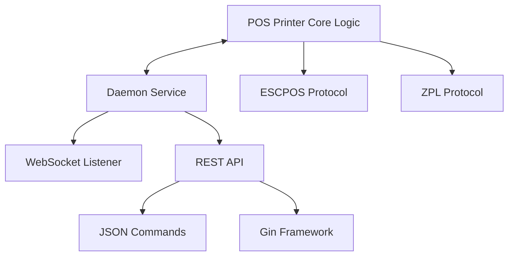

# 🏢 RED2000 Development Journal
>
> **Learning Progress & Project Evolution**

---

## 📅 Timeline Overview

**August 2025** ████████████████████████████████████████ **100%**

```
Week 1: Setup    │ Week 2: Refactor │ Week 3: Arch     │ Week 4: Testing
```

**September 2025** ██████████░░░░░░░░░░░░░░░░░░░░░░░░░░░░░░░░ **25%**

```
Week 1: Testing │ Week 2:          │ Week 3:          │ Week 4:
```

---

## 🗓️ **WEEK 5: Foundation & Setup**

**Period:** August 4-8, 2025

### 🏢 RED2000 Work Progress

#### 🏗️ Repository Infrastructure

| Component | Status | Description |
|-----------|--------|-------------|
| ✅ Issue Templates | Complete | Bug reports, features, general issues |
| ✅ Bug Report Templates | Complete | Structured bug reporting |
| ✅ Feature Request Templates | Complete | Feature proposal format |
| ⏳ Multi-OS Testing | In Progress | CI across Windows, Linux, macOS |
| ⏳ Linter Integration | Planned | Code quality automation |
| ⏳ Conventional Commits | Planned | Commit message standards |
| ⏳ Stale PR Auto-closer | Planned | Automatic cleanup |

#### 🔧 Automation Goals

- **Dependabot**: Periodic update checks, automerge to `dev` with PR review
- **PR Tagging**: File-based automatic labeling and size-based tagging
- **Release Automation**: Commit-type driven releases with PR descriptions
- **Greeting System**: Welcome comments for new PR authors

#### 🏛️ Architecture Vision: PosPrinter and Daemon Separation

**Repository Structure Decision:**

- Split repository: create new repo for core logic
- Microservices approach: at least two services (Printing + Daemon)

**Service Implementation Strategy:**



**Key Architectural Decisions:**

- ✅ JSON for ticket data instead of constructors
- ✅ REST API for protocol-agnostic, lightweight local use
- 🔄 gRPC evaluation for inter-service communication
- 🔄 Assess containerization impact on connectors

#### 🛠️ Development Tasks

- **Codepage Investigation**: Suspect printer issues, test with disk reader (firmware update needed?)
- **ESCPOS Functions**: Integrate documented commands, separate responsibilities
- **Code Refactoring**: Use Copilot suggestions, review TODOs and FIXMEs

#### 📋 Pending GitHub Tasks

- Translate `pr-template`
- Investigate `renovate.json`
- Update `README.md`

### 📚 Personal Learning

- **Documentation & Code Quality**: Commit instructions for better messages and Copilot usage
- **Linter Setup**: Commit message linter, code linters for GoLand and GH Actions
- **Documentation Creation**: Contribution guide, code of conduct, setup instructions

---

## 🗓️ **WEEK 6: Code Quality & Architecture**

**Period:** August 11-15, 2025

### 🏢 RED2000 Work Progress

#### 🔍 Codebase Health Analysis

**Issues Identified:**

- 📊 **TODOs Found:** ~15 items (mostly unfinished ESCPOS command implementations)
- 🐛 **FIXMEs Found:** ~8 items (many require specific types to validate inputs)
- 🧪 **Testing Strategy:** Develop testing for commands without physical printer (`os.stdout` as `io.writer`)

#### 🎯 Quality Improvements

- **Modularity**: Separate protocol modules (ESCPOS, ZPL) as Go packages within same repository
- **Visibility**: Proper public/private function declarations
- **Architecture**: Registry pattern to handle multiple printers and abstract POS concept
- **Middleware**: Reduce command boilerplate code

### 📚 Personal Learning

- **Protocol Architecture**: Review differences between protocols (ESCPOS vs ZPL command equivalents)
- **Code Organization**: Improve modularity and separation of concerns

---

## 🗓️ **WEEK 7: Implementation & Learning**

**Period:** August 18-22, 2025

### 🏢 RED2000 Work Progress

#### 📦 Module Architecture Implementation

```
pos-printer/
├── escpos/
│   ├── standard/     ✅ Implemented
│   └── pagemode/     ⏳ Postponed (can be handled by same codebase with different configs)
├── zpl/              ⏳ Planned
└── registry/         ⏳ In Progress
```

#### 🚀 Implementation Progress

- **Barcode Support**: Improved implementation
- **ESCPOS Basic Commands**: Started text and formatting commands
- **Second Layer Planning**:
  - Auto-formatting to active charset for printer code page
  - Improved error handling with specific error types

#### 📋 Project Management

- Set up PRs and issues in pos-printer repository for tracking
- Need to generate documentation for each protocol module
- Move diary tasks into GitHub project backlog items
- Review GitHub project management best practices

#### 🏗️ Architecture Progress

**ESCPOS Implementation Status:**

| Command Type | Implementation | Tests | Notes |
|--------------|---------------|-------|-------|
| Basic Printing | ✅ Complete | ✅ Tested | Production ready |
| Line Spacing | ✅ Complete | ✅ Tested | Production ready |
| Barcode Support | 🔄 In Progress | ⏳ Pending | Under development |
| Character Format | 🔄 In Progress | ⏳ Pending | Under development |

### 📚 Personal Learning

- **Go Concurrency**: Deepened knowledge of channels and goroutines
- **Memory Management**: Learning about stack, heap, and garbage collection in Golang
- **Go Migration**: Slowly migrating to Go 1.25

---

## 🗓️ **WEEK 8: Testing Excellence**

**Period:** August 25-29, 2025

### 🏢 RED2000 Work Progress

#### 🧪 Testing Strategy Implementation

- **Command Testing**: Planning to replicate testing approach for all commands
- **Alternative Delivery**: Investigating PDF/image generation as additional protocol option for receipt delivery
- **Prototype Focus**: Delivering working prototype ASAP
- **Process Improvement**: Established weekly policy to push to remote branches with open PRs every Friday

#### 📋 Project Management

- Need to consolidate backlog items from laptop notes to GitHub Project

### 📚 Personal Learning

#### 🎯 Testing Patterns Mastered

**1. Dependency Injection Testing**
> **Purpose**: Verify that your code works with any implementation of an interface

- Tests flexibility and substitutability
- Ensures loose coupling
- Validates the Liskov Substitution Principle

**2. Fake Implementation Testing**
> **Purpose**: Test behavior with stateful simulations

- Tracks accumulated state over multiple operations
- Simulates real-world behavior without real hardware
- Useful for integration testing

**3. Interface Composition Testing**
> **Purpose**: Verify that composite interfaces work correctly

- Tests that a type implements multiple interfaces
- Validates interface embedding
- Ensures polymorphic behavior

**4. Mock Testing**
> **Purpose**: Verify interactions and behavior

- Tracks method calls
- Controls return values
- Simulates error conditions

#### 🔧 Testing Implementation Notes

- Working on tests with simple fixes and better structure
- Ensuring comprehensive and maintainable tests
- Created guide for future contributors
- Working on Character and Position commands (declaring base commands and interfaces)
- Refactored methods and tests of Printing commands

#### 📚 Advanced Topics Explored

- **Backpressure and Exponential Backoff**: Reviewed and created simple examples
- **Database Internals**: Planning to look at optimization for our use case
- **Custom DBMS**: Probably will implement a DBMS from scratch

---

## 🗓️ **WEEK 9: Advanced Patterns & API Design**

**Period:** September 1-5, 2025

### 🏢 RED2000 Work Progress

#### 🧪 Character Commands Testing Achievement

- Created unit tests for character commands to ensure they work as expected
- Used table-driven tests to cover various input scenarios
- Implemented mocks for dependencies to isolate tests
- Verified that all tests pass and provide meaningful coverage

### 📚 Personal Learning

#### 🌐 REST API Learning with Gin Framework

- Reviewed very basic implementation of REST API with Gin
- Simple guide was written for future reference

**Basic Endpoint Structure:**

```http
GET  /api/v1/printers    # List available printers
POST /api/v1/print       # Send print job
GET  /api/v1/status      # Check printer status
```

**Focus Areas:**

- ⚡ Performance optimization
- 🪶 Lightweight design principles

#### 🧪 Testing Patterns in Go

- Learned about different testing patterns in Go
- Created a guide for future reference

**New entries to journal:**

- I have to review how golang errors behave during testing. I added a mini-guide on error handling in Go. Values can be programmed, and since errors are values, errors can be programmed.
- I achieved a lot of new testing patterns. Tests around Print, Character and Position commands are almost complete. Few fixes and refactoring are still needed. I have completed with success the tests for Print, Character and Line Spacing commands. They merged correctly and passed every check in Github.

- I have advanced a lot in Position Printing commands. Tests are missing still, but I have a clear plan for their implementation.
- I refactored and improved casting around uint16 data types for commands that use little endian representation(`qrcode.go`, `image.go`).
- I probably will need to redo this journal, as I want to include more details about the testing process and the challenges faced. Also, I will need checkboxes for tracking progress as i didn't finish certain ideas or task mentioned before.
- I have checked database internal concepts and their implications for our use case. Mainly, the difference between in-memory and on-disk storage. From DSA perpective i will check B+ trees and Log-Structured Merge-trees (LSM).

- I checked the CAP theorem and its implications for distributed systems. I created a simple example in Go to illustrate the concepts of Consistency, Availability, and Partition Tolerance.
- I have been very focused on test patterns and their implementation in Go. I should check Test-Driven Development (TDD) practices to further enhance my testing skills. Search for books on TDD in Go.
- Character commands so they tests ASCII inputs. I need to ensure that all edge cases are covered.

- Today i refactored certain commands, i focused on type safety and proper error handling. I created types based on values used and indicated in the ESCPOS documentation. I also created specific error types for better error management.

- I created helpers, builders and assertions for tests. These utilities streamline the testing process and improve code readability. Also, type safety was improved by using specific types instead of generic ones. This encourages the use of constants as parameters in final implementation.
- I found a [guide](https://forums.adafruit.com/viewtopic.php?t=32217) for better understanding about User-Defined character in ESCPOS. Maybe at least leave the maps for `áéíóúü`, `ÁÉÍÓÚÜ` and `ñÑ` characters. The thing is not every printers need this implementation, so this should be optional at capabilities level.
- I will need a function that auto turns on and off the User-Defined character mode. This function will be implemented in Text() level, it will apply a formatting similar to the swap between `\n` and `LF`.

---

## 🗓️ **WEEK 10: TBD**

**Period:** September 8-12, 2025

- The PR around the Position commands is finally merged. Tests were successfully implemented and passed. I need to review the code and ensure everything is in order.
- I have planned the workaround for the User-Defined characters. I will implement a function that automatically enables and disables this mode when printing text. This will be done at the Text() command level.
- The new paper for the printer is pretty bad, it has a lot of noise and the print quality is very poor. I will need to get better paper to properly test the printing quality.
- I read about interfaces and structs in Go. I need to ensure that I am using them correctly and efficiently.

- Insane [guide](https://refactoring.guru/es) to understand design patterns in many languages, including Go and Python. Worth checking it out and adding it to the resorces repository.
- I learned about design patterns in Go and how interfaces and structs can be used to implement them. I will need to review the patterns and see how they can be applied to our project.
- I learned about stack and heap memory management, i want to go deeper into garbage colletion in Go. Just as general knowledge, i want to understand how memory is managed in Go and how it affects performance.
- I am starting a side project about microservices in Go. I found a book called "gRPC Microservices in Go" that seems pretty good. I am really interested in another but related to REST API with Gin framework.

- For now i will be working on Protobuf definitions and the basics of the Saga pattern.
- Among other distributed system concepts i reviewed the CAP theorem and the PACELC theorem, and added a guide.
- Also, i checked the main concepts of system design and scaling.
- I checked SQL Injection countermeasures.

- I added a guide on Saga patterns, including Choreography and Orchestration.
- I continued with service discovery patterns in microservices. I added a simple graph for client-side and server-side discovery.
- I am ready to start with the implementation of a simple microservice using gRPC and Protobuf. I will start with simple tasks that do not have any business logic, only isolated tasks with each technology/pattern involved just to get familiar with the tools and the workflow.

- I am learning about ACID vs BASE properties in databases. i am most familiar with ACID, so i will need to review BASE properties and how they apply to NoSQL databases.
- I am seriusly thinking on learning Kafka, PySpark and data pipelines. Retaking the Data Engineering path i left years ago.
- I reviewed the history of Go and its main features. I want to understand why Go was created and how it differs from other languages.
- I learned about backpropagation algorithm in neural networks and machine learning concepts. If i am that into DevOps, probably MLOps is a good path to follow.

## 🗓️ **WEEK 11: TBD**

**Period:** September 15-19, 2025

- I have worked on CI/CD pipelines and their refactoring for the pos-printer repository. I ensured that dependabot is properly configured and that PRs are automatically tagged based on file changes and size. Automerge should work correctly now.
- I will focus this week in the PDF generation as an alternative output for receipts. I will research libraries and tools that can help with this task. Maroto seems a good option. As soon as i have a working prototype, i will create a PR for the image printing commands.
- I studied more about techniques and patterns for caching, message queues and API styles and architectures.

- 16 september was a holiday in my country, so i had the day off. Only checked for AWS courses and identified system desing homologies.

- I will continue with API design patterns and architectures.
- Also, i will create guides for the topics from the monday and based on the guides i found online.
- I finished a demo implementation around Channels and Goroutines. It managed channels, goroutines and backpressure, and simulated a simple but concurrent task. I added it to `go-examples` repository.

- I have been exploring different API styles and architectures. I will work on a practice to implement gRPC and Protobuf in a simple microservice.
- Built a multi-goroutine system demonstrating channel-based communication. Features exponential backoff with jitter for retry logic, fan-in pattern, dead letter queue for failed messages, and timeout-based race conditions using select.

- Today i will read about Database Internals from Alex Petrov. I want to understand how databases work under the hood and how to optimize them for our use case.
- I continued an implementation around a database from scratch in Go. I finished Chapter 1 and created a github repository for it, `go-databases`. I will continue with it as a side project.
- I checked panic, recover and graceful shutdown in Go. I added a simple example to `go-examples` repository.

## 🗓️ **WEEK 12: TBD**

**Period:** September 22-26, 2025

- I got wise tooth removal surgery, so i will be out of commission for today, monday.

- Checked Github Fundamentals course.
- *Inside Cyber Warfare: Mapping the Cyber Underworld* by **Jeffrey Caruso** is a really good book about cyber warfare and cyber security.
- Continued the database from scratch implementation. I finished Chapter 2 and started Chapter 3.

- Copilot wasn't working properly yesterday, so i will check today and continue ESCPOS commands implementation. Barcode command are being done and tested.
- I did some investigation for a friend about the 2025 Stackoverflow Developer Survey results, AWS most important services and Docker Containers vs Virtual Machines.

- I'm working on a simple CRUD example with FastAPI and SQLModel with PostgreSQL as the database.

- I will continue the Python API example. The idea is to create a skeleton for a friend to modify and use in her projects. Thus, Github Codespaces will be used for development and testing. I did a lot of tests with Docker containers and Codespaces.
- I set up a container running PostgreSQL with a persistent volume. I created a simple FastAPI application with SQLModel to interact with the database.

## 🗓️ **WEEK 13: TBD**

**Period:** September 29 - October 03, 2025

- Repaired my pc, it wasn't turning on. Due to a USB overcurrent issue, one of the ports was damaged. I did many tests, at the end i managed to enter BIOS and disable the faulty port. Now everything is working fine.
- I was looking for a good book and tutorial. tutorial will be around MERN stack, the book is about boostrapping microservices with JavaScript, using Terraform, Github Actions, Docker and Kubernetes.

- I will squeeze the Copilot premium request as i have half of them left, i have just one day to use them. For it, i will create a personal website with Hugo and its templates. I am thinking in a website that can be used as a portfolio, blog, docs and tutorials.
- I checked cloud computing core concepts and AWS services.

- I will start the MERN stack tutorial, i will use WebStorm. I will keep an eye on the microservices book around Golang and gRPC. I got all dependencies through Docker containers.
- I started a simple project with AWS Lambda, API Gateway and DynamoDB. I will use the AWS SDK for Go to create a simple serverless CRUD.
- I dived into IAM user and roles, policies and best practices. I created a simple user with programmatic access and attached the `AWSLambdaFullAccess` policy for testing purposes.

- I am studying Frontend Fundamentals. I will continue with the MERN stack tutorial later. For now, i will focus on HTML, CSS and JavaScript basics.
- I have to upgrade to Windows 11, i will check BIOS settings and do a clean installation. Looks like CPU has the TPM 2.0 module, so i will enable it in BIOS.
- I will return to the ESC/POS commands implementation after finishing the Windows 11 installation. An USB will be bought for later.
- I ended diving into Containerization with Docker and Compose. I want to do a project where no local installation is needed, everything will be done through containers. Imagine getting rid of mocks tests and use a container with a test postgresql database. not mock anymore, just testing against a containerized database. Nice Docker [Cheatsheet](https://dockerlabs.collabnix.com/docker/cheatsheet/) and [Commands](https://kapeli.com/cheat_sheets/Dockerfile.docset/Contents/Resources/Documents/index).
- I really need to dive into Testcontainers. Looks like game changer for integration testing and DevOps.
- I will look for cheatsheets for technology i am interested in. Look for the n8n repository, it has a lot of useful resources and workflows.

- I still working in MERN stack tutorial. I have dependencies through Docker containers, thay are part of my Dev Containers setup. I worked again on Dev Containers and Codespaces. It was a day about containers, docker and docker-compose.

## 🗓️ **WEEK 14: TBD**

**Period:** October 06 - October 10, 2025

- I keep working on the MERN stack tutorial. I have setup the container of each service, now i will work on the code. As for now, i have a "Hello, World!" implementation for each service.
- I will check how a Js Promise would look like in Go. I know there are goroutines and channels, but i want to see a simple example that mimics the behavior of Promises in JavaScript.

- Worked on to finally finish the Barcode commands implementation. They are finally done and tested. they are already merged into main branch.
- I will check about VPS providers and prices. I have the idea of setting up a Dokploy instance with Terraform and Ansible. I will check the Dokploy repository for guides and documentation.
- I will check all the Docker and Docker Compose posibilities with Github Actions. I want to create a workflow that builds and tests the code in a containerized environment. Maybe the Dokploy VPS can be used for it.

- *Web Application Security: Exploitation and Countermeasures for Modern Web Applications by Andrew Hoffman* looks like a very hands-on book about web security. I will check it out.
- I will check which VPS providers are the best for my needs. To ensure a smooth experience with Dokploy, my server should have at least 2GB of RAM and 30GB of disk space. I am diving more into VPS and Cloud providers.
- Nice [ebook](https://astaxie.gitbooks.io/build-web-application-with-golang/content/en/) about building web applications with Go.
- I reformated, refactored ESCPOS commands package and integrated the Barcode commands. I also added a simple example that shows how to use the package. I translated comments to latin spanish for better understanding.
- i will check the main differences between Docker Swarm and Kubernetes. I want to understand the pros and cons of each one and see which one fits better for my needs.

- I wil setup Dokploy in my VPS. I have a DigitalOcean droplet with Ubuntu 24.04 LTS.
- Also, i will add the mechanim control command to the ESC/POS package. they are used to cut paper and open cash drawer.
- I started to work in a minimal daemon to get data from a weight scale. I will use it later for testing purposes with the pos-printer package. As first task, i wil review the code.

- Once daemon was done, i started to work on a TUI in a `BSInstaller.exe` to manage installation, uninstallation and monitoring of the daemon. I will use ***Bubble Tea*** package for it. The idea is to have everything embedded in a single binary, and install it with mininal user technical knowledge. I will check this article about [Bubble Tea](https://penchev.com/posts/create-tui-with-go/) for later.
- I will check the following [article](https://harishd.hashnode.dev/go-import-side-effect-or-blank-import) about importing only side effects (`_ "import/pkg"`) in Go. I want to understand how it works and how to use it properly.
- I worked on a `Taskfile.yml` for the `BSInstaller.exe`, this will help the developer side. It is a Go alteranative to Makefile. the file will help to build, test and run the `BSInstaller.exe`.


## 🗓️ **WEEK 15: TBD**

**Period:** October 13 - October 17, 2025

- I was tasked to improve the security of the Weight Scale Daemon. Not everyone should be able to access the scale data.
- Make the changes in the installer to accept arguments and passes them to the service executable.
  - Among them is the `--secure` flag to enable secure mode. I need to allow only certain clients to access the scale data in the websocket.
  - The `--url` flag to change the default URL (<http://localhost:8080>). Default will be `http://localhost:8080`.
- I set up alerts and monitoring for the VPS. A container with n8n is being monitored and RAM usage is being tracked. DigitalOcean will trigger an alert if RAM usage exceeds 75% for more than 5 minutes or if n8n crashes.
- The VPS was built with DigitalOcean. It leverages on containers for each service, because of this Traefik is being used as a reverse proxy, load balancer and SSL termination. It is also running a n8n container for workflow automation.
- I will create replicas at least for the n8n container and setup Watchtower for automatic updates with zero downtime. I will check Dokploy today in case a database is needed as external service for n8n.
- I need to design tests against failure scenarios in the Weight Scale Daemon. I will check how to simulate a crash and how the service behaves in that situation. Even from physical disconnection of the scale.

- I made breaking changes in the Weight Scale Daemon. Service and installer have now two versions: local and remote. Local version is for local use only, it does not expose any network interface. Remote version exposes a WebSocket interface for remote clients to connect and get scale data. I designed a better HTML to interact with the WebSocket server, it receives initial configuration data, and changes can be made through the WebSocket connection without reloading as it has a button to send new configuration data. As for the installer, a flag is used to select which service binary to embed. For its TUI i used Bubble Tea and its components, it is interactive and user-friendly, it has a local version which is clearly different in colors from the production one.
- Documentation was written for the Weight Scale Daemon and its installer. It includes installation instructions, configuration options, and usage examples. Has 2 main parts, the Dev Guide and the User Guide.

- Today i will make a combination of the websocket-serial service, but instead of a weight scale, it will be a POS printer. I will start from the lastest version of pos-printer package, so i have a clean start. From here, i will need:
- The tech stack
  - Frontend: HTML, (minimal) CSS, JavaScript. Simple, no frameworks. Textbox to write text, button to send it. As page is reloaded when connecting, initial configuration data will be sent through a form, and will have the option to be changed through the websocket connection. Very similar to `service.go` in the weight scale daemon.
  - WebSocket server: Go, Gorilla WebSocket package. Simple, and very similar to the weight scale daemon. It will receive text from the frontend and send it to the printer through the pos-printer package(most basic commands, print and cut at most). Finally, it will return an acknowledgment to the frontend. No complex additional logic, just like the one in `service.go`, just a simple echo server with printing capabilities. No extra consideration with printing timeouts or buffering, as it is a prototype.
  - POS printer: pos-printer package, based on the `windows.go` example. It will use the latest version of the package, with recently mechanical control commands. It will be a simple implementation that uses the `escpos.print.Text()` and `escpos.mechanical.Cut()` commands.
  - An extra prototype feature inside a there will be a button to that triggers and endpoint to get the devices in COM ports. This will be useful for the user to know which port to use for the printer. And just for show purposes, the endpoint will return a JSON with the list of COM ports. The frontend will display them in a simple list.
- I worked in the last implementations, i started with the frontend, then the websocket server and finally the pos-printer usage as handlers. First, i will communicate HTML textboxes to server logs.
- Check Grafana, useSend, Portainer, Watchtower, Evolution API, GOWA, Minio, BookStack. 

- I achieved printing from the WebSocket server to a POS printer. The frontend sends text to the server, which uses the pos-printer package to print it. My test was from a remote LAN computer, so it is working as expected.
- Tomorrow i will work on the COM ports listing endpoint and its frontend integration. Also, i will try to implement a printing queue with buffered channels to avoid message loss if multiple print requests are sent in a short time. Same for timeouts, failure and concurrent scenarios, this is to be similar as the weight scale daemon.
- I set up a new printer and it worked with the pos-printer package without issues, only minimal adptations were needed for the codepage. I will continue adding.

---

## 🎯 **Current Focus Areas**

### 🔬 Active Research & Development

| Area | Tool/Technology | Status |
|------|-----------------|--------|
| 📄 JSON Ticket Representation | Parzibyte tools | Investigating |
| 🔌 Communication Protocol | WebSocket vs REST API | Feasibility analysis |
| 📟 Hardware Issues | Codepage problems | Firmware updates needed? |
| 🐳 Deployment | Containerization | Impact on connectors |

### 🛠️ Technical Debt Management

**High Priority:**

- Complete ESCPOS commands
- Implement input validation
- Reduce boilerplate code

**Medium Priority:**

- Documentation generation
- Error handling improvements
- Performance optimization

---

## 📈 **Learning Trajectory**

### 🧠 Skills Developed

- **Go Programming**: From basics to advanced patterns
- **Testing Mastery**: Multiple testing strategies and patterns
- **Architecture Design**: Microservices & API design principles
- **DevOps Practices**: CI/CD, automation, project management

### 🏆 Key Achievements

- ✅ Robust testing framework established
- ✅ Clean architecture principles applied
- ✅ Comprehensive documentation approach
- ✅ Sustainable development practices

---

## 🔮 **Future Roadmap**

### 📋 Next Milestones

1. **Complete ESCPOS Implementation**
2. **ZPL Protocol Integration**
3. **REST API Prototype**
4. **Hardware Testing Phase**
5. **Performance Benchmarking**

### 🎯 Success Metrics

- [ ] 100% Command Coverage
- [ ] Sub-100ms Response Times
- [ ] Zero Hardware Dependencies for Testing
- [ ] Comprehensive Documentation
- [ ] Production-Ready Prototype

---

> 💡 **Project Mission**  
> *"Building robust, testable, and maintainable POS printing solutions"*  
> **— Adrián Constante, RED2000**
