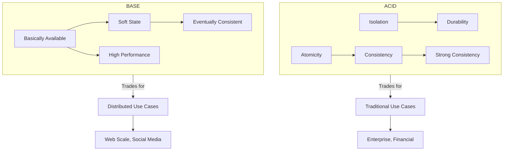
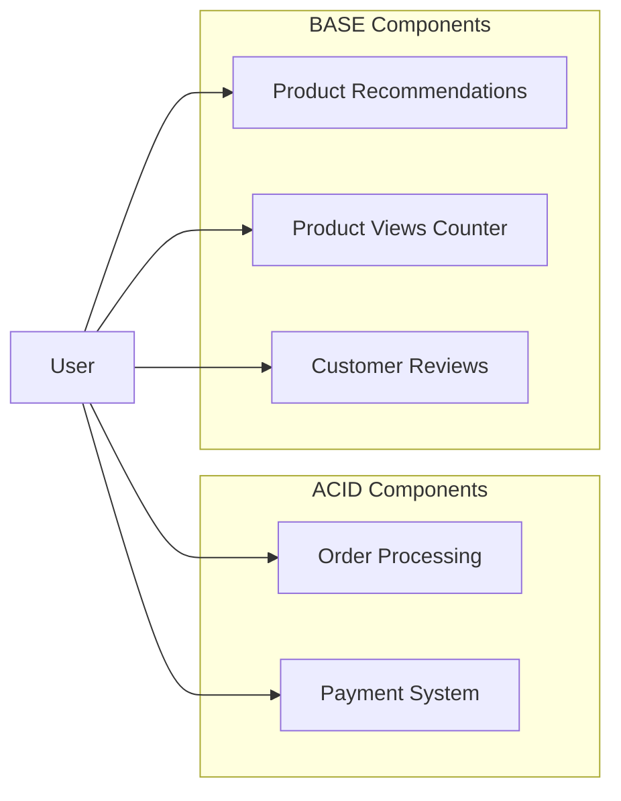

# ACID vs BASE in Database Systems

ACID and BASE represent opposing approaches to database design. ACID guarantees reliability in transactions with strong consistency, while BASE offers higher availability and scalability through eventual consistency.

## Key Concepts

### ACID Properties

- **Atomicity**: Transactions are all-or-nothing; either complete successfully or fail completely
- **Consistency**: Transactions maintain database integrity constraints
- **Isolation**: Concurrent transactions don't interfere with each other
- **Durability**: Completed transactions persist even during system failures

### BASE Properties

- **Basically Available**: System guarantees availability
- **Soft state**: System state may change over time, even without input
- **Eventually consistent**: System will become consistent over time

## Comparison Table

| Aspect | ACID | BASE |
|--------|------|------|
| **Focus** | Strong consistency | High availability |
| **Scaling** | Vertical (harder to scale) | Horizontal (easier to scale) |
| **Performance** | May be slower due to locks | Generally faster, fewer locks |
| **Data Integrity** | Immediate guarantees | Eventual guarantees |
| **Transactions** | Strong transaction support | Limited transaction support |
| **Failure Handling** | Roll back on failure | Continue operation, resolve later |
| **CAP Theorem** | Prioritizes Consistency | Prioritizes Availability |
| **Examples** | PostgreSQL, MySQL, Oracle | Cassandra, MongoDB, DynamoDB |

## Visual Comparison

## ACID Example Scenario

A banking transaction transferring money between accounts:

1. Begin transaction
2. Debit $100 from Account A
3. Credit $100 to Account B
4. Commit transaction

If any step fails, the entire transaction rolls back. This ensures account balances are always correct and no money is lost or created.

## BASE Example Scenario

A social media application showing post likes:

1. User likes a post
2. Like is stored locally and in nearest datacenter
3. Like count is eventually propagated to all datacenters
4. Other users may temporarily see different like counts

The system prioritizes speed and availability over immediate consistency.

## Implementation Considerations

### When to Choose ACID

- Financial transactions
- Inventory management
- Systems requiring data integrity guarantees
- Applications with complex relationships between entities
- When correctness is more important than availability

### When to Choose BASE

- Social media applications
- Content delivery networks
- Systems requiring high scalability
- Real-time analytics with approximate results
- When availability is more important than perfect consistency

## Hybrid Approaches

Modern systems often combine both paradigms:

- **Polyglot Persistence**: Using different database types for different components
- **Compensating Transactions**: BASE systems with business-level corrections
- **ACID within BASE**: Strong local consistency with eventual global consistency
- **Saga Pattern**: Coordinating multiple local transactions across services

## Real-world Application

### E-commerce Platform Example

- **ACID for**: Order processing, payments, inventory updates
- **BASE for**: Product recommendations, review systems, view counters

## Explanation

ACID and BASE represent different philosophies for managing data:

- **ACID** offers strong guarantees but can limit scalability. Traditional relational databases implement ACID to ensure data validity even during errors, crashes, or power failures. This comes at the cost of availability during partitions and more complex scaling.

- **BASE** accepts weaker consistency for improved availability and partition tolerance. NoSQL databases implement BASE principles to achieve horizontal scalability and high performance, but applications must handle eventual consistency.

The choice between ACID and BASE isn't binary—modern applications often use both approaches for different components based on their specific requirements. Understanding these trade-offs helps architects design systems that balance consistency, availability, and partition tolerance appropriately.