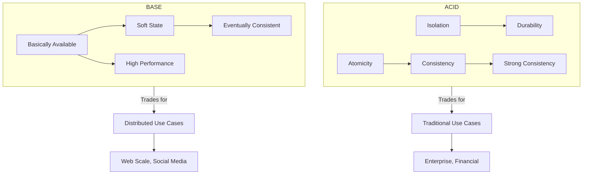
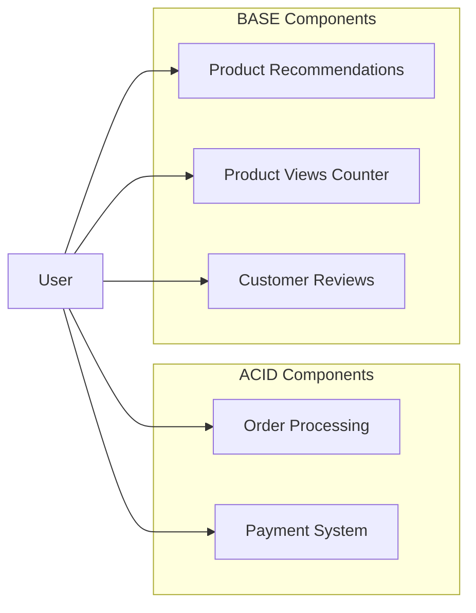

# ACID vs BASE in Database Systems

ACID and BASE represent opposing approaches to database design. ACID guarantees reliability in transactions with strong consistency, while BASE offers higher availability and scalability through eventual consistency.

## Prerequisites

- Basic understanding of database transactions.
- Familiarity with distributed systems concepts (nodes, partitions).

## Key Concepts

### ACID Properties

- **Atomicity**: Transactions are all-or-nothing; either complete successfully or fail completely.
- **Consistency**: Transactions maintain database integrity constraints.
- **Isolation**: Concurrent transactions don't interfere with each other.
- **Durability**: Completed transactions persist even during system failures.

### BASE Properties

- **Basically Available**: System guarantees availability.
- **Soft state**: System state may change over time, even without input.
- **Eventually consistent**: System will become consistent over time.

## Visual Comparison

## Comparison Table

| Aspect | ACID | BASE |
| :--- | :--- | :--- |
| **Focus** | Strong consistency | High availability |
| **Scaling** | Vertical (harder to scale) | Horizontal (easier to scale) |
| **Performance** | May be slower due to locks | Generally faster, fewer locks |
| **Data Integrity** | Immediate guarantees | Eventual guarantees |
| **Transactions** | Strong transaction support | Limited transaction support |
| **Failure Handling** | Roll back on failure | Continue operation, resolve later |
| **CAP Theorem** | Prioritizes Consistency | Prioritizes Availability |
| **Examples** | PostgreSQL, MySQL, Oracle | Cassandra, MongoDB, DynamoDB |

## Real-world Application

### E-commerce Platform Example

- **ACID for**: Order processing, payments, inventory updates.
- **BASE for**: Product recommendations, review systems, view counters.

## Implementation Considerations

### When to Choose ACID
- Financial transactions.
- Inventory management.
- Systems requiring data integrity guarantees.
- Applications with complex relationships between entities.
- When correctness is more important than availability.

### When to Choose BASE
- Social media applications.
- Content delivery networks.
- Systems requiring high scalability.
- Real-time analytics with approximate results.
- When availability is more important than perfect consistency.

## Next Steps

- Study the **CAP Theorem** (PACELC) to understand the theoretical limits.
- Learn about **Saga Patterns** for handling transactions across distributed services.

## Tags

#database-design #distributed-systems #acid #base #system-design