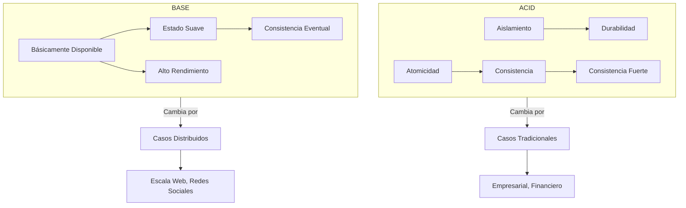
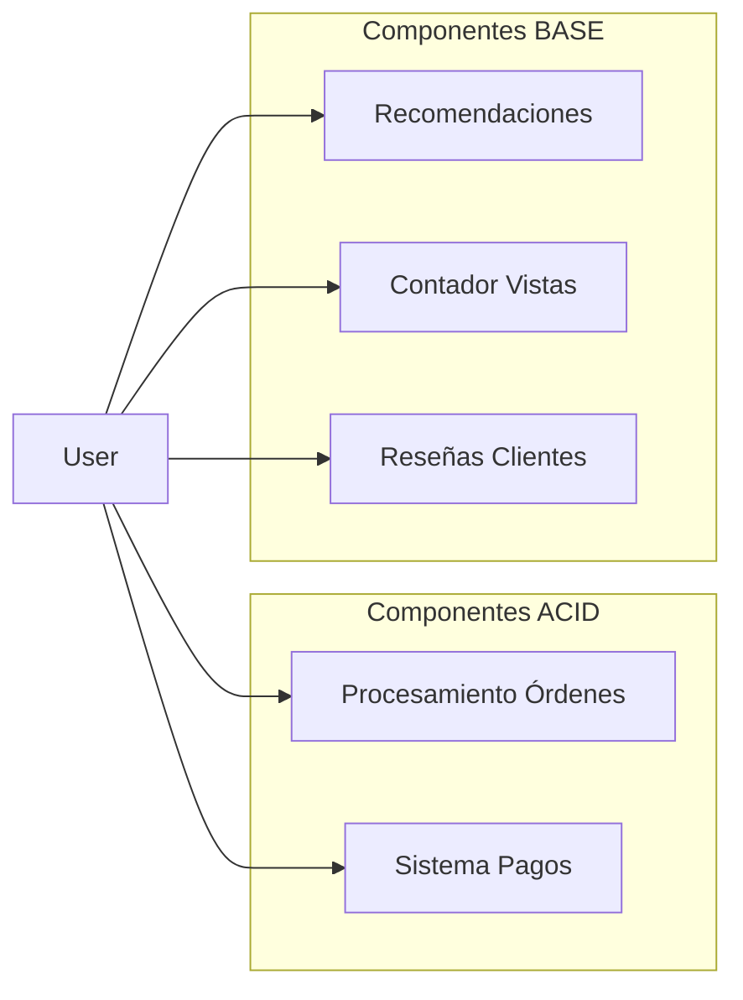

# ACID vs BASE en Sistemas de Bases de Datos

ACID y BASE representan enfoques opuestos en el diseño de bases de datos. ACID garantiza confiabilidad en transacciones con consistencia fuerte, mientras que BASE ofrece mayor disponibilidad y escalabilidad por medio de consistencia eventual.

## Prerrequisitos

- Entendimiento básico de transacciones de bases de datos.
- Familiaridad con conceptos de sistemas distribuidos (nodos, particiones).

## Conceptos Clave

### Propiedades ACID

- **Atomicidad**: Las transacciones son "todo o nada"; se completan o fallan totalmente.
- **Consistencia**: Las transacciones mantienen restricciones de integridad de la base de datos.
- **Aislamiento**: Las transacciones concurrentes no interfieren entre sí.
- **Durabilidad**: Las transacciones completadas persisten incluso durante fallos del sistema.

### Propiedades BASE

- **Básicamente Disponible**: El sistema garantiza disponibilidad.
- **Estado Suave**: El estado del sistema puede cambiar con el tiempo, incluso sin entrada.
- **Consistencia Eventual**: El sistema llegará a ser consistente con el tiempo.

## Comparación Visual

## Tabla Comparativa

| Aspecto | ACID | BASE |
| :--- | :--- | :--- |
| **Enfoque** | Consistencia fuerte | Alta disponibilidad |
| **Escalado** | Vertical (difícil escalar) | Horizontal (fácil escalar) |
| **Rendimiento** | Más lento por bloqueos | Generalmente más rápido |
| **Integridad de Datos** | Garantías inmediatas | Garantías eventuales |
| **Transacciones** | Soporte fuerte | Soporte limitado |
| **Manejo de Fallos** | Rollback en fallo | Continuar, resolver después |
| **Teorema CAP** | Prioriza Consistencia | Prioriza Disponibilidad |
| **Ejemplos** | PostgreSQL, MySQL, Oracle | Cassandra, MongoDB, DynamoDB |

## Aplicación en el Mundo Real

### Ejemplo de Plataforma de E-commerce

- **ACID para**: Procesamiento de órdenes, pagos, actualizaciones de inventario.
- **BASE para**: Recomendaciones de productos, sistemas de reseñas, contadores de vistas.

## Consideraciones de Implementación

### Cuándo Elegir ACID
- Transacciones financieras.
- Gestión de inventario.
- Sistemas que requieren garantías de integridad de datos.
- Aplicaciones con relaciones complejas entre entidades.
- Cuando la corrección es más importante que la disponibilidad.

### Cuándo Elegir BASE
- Aplicaciones de redes sociales.
- Redes de entrega de contenido (CDNs).
- Sistemas que requieren alta escalabilidad.
- Análisis en tiempo real con resultados aproximados.
- Cuando la disponibilidad es más importante que la consistencia perfecta.

## Siguientes Pasos

- Estudiar el **Teorema CAP** (PACELC) para entender los límites teóricos.
- Aprender sobre **Patrones Saga** para manejar transacciones a través de servicios distribuidos.

## Etiquetas

#database-design #distributed-systems #acid #base #system-design
