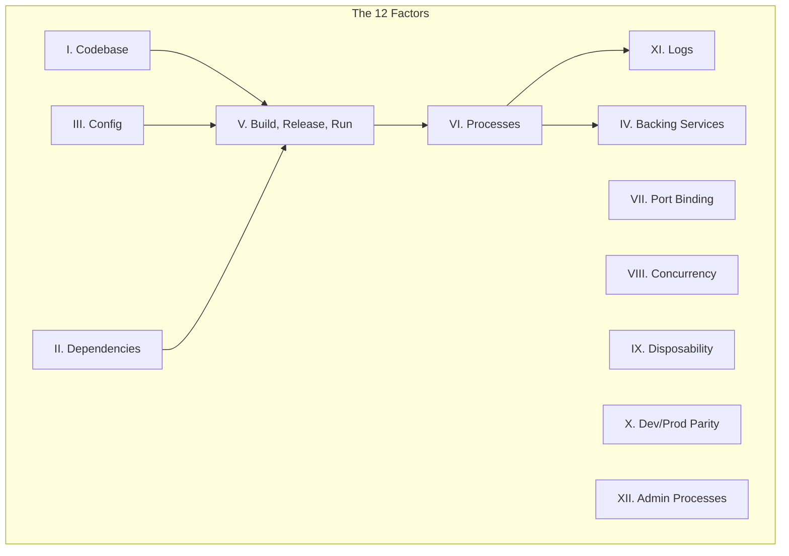

# The 12-Factor App in Go

The **12-Factor App** methodology is a gold standard for building modern, scalable Software-as-a-Service (SaaS) applications. It focuses on portability, resilience, and automation. While originally written for Heroku, these principles are the foundation of Cloud Native development (Kubernetes, Docker, Serverless).

## Prerequisites

- Basic understanding of **Go** modules and `http` server.
- Familiarity with **Docker** and environment variables.
- Concept of deployments (Dev vs. Prod).

## Key Concepts

- **Portability**: App works anywhere (laptop, AWS, Azure) without code changes.
- **Scalability**: Scaling is done by adding more processes, not making one process larger.
- **Parity**: Development environment mirrors Production as closely as possible.

## Visual Explanation



## Practical Implementation

### I. Codebase

**One codebase tracked in revision control, many deploys.**

- **Principle**: One Git repo = One App.
- **Go**: Your `go.mod` defines the module boundaries.
- **Anti-pattern**: Monorepos *can* be okay if managed well, but sharing code via copy-paste is bad. Multiple apps sharing the same repository without clear separation is a violation.

### II. Dependencies

**Explicitly declare and isolate dependencies.**

- **Principle**: Never assume a library exists on the server.
- **Go**: `go.mod` and `go.sum` lock your exact dependencies.
- **Docker**: The `Dockerfile` declares system-level dependencies (like `ca-certificates` or `libc`).

```dockerfile
# Dockerfile explicitly declares the OS and Go version
FROM golang:1.22-alpine
WORKDIR /app
COPY go.mod go.sum ./
RUN go mod download
```

### III. Config

**Store config in the environment.**

- **Principle**: Credentials and endpoint URLs vary between deploys (Dev, Staging, Prod); code does not.
- **Go**: Use `os.Getenv` or libraries like `godotenv` / `viper`.

```go
// Bad: Hardcoded
// dbUrl := "user:pass@tcp(localhost:3306)/db"

// Good: From Environment
dbUrl := os.Getenv("DB_URL")
if dbUrl == "" {
    log.Fatal("DB_URL is required") // Fail fast
}
```

### IV. Backing Services

**Treat backing services as attached resources.**

- **Principle**: A database is a URL. Swapping local MySQL for AWS RDS should strictly be a config change.
- **Go**: Pass the connection string/struct to your application logic. Never couple your app to a specific local file path or instance ID.

### V. Build, Release, Run

**Strictly separate build and run stages.**

- **Build**: Code + Deps = Binary/Image (Immutable).
- **Release**: Build + Config = Runnable Release.
- **Run**: Execution of the release.
- **Practice**: You verify the *Build* artifact alone. You don't patch code on the productions server ("hot fixing" live files).

### VI. Processes

**Execute the app as one or more stateless processes.**

- **Principle**: Sticky sessions are evil. Assume the server can crash/restart at any moment.
- **Go**: Store session data in Redis, not in a global map/variable.

```go
// Bad: Local State
var sessionCache = make(map[string]string) 

// Good: External State
func setSession(key, val string) {
    redisClient.Set(ctx, key, val, 0)
}
```

### VII. Port Binding

**Export services via port binding.**

- **Principle**: The app handles the web server, not an external container (like Tomcat/PHP-FPM).
- **Go**: Go's `net/http` is perfect for this.

```go
// The app listens on a port defined by the environment
port := os.Getenv("PORT")
if port == "" {
    port = "8080"
}
log.Fatal(http.ListenAndServe(":"+port, nil))
```

### VIII. Concurrency

**Scale out via the process model.**

- **Principle**: Scale by adding more copies (replicas) of your process, not by making the process use more threads (though Go handles concurrency well internally, horizontal scaling is superior for reliability).
- **Practice**: `kubectl scale deployment my-app --replicas=3`.

### IX. Disposability

**Maximize robustness with fast startup and graceful shutdown.**

- **Principle**: Processes should be ephemeral.
- **Go**: Handle `SIGTERM` / `SIGINT` to close connections properly.

```go
// Graceful Shutdown snippet
c := make(chan os.Signal, 1)
signal.Notify(c, os.Interrupt, syscall.SIGTERM)
<-c // Block until signal
// ... cleanup db connections ...
os.Exit(0)
```

### X. Dev/Prod Parity

**Keep development, staging, and production as similar as possible.**

- **Principle**: Don't use SQLite in MacOS (dev) and PostgreSQL in Linux (prod).
- **Tooling**: Use Docker Compose locally to spin up the *exact* same Postgres version as production.

### XI. Logs

**Treat logs as event streams.**

- **Principle**: Apps should not manage log files. Write to `stdout`.
- **Go**: `log.Println` or `slog` (structured logging).
- **Infrastructure**: Let Docker/K8s capture stdout and send it to Splunk/Datadog.

```go
// Good
log.Printf("Request received path=%s", r.URL.Path)

// Bad
f, _ := os.OpenFile("app.log", ...)
f.Write([]byte("Request received"))
```

### XII. Admin Processes

**Run admin/management tasks as one-off processes.**

- **Principle**: DB Migrations should use the same code/image as the app.
- **Practice**: Run `docker run my-image ./migrate-db` instead of SSH-ing into the server and running SQL manually.

## Trade-offs

| Factor | Pros | Cons |
| :--- | :--- | :--- |
| **Config (Env methods)** | Security, Flexibility | Formatting complex configs (JSON/YAML) in Env vars is annoying |
| **Backing Services** | Loose coupling, easy migration | Network latency vs local socket |
| **Stateless Processes** | Infinite scaling, Zero-downtime deploys | Requires external state store (Redis cost/complexity) |
| **Disposability** | Resilience, fast recovery | Needs careful code for graceful shutdown |

## Next Steps

- **Containerize a Go App**: Write a `Dockerfile` following these principles.
- **Orchestration**: Learn how **Kubernetes** enforces many of these factors (Pods, Services, incomplete/complete states).
- **Observability**: Look into **OpenTelemetry** for tracing across these distributed processes.

## Tags

12-factor #architecture #devops #cloud-native #best-practices #golang
