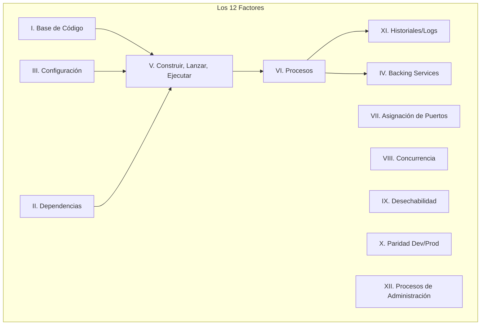

# The 12-Factor App en Go

La metodología **12-Factor App** es el estándar de oro para construir aplicaciones Software-as-a-Service (SaaS) modernas y escalables. Se enfoca en la portabilidad, resiliencia y automatización. Aunque fue escrita originalmente para Heroku, estos principios son la base del desarrollo Cloud Native (Kubernetes, Docker, Serverless).

## Prerrequisitos

- Entendimiento básico de **Go Modules** y servidores `http`.
- Ojo clínico para **Docker** y variables de entorno.
- Concepto de despliegues (Dev vs. Prod).

## Conceptos Clave

- **Portabilidad**: La app funciona donde sea (laptop, AWS, Azure) sin cambios de código.
- **Escalabilidad**: Se escala agregando más procesos, no haciendo un proceso más grande (horizontal vs vertical).
- **Paridad**: El entorno de desarrollo es un espejo del de producción.

## Explicación Visual



## Implementación Práctica

### I. Base de Código (Codebase)

**Un código base rastreado en control de versiones, muchos despliegues.**

- **Principio**: Un Repo Git = Una App.
- **Go**: Tu `go.mod` define los límites del módulo.
- **Anti-patrón**: Monorepos *pueden* estar bien si se gestionan correctamente, pero compartir código via copy-paste es terrible. Varias apps compartiendo el mismo repo sin separación clara es una violación.

### II. Dependencias

**Declara y aísla explícitamente las dependencias.**

- **Principio**: Nunca asumas que una librería existe en el servidor.
- **Go**: `go.mod` y `go.sum` bloquean tus dependencias exactas.
- **Docker**: El `Dockerfile` declara dependencias a nivel sistema (como `ca-certificates` o `libc`).

```dockerfile
# Dockerfile declara explícitamente el SO y la versión de Go
FROM golang:1.22-alpine
WORKDIR /app
COPY go.mod go.sum ./
RUN go mod download
```

### III. Configuración

**Guarda la configuración en el entorno.**

- **Principio**: Credenciales y URLs varían entre despliegues (Dev, Staging, Prod); el código no.
- **Go**: Usa `os.Getenv` o librerías como `godotenv` / `viper`.

```go
// Mal: Hardcoded
// dbUrl := "user:pass@tcp(localhost:3306)/db"

// Bien: Desde Variables de Entorno
dbUrl := os.Getenv("DB_URL")
if dbUrl == "" {
    log.Fatal("DB_URL is required") // Fail fast (Falla rápido)
}
```

### IV. Backing Services

**Trata los servicios de apoyo como recursos adjuntos.**

- **Principio**: Una base de datos es una URL. Cambiar de MySQL local a AWS RDS debe ser estrictamente un cambio de configuración.
- **Go**: Pasa la cadena de conexión a tu lógica de aplicación. Nunca acoples tu app a una ruta de archivo local específica o ID de instancia.

### V. Construir, Lanzar, Ejecutar (Build, Release, Run)

**Separa estrictamente las etapas de construcción y ejecución.**

- **Build**: Código + Dependencias = Binario/Imagen (Inmutable).
- **Release**: Build + Configuración = Release Ejecutable.
- **Run**: Ejecución del release en el entorno.
- **Práctica**: Verificas el artefacto de *Build*. No parchas código en el servidor de producción ("hot fixing" archivos en vivo).

### VI. Procesos

**Ejecuta la app como uno o más procesos sin estado (stateless).**

- **Principio**: Las sesiones "sticky" son del diablo. Asume que el servidor puede reiniciar/morir en cualquier momento.
- **Go**: Guarda datos de sesión en Redis, no en un mapa/variable global.

```go
// Mal: Estado Local
var sessionCache = make(map[string]string) 

// Bien: Estado Externo
func setSession(key, val string) {
    redisClient.Set(ctx, key, val, 0)
}
```

### VII. Asignación de Puertos (Port Binding)

**Exporta servicios mediante asignación de puertos.**

- **Principio**: La app maneja su propio servidor web, no un contenedor externo (como Tomcat/PHP-FPM).
- **Go**: `net/http` en Go es perfecto para esto.

```go
// La app escucha en un puerto definido por el entorno
port := os.Getenv("PORT")
if port == "" {
    port = "8080"
}
log.Fatal(http.ListenAndServe(":"+port, nil))
```

### VIII. Concurrencia

**Escala mediante el modelo de procesos.**

- **Principio**: Escala agregando más copias (réplicas) de tu proceso, no haciendo que el proceso use más hilos (aunque Go maneja concurrencia genial, el escalado horizontal es superior para fiabilidad).
- **Práctica**: `kubectl scale deployment my-app --replicas=3`.

### IX. Desechabilidad (Disposability)

**Maximiza la robustez con inicios rápidos y cierres limpios.**

- **Principio**: Los procesos deben ser efímeros.
- **Go**: Maneja `SIGTERM` / `SIGINT` para cerrar conexiones limpiamente.

```go
// Snippet de Graceful Shutdown
c := make(chan os.Signal, 1)
signal.Notify(c, os.Interrupt, syscall.SIGTERM)
<-c // Bloquear hasta señal
// ... cerrar conexiones a DB ...
os.Exit(0)
```

### X. Paridad Dev/Prod

**Mantén desarrollo, staging y producción lo más parecidos posible.**

- **Principio**: No uses SQLite en MacOS (dev) y PostgreSQL en Linux (prod).
- **Herramientas**: Usa Docker Compose localmente para levantar la versión *exacta* de Postgres que usas en producción.

### XI. Historiales (Logs)

**Trata los historiales como flujos de eventos.**

- **Principio**: Las apps no deben gestionar archivos de log. Escribe a `stdout`.
- **Go**: `log.Println` o `slog`.
- **Infraestructura**: Deja que Docker/K8s capture `stdout` y lo mande a Splunk/Datadog.

```go
// Bien
log.Printf("Request received path=%s", r.URL.Path)

// Mal
f, _ := os.OpenFile("app.log", ...)
f.Write([]byte("Request received"))
```

### XII. Procesos de Administración

**Ejecuta las tareas de gestión/administración como procesos que se ejecutan una sola vez.**

- **Principio**: Migraciones de BD deben usar el mismo código/imagen que la app.
- **Práctica**: Ejecuta `docker run my-image ./migrate-db` en lugar de entrar por SSH al servidor y correr SQL manual.

## Trade-offs (Compromisos)

| Factor | Pros | Contras |
| :--- | :--- | :--- |
| **Config (Env vars)** | Seguridad, Flexibilidad | Formatear configs complejas (JSON/YAML) en variables de entorno es molesto |
| **Backing Services** | Desacoplamiento, migración fácil | Latencia de red vs socket local |
| **Procesos Stateless** | Escalado infinito, Deploys sin downtime | Requiere almacén de estado externo (costo/complejidad de Redis) |
| **Desechabilidad** | Resiliencia, recuperación rápida | Requiere código cuidadoso para el cierre limpio (graceful shutdown) |

## Siguientes Pasos

- **Containerizar una App Go**: Escribe un `Dockerfile` siguiendo estos principios.
- **Orquestación**: Aprende cómo **Kubernetes** impone muchos de estos factores (Pods, Services).
- **Observabilidad**: Investiga **OpenTelemetry** para rastreo (tracing) en estos sistemas distribuidos.

## Tags

# 12-factor #arquitectura #devops #cloud-native #mejores-practicas #golang
