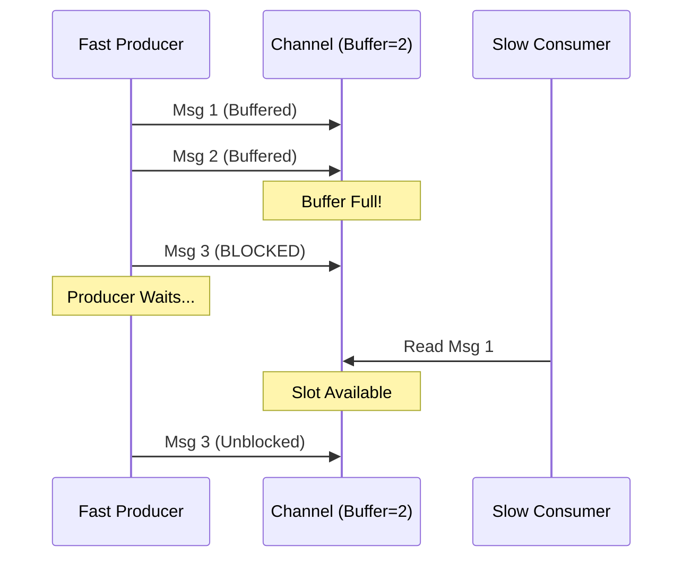

# Backpressure in Go

Backpressure prevents a fast producer from overwhelming a slow consumer by controlling data flow. In Go, use buffered channels and `select` to signal or block when buffers fill, forcing the producer to wait.

## Prerequisites

- Understanding of Go goroutines and channels.
- Familiarity with the `select` statement.

## Key Concepts

- **Producer**: Sends data to a channel.
- **Consumer**: Reads from the channel.
- **Backpressure**: Occurs when channel buffer fills; sender blocks, slowing production.
- **Buffered Channels**: Channels with capacity that buffer values before blocking.

## Visual Explanation



## Practical Implementation

### Blocking Backpressure (Natural)

The simplest form of backpressure relies on channel blocking.

```go
package main

import "time"

func main() {
    // Buffer size 2: Allows small bursts
    ch := make(chan int, 2)

    // Fast Producer
    go func() {
        for i := 0; i < 10; i++ {
            ch <- i // BLOCKS here if buffer is full
            println("Sent:", i)
        }
        close(ch)
    }()

    // Slow Consumer
    for msg := range ch {
        time.Sleep(100 * time.Millisecond) // Simulate work
        println("Processed:", msg)
    }
}
```

### Non-Blocking Backpressure (Dropping/Signaling)

Use `select` with `default` to handle overflow explicitly (e.g., drop messages or return error).

```go
func trySend(ch chan int, val int) bool {
    select {
    case ch <- val:
        return true // Sent successfully
    default:
        return false // Buffer full, drop or handle error
    }
}
```

## Trade-offs

| Approach | Pros | Cons |
| :--- | :--- | :--- |
| **Blocking (Standard)** | • Simple implementation<br>• Guarantees data processing<br>• Natural throttling | • Can deadlock if not careful<br>• Slows down entire upstream chain |
| **Dropping (Select)** | • Protects producer latency<br>• System stays responsive | • Data loss<br>• Needs retry logic or fallback |
| **Unbuffered Channel** | • Strongest synchronization<br>• Instant backpressure | • Zero burst tolerance<br>• High coupling between producer/consumer speed |

## Real-world Scenario

**Log Processing Pipeline**:
- **Producer**: Reads logs from disk (Fast).
- **Consumer**: Uploads logs to S3 (Slow).
- **Mechanism**: Buffered channel of size 100.
- **Result**: If S3 is slow, the buffer fills, and the disk reader pauses. This prevents the application from running out of memory by queuing millions of logs in RAM.

## Next Steps

- Explore **Exponential Backoff** for handling retries when backpressure leads to errors.
- Learn about **Rate Limiting** (Token Bucket) for more fine-grained control.

## Tags

#golang #concurrency #channels #performance #system-design