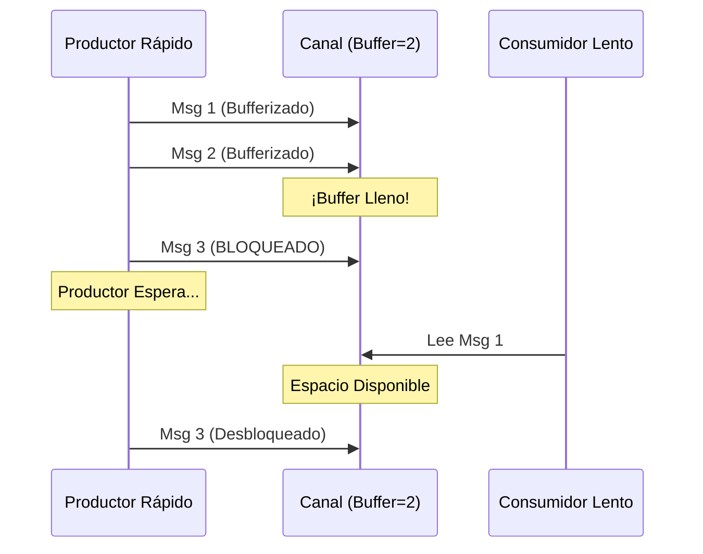

# Contrapresión (Backpressure) en Go

La contrapresión previene que un productor rápido abrume a un consumidor lento controlando el flujo de datos. En Go, usa canales bufferizados y `select` para señalizar o bloquear cuando los búferes se llenan, forzando al productor a esperar.

## Prerrequisitos

- Entendimiento de goroutines y canales en Go.
- Familiaridad con la sentencia `select`.

## Conceptos Clave

- **Productor**: Envía datos a un canal.
- **Consumidor**: Lee del canal.
- **Contrapresión**: Ocurre cuando el búfer del canal se llena; el envío se bloquea, ralentizando la producción.
- **Canales Bufferizados**: Canales con capacidad que almacenan valores antes de bloquear.

## Explicación Visual



## Implementación Práctica

### Contrapresión Bloqueante (Natural)

La forma más simple de contrapresión depende del bloqueo de canales.

```go
package main

import "time"

func main() {
    // Tamaño buffer 2: Permite pequeñas ráfagas
    ch := make(chan int, 2)

    // Productor Rápido
    go func() {
        for i := 0; i < 10; i++ {
            ch <- i // SE BLOQUEA aquí si el buffer está lleno
            println("Enviado:", i)
        }
        close(ch)
    }()

    // Consumidor Lento
    for msg := range ch {
        time.Sleep(100 * time.Millisecond) // Simular trabajo
        println("Procesado:", msg)
    }
}
```

### Contrapresión No-Bloqueante (Descartar/Señalizar)

Usa `select` con `default` para manejar el desbordamiento explícitamente (ej. descartar mensajes o retornar error).

```go
func trySend(ch chan int, val int) bool {
    select {
    case ch <- val:
        return true // Enviado exitosamente
    default:
        return false // Buffer lleno, descartar o manejar error
    }
}
```

## Trade-offs

| Enfoque | Pros | Contras |
| :--- | :--- | :--- |
| **Bloqueo (Estándar)** | • Implementación simple• Garantiza procesamiento• Throttling natural | • Puede causar deadlocks si no se cuida• Ralentiza toda la cadena upstream |
| **Descarte (Select)** | • Protege latencia del productor• Sistema permanece responsivo | • Pérdida de datos• Requiere lógica de reintento o fallback |
| **Canal Sin Buffer** | • Sincronización más fuerte• Contrapresión instantánea | • Cero tolerancia a ráfagas• Alto acoplamiento de velocidad |

## Escenario del Mundo Real

**Pipeline de Procesamiento de Logs**:

- **Productor**: Lee logs del disco (Rápido).
- **Consumidor**: Sube logs a S3 (Lento).
- **Mecanismo**: Canal bufferizado de tamaño 100.
- **Resultado**: Si S3 es lento, el buffer se llena y el lector de disco se pausa. Esto previene que la aplicación se quede sin memoria por encolar millones de logs en RAM.

## Siguientes Pasos

- Explorar **Exponential Backoff** para manejar reintentos cuando la contrapresión lleva a errores.
- Aprender sobre **Rate Limiting** (Token Bucket) para control más fino.

## Etiquetas

golang #concurrency #channels #performance #system-design
