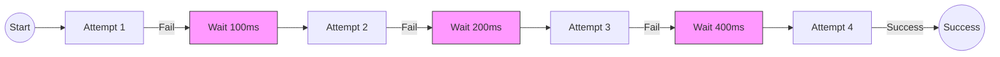

# Exponential Backoff in Go

Exponential backoff is a retry strategy that progressively increases wait time between retries to reduce system load. Essential for handling transient failures in distributed systems, especially when multiple clients retry simultaneously.

## Prerequisites

- Basic understanding of distributed systems and network failures.
- Familiarity with Go's `time` package and loops.

## Key Concepts

- **Initial Delay**: Starting wait time (e.g., 100ms).
- **Multiplier**: Exponential factor per retry (typically 2x).
- **Maximum Delay**: Cap to prevent waiting too long (e.g., 10s).
- **Jitter**: Random variation (±10-20%) to prevent synchronized retries (Thundering Herd).
- **Maximum Retries**: Attempt limit (e.g., 5 tries).

## Visual Explanation



## Practical Implementation

### Simple Backoff with Jitter

```go
package main

import (
    "math/rand"
    "time"
)

func retryOperation() error {
    maxRetries := 5
    baseDelay := 100 * time.Millisecond
    maxDelay := 2 * time.Second

    for i := 0; i < maxRetries; i++ {
        err := doWork()
        if err == nil {
            return nil // Success
        }

        // Calculate delay: base * 2^i
        delay := baseDelay * time.Duration(1<<i)
        if delay > maxDelay {
            delay = maxDelay
        }

        // Add Jitter: ±10%
        jitter := time.Duration(rand.Int63n(int64(delay/10)))
        sleepTime := delay + jitter

        time.Sleep(sleepTime)
    }
    return fmt.Errorf("operation failed after %d attempts", maxRetries)
}

func doWork() error {
    // Simulate work
    return nil
}
```

## Trade-offs

| Strategy | Pros | Cons |
| :--- | :--- | :--- |
| **Immediate Retry** | • Fastest recovery for very brief glitches | • Can overwhelm system (Thundering Herd)<br>• Wastes resources |
| **Fixed Interval** | • Simple to implement<br>• Predictable | • Not responsive enough for short outages<br>• Too aggressive for long outages |
| **Exponential Backoff** | • Balances recovery speed and system load<br>• Prevents cascading failures | • Slightly more complex logic<br>• Latency increases with failure duration |

## Real-world Parameters

| Scenario | Base | Multiplier | Max | Retries | Jitter |
| :--- | :--- | :--- | :--- | :--- | :--- |
| **API Client** | 100ms | 2x | 10s | 5 | ±10% |
| **Database** | 50ms | 2x | 5s | 7 | ±15% |
| **Batch Job** | 1s | 2x | 60s | 6 | ±5% |

## Next Steps

- Combine with **Circuit Breaker** pattern to stop retrying when the system is down.
- Explore **Idempotency** to ensure retries don't cause side effects (e.g., double payments).

## Tags

#golang #reliability #distributed-systems #retry-strategy #resilience