# Backoff Exponencial en Go

El backoff exponencial es una estrategia de reintento que aumenta progresivamente el tiempo de espera entre reintentos para reducir carga del sistema. Esencial para manejar fallos transitorios en sistemas distribuidos, especialmente cuando múltiples clientes reintentan simultáneamente.

## Prerrequisitos

- Entendimiento básico de sistemas distribuidos y fallos de red.
- Familiaridad con el paquete `time` de Go y bucles.

## Conceptos Clave

- **Retraso Inicial**: Tiempo de espera inicial (ej: 100ms).
- **Multiplicador**: Factor exponencial por reintento (típicamente 2x).
- **Retraso Máximo**: Límite para no esperar demasiado (ej: 10s).
- **Jitter**: Variación aleatoria (±10-20%) para prevenir reintentos sincronizados (Manada Atronadora).
- **Máximos Reintentos**: Límite de intentos (ej: 5 intentos).

## Explicación Visual

```mermaid
graph LR
    Start((Inicio)) --> Attempt1[Intento 1]
    Attempt1 -->|Fallo| Wait1[Espera 100ms]
    Wait1 --> Attempt2[Intento 2]
    Attempt2 -->|Fallo| Wait2[Espera 200ms]
    Wait2 --> Attempt3[Intento 3]
    Attempt3 -->|Fallo| Wait3[Espera 400ms]
    Wait3 --> Attempt4[Intento 4]
    Attempt4 -->|Éxito| End((Éxito))
    
    style Wait1 fill:#f9f,stroke:#333
    style Wait2 fill:#f9f,stroke:#333
    style Wait3 fill:#f9f,stroke:#333
```



## Implementación Práctica

### Backoff Simple con Jitter

```go
package main

import (
    "math/rand"
    "time"
)

func retryOperation() error {
    maxRetries := 5
    baseDelay := 100 * time.Millisecond
    maxDelay := 2 * time.Second

    for i := 0; i < maxRetries; i++ {
        err := doWork()
        if err == nil {
            return nil // Éxito
        }

        // Calcular retraso: base * 2^i
        delay := baseDelay * time.Duration(1<<i)
        if delay > maxDelay {
            delay = maxDelay
        }

        // Agregar Jitter: ±10%
        jitter := time.Duration(rand.Int63n(int64(delay/10)))
        sleepTime := delay + jitter

        time.Sleep(sleepTime)
    }
    return fmt.Errorf("operación falló después de %d intentos", maxRetries)
}

func doWork() error {
    // Simular trabajo
    return nil
}
```

## Trade-offs

| Estrategia | Pros | Contras |
| :--- | :--- | :--- |
| **Reintento Inmediato** | • Recuperación más rápida para fallos breves | • Puede abrumar el sistema (Manada Atronadora)<br>• Desperdicia recursos |
| **Intervalo Fijo** | • Simple de implementar<br>• Predecible | • No es responsivo para cortes cortos<br>• Muy agresivo para cortes largos |
| **Backoff Exponencial** | • Balancea velocidad de recuperación y carga<br>• Previene fallos en cascada | • Lógica ligeramente más compleja<br>• Latencia aumenta con duración del fallo |

## Parámetros del Mundo Real

| Escenario | Base | Multiplicador | Máx | Reintentos | Jitter |
| :--- | :--- | :--- | :--- | :--- | :--- |
| **Cliente API** | 100ms | 2x | 10s | 5 | ±10% |
| **Base de Datos** | 50ms | 2x | 5s | 7 | ±15% |
| **Trabajo Batch** | 1s | 2x | 60s | 6 | ±5% |

## Siguientes Pasos

- Combinar con el patrón **Circuit Breaker** para dejar de reintentar cuando el sistema está caído.
- Explorar **Idempotencia** para asegurar que los reintentos no causen efectos secundarios (ej: pagos dobles).

## Etiquetas

#golang #reliability #distributed-systems #retry-strategy #resilience
