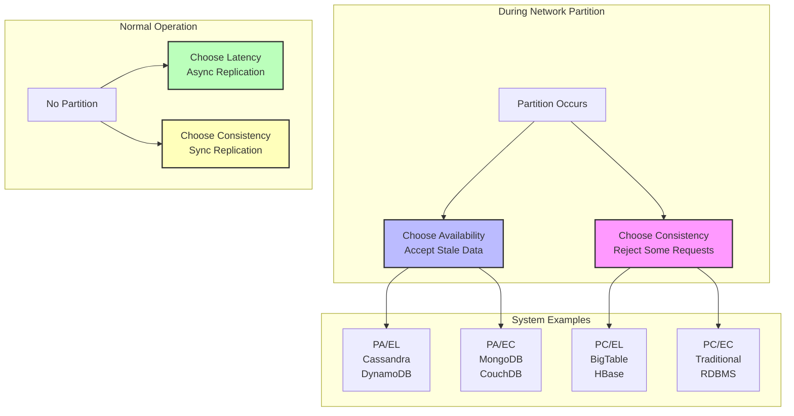

# PACELC Theorem in Distributed Systems

The PACELC theorem extends CAP by addressing a critical limitation: what happens during normal operation when networks aren't partitioned? PACELC provides a complete design framework for both failure and normal conditions.

## PACELC Formula

**"If network Partition (P): choose Availability (A) or Consistency (C). Else (E) in normal operation: choose Latency (L) or Consistency (C)."**

## Key Concepts

### During Partitions (PAC)

- **Partition (P)**: Network failures or message loss between nodes
- **Availability (A)**: The system responds to every request, even during failures
- **Consistency (C)**: All nodes see the same data at the same time

### During Normal Operation (ELC)

- **Else (E)**: Normal operation without network partitions
- **Latency (L)**: Fast response times for read/write operations
- **Consistency (C)**: Strong consistency guarantees even during normal operation

## PACELC Trade-offs Matrix

The PACELC theorem creates a two-dimensional decision matrix for distributed systems:

| System Classification | During Partition | Normal Operation | Examples |
|----------------------|------------------|------------------|-----------|
| **PA/EL** | Prefers Availability | Prefers Latency | Cassandra, Dynamo, Voldemort |
| **PA/EC** | Prefers Availability | Prefers Consistency | MongoDB (default), CouchDB |
| **PC/EL** | Prefers Consistency | Prefers Latency | BigTable, HBase, VoltDB |
| **PC/EC** | Prefers Consistency | Prefers Consistency | Traditional ACID databases |

## PACELC Visual Framework

## System Design Examples

| System Type | Examples | Prioritizes | Use Cases |
|-------------|----------|-------------|-----------|
| **PA/EL** | Cassandra, DynamoDB | Availability & Latency | Social media, content delivery |
| **PA/EC** | MongoDB (default) | Availability during partition, Consistency during normal operation | Web applications |
| **PC/EL** | BigTable, HBase | Consistency during partition, Latency during normal operation | Analytics systems |
| **PC/EC** | Traditional RDBMS | Strong Consistency | Banking, financial systems |

## Real-world PACELC Examples

### 1. Cassandra (PA/EL)

- **During Partitions**: Chooses availability - accepts writes on all reachable nodes
- **Normal Operation**: Chooses latency - uses asynchronous replication
- **Trade-off**: Eventually consistent, but highly available and fast
- **Use Case**: Social media feeds, IoT data collection

### 2. MongoDB (PA/EC)

- **During Partitions**: Chooses availability - allows reads from secondaries
- **Normal Operation**: Chooses consistency - waits for majority write acknowledgment
- **Trade-off**: Balanced approach with tunable consistency
- **Use Case**: Web applications requiring some consistency guarantees

### 3. Google Spanner (PC/EC)

- **During Partitions**: Chooses consistency - rejects operations if quorum unavailable
- **Normal Operation**: Chooses consistency - synchronous replication with TrueTime
- **Trade-off**: Strong consistency but potential unavailability during partitions
- **Use Case**: Global financial systems, critical data requiring ACID properties

## Real-world Implementation Patterns

### 1. PA/EL Systems (High Availability & Low Latency)

- **Pattern**: Eventual consistency with asynchronous replication
- **Behavior**: Accepts all operations, resolves conflicts later
- **Trade-off**: Fastest performance but temporary inconsistency
- **Example**: Social media platforms where users can post even during network issues

### 2. PA/EC Systems (Availability with Strong Normal Consistency)

- **Pattern**: Tunable consistency levels
- **Behavior**: Maintains availability during partitions but enforces consistency when possible
- **Trade-off**: Balanced approach with configurable guarantees
- **Example**: Web applications that need some consistency but cannot afford downtime

### 3. PC/EL Systems (Strong Partition Consistency, Fast Normal Operation)

- **Pattern**: Consensus protocols with optimized normal-case performance
- **Behavior**: Rejects operations during partitions but optimizes for speed otherwise
- **Trade-off**: Fast reads/writes when healthy, unavailable during network splits
- **Example**: Analytics systems that prioritize data accuracy over continuous availability

### 4. PC/EC Systems (Strong Consistency Always)

- **Pattern**: Synchronous replication and consensus
- **Behavior**: Ensures strong consistency at all times
- **Trade-off**: Highest consistency guarantees but potential unavailability and higher latency
- **Example**: Banking systems where accuracy is critical

## PACELC Decision Framework

When designing a distributed system, ask these questions:

### During Network Partitions

1. **Can your application tolerate stale data?**
   - Yes → Choose Availability (PA)
   - No → Choose Consistency (PC)

### During Normal Operation

2. **What matters more for user experience?**
   - Fast response times → Choose Latency (EL)
   - Always accurate data → Choose Consistency (EC)

### Business Context

3. **What are the consequences of inconsistency?**
   - Minor inconvenience → PA/EL
   - Financial loss → PC/EC
   - Mixed requirements → PA/EC or PC/EL

## System Design Considerations

When applying PACELC theorem to your architecture:

- **Data Criticality**: How important is it that all nodes have identical data?
- **User Expectations**: Do users expect instant responses or accurate information?
- **Geographic Distribution**: Are your users and servers spread across continents?
- **Failure Recovery**: How quickly can your system detect and recover from partitions?
- **Operational Complexity**: Can your team manage eventual consistency conflicts?

## PACELC vs CAP: Key Differences

| Aspect | CAP Theorem | PACELC Theorem |
|--------|-------------|----------------|
| **Scope** | Only during network partitions | Both partitions and normal operation |
| **Focus** | Availability vs Consistency | Adds Latency vs Consistency trade-off |
| **Completeness** | Partial view of system behavior | Comprehensive framework |
| **Design Guidance** | Limited to failure scenarios | Covers entire system lifecycle |

## Conclusion

The PACELC theorem provides a more complete framework for understanding distributed system trade-offs than CAP alone. By considering both partition scenarios and normal operation, it helps architects make informed decisions about:

- **Replication strategies**: Synchronous vs asynchronous
- **Consistency models**: Strong, eventual, or tunable
- **Performance characteristics**: Optimizing for latency or consistency
- **Failure handling**: How to behave during network partitions

Remember: There is no "best" choice—only the most appropriate trade-off for your specific use case and business requirements.