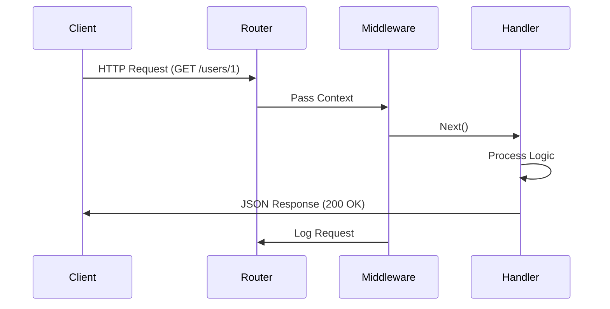

# REST API with Gin in Go

Gin is a high-performance HTTP web framework for Go, ideal for building REST APIs with minimal boilerplate. It provides routing, middleware, JSON binding, and error handling out of the box.

## Prerequisites

- Basic knowledge of Go syntax and structs.
- Understanding of HTTP methods (GET, POST, PUT, DELETE) and status codes.
- Go installed on your machine.

## Key Concepts

- **Router**: Maps HTTP methods to handlers.
- **Context (`*gin.Context`)**: Holds request data, response writer, and middleware chain.
- **Binding**: Automatic JSON parsing and validation.
- **Middleware**: Functions that run before/after handlers (e.g., Logger, Auth).

## Visual Explanation



## Practical Implementation

### Basic CRUD API

```go
package main

import (
    "net/http"
    "github.com/gin-gonic/gin"
)

type User struct {
    ID    string `json:"id"`
    Name  string `json:"name" binding:"required"`
    Email string `json:"email" binding:"required,email"`
}

func main() {
    r := gin.Default() // Includes Logger and Recovery middleware

    r.GET("/users/:id", func(c *gin.Context) {
        id := c.Param("id")
        c.JSON(http.StatusOK, gin.H{"id": id, "name": "John Doe"})
    })

    r.POST("/users", func(c *gin.Context) {
        var user User
        // BindJSON validates the request body
        if err := c.ShouldBindJSON(&user); err != nil {
            c.JSON(http.StatusBadRequest, gin.H{"error": err.Error()})
            return
        }
        c.JSON(http.StatusCreated, user)
    })

    r.Run(":8080")
}
```

## Middleware Pattern

Middleware allows you to intercept requests.

```go
func AuthMiddleware() gin.HandlerFunc {
    return func(c *gin.Context) {
        token := c.GetHeader("Authorization")
        if token != "secret-token" {
            c.AbortWithStatusJSON(http.StatusUnauthorized, gin.H{"error": "unauthorized"})
            return
        }
        c.Next() // Proceed to next handler
    }
}

// Usage
r.GET("/admin", AuthMiddleware(), adminHandler)
```

## Trade-offs

| Feature | Gin | Standard Library (`net/http`) |
| :--- | :--- | :--- |
| **Routing** | Fast, feature-rich (params, groups) | Basic (requires Go 1.22+ for better routing) |
| **Middleware** | Built-in chain support | Manual chaining required |
| **Validation** | Built-in struct tags binding | Manual parsing and validation |
| **Performance** | Extremely high (Radix tree) | High |
| **Dependency** | External dependency | No dependencies |

## Next Steps

- Learn about **Dependency Injection** to inject services into your handlers.
- Explore **Swagger/OpenAPI** integration for API documentation (swaggo/gin-swagger).

## Tags

#golang #web-development #rest-api #gin-framework #backend
