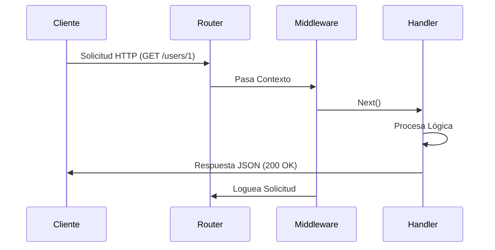

# API REST con Gin en Go

Gin es un framework web HTTP de alto rendimiento para Go, ideal para construir APIs REST con mínimo código repetitivo. Proporciona routing, middleware, binding JSON, y manejo de errores lista para usar.

## Prerrequisitos

- Conocimiento básico de sintaxis Go y structs.
- Entendimiento de métodos HTTP (GET, POST, PUT, DELETE) y códigos de estado.
- Go instalado en tu máquina.

## Conceptos Clave

- **Router**: Mapea métodos HTTP a handlers.
- **Contexto (`*gin.Context`)**: Mantiene datos de solicitud, escritor de respuesta y cadena de middleware.
- **Binding**: Parsing y validación automática de JSON.
- **Middleware**: Funciones que se ejecutan antes/después de handlers (ej: Logger, Auth).

## Explicación Visual



## Implementación Práctica

### API CRUD Básica

```go
package main

import (
    "net/http"
    "github.com/gin-gonic/gin"
)

type User struct {
    ID    string `json:"id"`
    Name  string `json:"name" binding:"required"`
    Email string `json:"email" binding:"required,email"`
}

func main() {
    r := gin.Default() // Incluye middleware Logger y Recovery

    r.GET("/users/:id", func(c *gin.Context) {
        id := c.Param("id")
        c.JSON(http.StatusOK, gin.H{"id": id, "name": "Juan Perez"})
    })

    r.POST("/users", func(c *gin.Context) {
        var user User
        // BindJSON valida el cuerpo de la solicitud
        if err := c.ShouldBindJSON(&user); err != nil {
            c.JSON(http.StatusBadRequest, gin.H{"error": err.Error()})
            return
        }
        c.JSON(http.StatusCreated, user)
    })

    r.Run(":8080")
}
```

## Patrón de Middleware

El middleware te permite interceptar solicitudes.

```go
func AuthMiddleware() gin.HandlerFunc {
    return func(c *gin.Context) {
        token := c.GetHeader("Authorization")
        if token != "secret-token" {
            c.AbortWithStatusJSON(http.StatusUnauthorized, gin.H{"error": "no autorizado"})
            return
        }
        c.Next() // Proceder al siguiente handler
    }
}

// Uso
r.GET("/admin", AuthMiddleware(), adminHandler)
```

## Trade-offs

| Característica | Gin | Librería Estándar (`net/http`) |
| :--- | :--- | :--- |
| **Routing** | Rápido, rico en features (params, grupos) | Básico (requiere Go 1.22+ para mejor routing) |
| **Middleware** | Soporte de cadena nativo | Requiere encadenamiento manual |
| **Validación** | Binding con struct tags nativo | Parsing y validación manual |
| **Rendimiento** | Extremadamente alto (Radix tree) | Alto |
| **Dependencia** | Dependencia externa | Sin dependencias |

## Siguientes Pasos

- Aprender sobre **Inyección de Dependencias** para inyectar servicios en tus handlers.
- Explorar integración con **Swagger/OpenAPI** para documentación de API (swaggo/gin-swagger).

## Etiquetas

#golang #web-development #rest-api #gin-framework #backend
