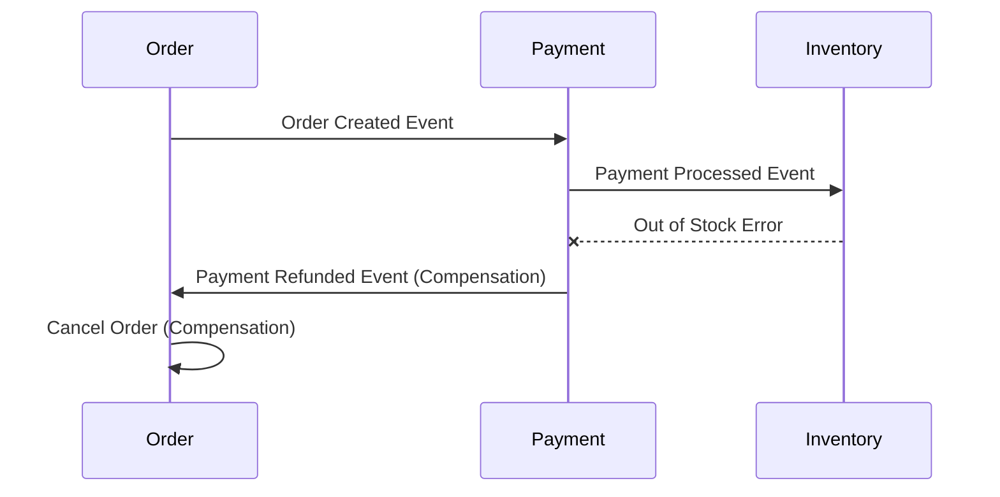
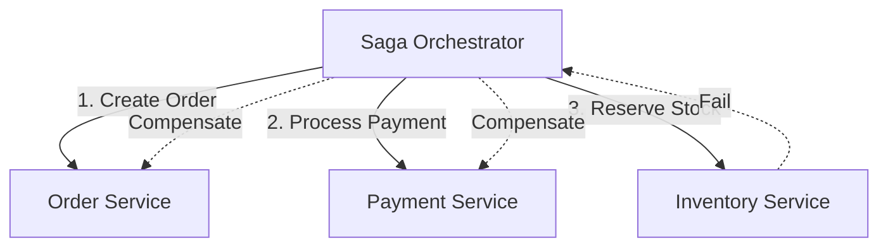

# Saga Pattern in Microservices

The Saga pattern helps maintain data consistency across multiple services in a distributed transaction without tight coupling. It breaks a distributed transaction into a sequence of local transactions, with each service publishing events or being coordinated by a central orchestrator.

## Prerequisites

- Understanding of Microservices architecture.
- Basic knowledge of database transactions (ACID).
- Familiarity with Event-Driven Architecture.

## Key Concepts

- **Distributed Transaction**: Operation spanning multiple services.
- **Compensating Transaction**: Reverses the effects of a failed step (Undo).
- **Choreography**: Decentralized coordination via events.
- **Orchestration**: Centralized coordination via a controller.

## Visual Explanation

### Choreography (Event-Driven)



### Orchestration (Command-Driven)



## Practical Implementation

### Orchestrator Example (Go)

```go
package main

// Saga Orchestrator logic
func ProcessOrderSaga(order Order) error {
    // Step 1: Create Order
    if err := services.Order.Create(order); err != nil {
        return err // No compensation needed yet
    }

    // Step 2: Payment
    if err := services.Payment.Charge(order); err != nil {
        services.Order.Cancel(order) // Compensate Step 1
        return err
    }

    // Step 3: Inventory
    if err := services.Inventory.Reserve(order); err != nil {
        services.Payment.Refund(order) // Compensate Step 2
        services.Order.Cancel(order)   // Compensate Step 1
        return err
    }

    return nil // Success
}
```

## Comparison Table

| Feature | Choreography | Orchestration |
| :--- | :--- | :--- |
| **Coupling** | Low (Decoupled) | Higher (Centralized) |
| **Complexity** | Harder to track flow | Easier to track flow |
| **Scalability** | High | Orchestrator can be bottleneck |
| **Best For** | Simple flows, few services | Complex flows, many steps |
| **Failure Handling** | Distributed logic | Centralized logic |

## Real-world Scenario

**Booking a Trip**:
1.  **Book Flight** (Success)
2.  **Book Hotel** (Success)
3.  **Book Car** (Fail - No cars available)
4.  **Compensate Hotel** (Cancel booking)
5.  **Compensate Flight** (Cancel booking)

## Next Steps

- Learn about **Two-Phase Commit (2PC)** and why Sagas are preferred in microservices.
- Explore **Outbox Pattern** for reliable event publishing.

## Tags

#microservices #distributed-systems #saga-pattern #transactions #architecture
