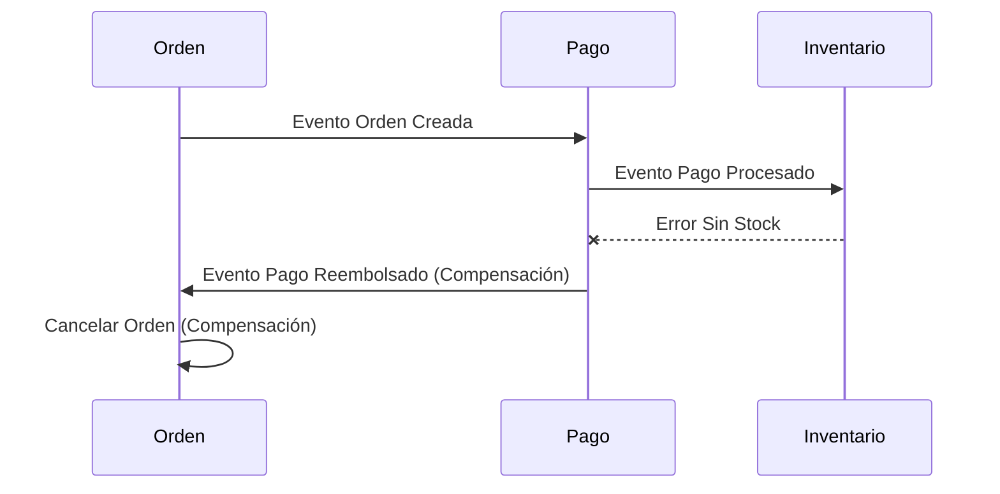
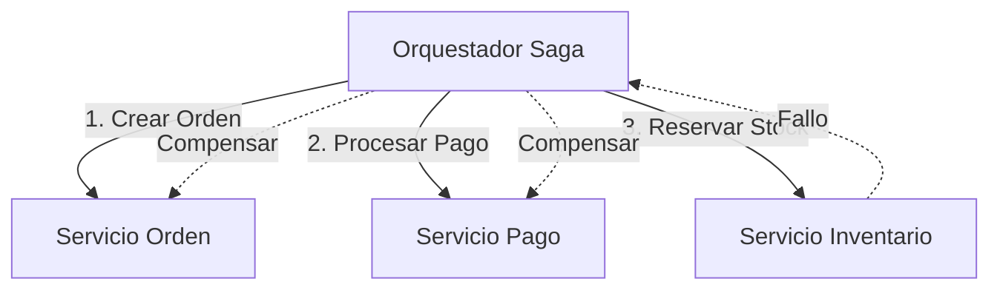

# Patrón Saga en Microservicios

El patrón Saga mantiene consistencia de datos entre múltiples servicios en transacciones distribuidas sin acoplamiento fuerte. Divide transacciones distribuidas en secuencias de transacciones locales con acciones compensatorias para fallos.

## Prerrequisitos

- Entendimiento de arquitectura de Microservicios.
- Conocimiento básico de transacciones de bases de datos (ACID).
- Familiaridad con Arquitectura Orientada a Eventos.

## Conceptos Clave

- **Transacción Distribuida**: Operación que abarca múltiples servicios.
- **Transacción Compensatoria**: Revierte los efectos de un paso fallido (Deshacer).
- **Coreografía**: Coordinación descentralizada vía eventos.
- **Orquestación**: Coordinación centralizada vía un controlador.

## Explicación Visual

### Coreografía (Event-Driven)



### Orquestación (Command-Driven)



## Implementación Práctica

### Ejemplo de Orquestador (Go)

```go
package main

// Lógica del Orquestador Saga
func ProcessOrderSaga(order Order) error {
    // Paso 1: Crear Orden
    if err := services.Order.Create(order); err != nil {
        return err // No se necesita compensación aún
    }

    // Paso 2: Pago
    if err := services.Payment.Charge(order); err != nil {
        services.Order.Cancel(order) // Compensar Paso 1
        return err
    }

    // Paso 3: Inventario
    if err := services.Inventory.Reserve(order); err != nil {
        services.Payment.Refund(order) // Compensar Paso 2
        services.Order.Cancel(order)   // Compensar Paso 1
        return err
    }

    return nil // Éxito
}
```

## Tabla Comparativa

| Característica | Coreografía | Orquestación |
| :--- | :--- | :--- |
| **Acoplamiento** | Bajo (Desacoplado) | Más alto (Centralizado) |
| **Complejidad** | Difícil rastrear flujo | Fácil rastrear flujo |
| **Escalabilidad** | Alta | Orquestador puede ser cuello de botella |
| **Mejor Para** | Flujos simples, pocos servicios | Flujos complejos, muchos pasos |
| **Manejo de Fallos** | Lógica distribuida | Lógica centralizada |

## Escenario del Mundo Real

**Reservar un Viaje**:
1.  **Reservar Vuelo** (Éxito)
2.  **Reservar Hotel** (Éxito)
3.  **Reservar Auto** (Fallo - No hay autos disponibles)
4.  **Compensar Hotel** (Cancelar reserva)
5.  **Compensar Vuelo** (Cancelar reserva)

## Siguientes Pasos

- Aprender sobre **Two-Phase Commit (2PC)** y por qué las Sagas son preferidas en microservicios.
- Explorar **Outbox Pattern** para publicación confiable de eventos.

## Etiquetas

#microservices #distributed-systems #saga-pattern #transactions #architecture
