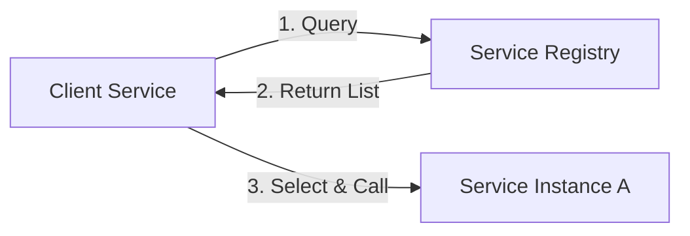
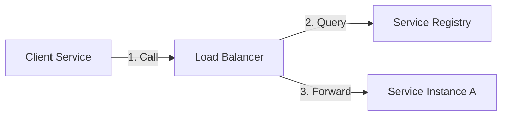

# Service Discovery in Microservices

Service discovery manages and exposes service locations, enabling microservices to locate and communicate with each other dynamically. It decouples service location from hardcoded addresses, enabling auto-scaling and resilience.

## Prerequisites

- Understanding of Microservices architecture.
- Basic knowledge of DNS and Load Balancing.
- Familiarity with containerization (Docker/Kubernetes) is helpful.

## Key Concepts

- **Service Registry**: Centralized catalog of available service instances (e.g., Consul, Etcd).
- **Registration**: Service registers itself on startup, deregisters on shutdown.
- **Health Checks**: Periodic probes to detect and remove unhealthy instances.
- **Client-side Discovery**: Clients query registry to find services.
- **Server-side Discovery**: Load balancer queries registry internally.

## Visual Explanation

### Client-Side Discovery



### Server-Side Discovery



## Practical Implementation

### Registration Pattern (Conceptual Go)

```go
// On Startup
func RegisterService() {
    serviceInfo := ServiceInfo{
        Name: "order-service",
        Address: "10.0.0.5",
        Port: 8080,
        HealthURL: "/health",
    }
    registryClient.Register(serviceInfo)
    
    // Start Heartbeat
    go func() {
        for {
            registryClient.SendHeartbeat(serviceInfo.ID)
            time.Sleep(5 * time.Second)
        }
    }()
}

// On Shutdown
func DeregisterService() {
    registryClient.Deregister(serviceInfo.ID)
}
```

## Comparison Matrix

| Feature | Client-Side Discovery | Server-Side Discovery |
| :--- | :--- | :--- |
| **Complexity** | High (Client logic needed) | Low (Handled by LB) |
| **Network Hops** | Fewer (Direct) | More (Through LB) |
| **Coupling** | Client coupled to Registry | Client decoupled |
| **Language Support** | Needs library per language | Language agnostic |
| **Example** | Netflix Eureka, Consul | Kubernetes Service, AWS ELB |

## Real-world Scenario

**Kubernetes (Server-Side)**:
- **Service**: Abstraction defining a logical set of Pods.
- **Kube-DNS**: Acts as the service registry.
- **Flow**: App A calls `http://app-b`. Kube-DNS resolves `app-b` to a ClusterIP (Virtual IP). The Kube-Proxy (Load Balancer) forwards traffic to a healthy Pod.

## Next Steps

- Learn about **Service Mesh** (Istio, Linkerd) which handles discovery and more (mTLS, tracing) transparently.
- Explore **Consul** for a platform-agnostic service registry.

## Tags

#microservices #service-discovery #kubernetes #distributed-systems #architecture