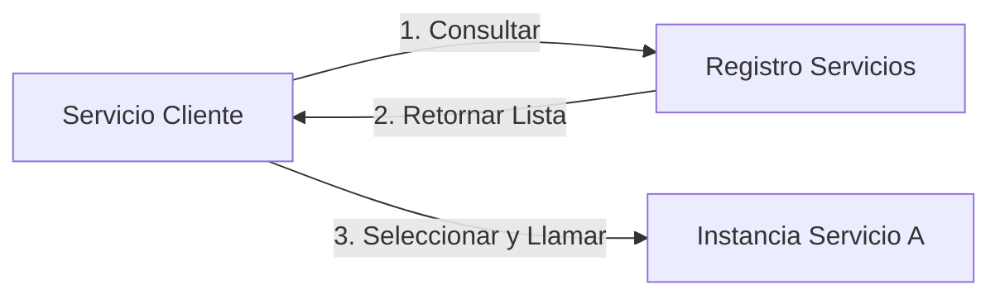
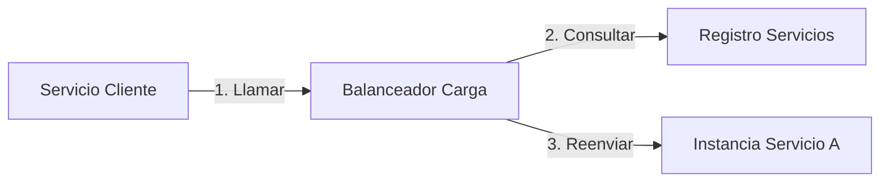

# Descubrimiento de Servicios en Microservicios

El descubrimiento de servicios gestiona y expone ubicaciones de servicios, permitiendo que los microservicios se localicen y comuniquen dinámicamente. Desvincula la ubicación del servicio de direcciones codificadas, habilitando auto-escalado y resiliencia.

## Prerrequisitos

- Entendimiento de arquitectura de Microservicios.
- Conocimiento básico de DNS y Balanceo de Carga.
- Familiaridad con contenerización (Docker/Kubernetes) es útil.

## Conceptos Clave

- **Registro de Servicios**: Catálogo centralizado de instancias de servicios disponibles (ej: Consul, Etcd).
- **Registro**: El servicio se registra al iniciar, se desregistra al apagar.
- **Chequeos de Salud**: Sondeos periódicos para detectar y remover instancias no saludables.
- **Descubrimiento del Lado del Cliente**: Los clientes consultan el registro para encontrar servicios.
- **Descubrimiento del Lado del Servidor**: El balanceador de carga consulta el registro internamente.

## Explicación Visual

### Descubrimiento del Lado del Cliente



### Descubrimiento del Lado del Servidor



## Implementación Práctica

### Patrón de Registro (Conceptual Go)

```go
// Al Iniciar
func RegisterService() {
    serviceInfo := ServiceInfo{
        Name: "order-service",
        Address: "10.0.0.5",
        Port: 8080,
        HealthURL: "/health",
    }
    registryClient.Register(serviceInfo)
    
    // Iniciar Heartbeat
    go func() {
        for {
            registryClient.SendHeartbeat(serviceInfo.ID)
            time.Sleep(5 * time.Second)
        }
    }()
}

// Al Apagar
func DeregisterService() {
    registryClient.Deregister(serviceInfo.ID)
}
```

## Matriz Comparativa

| Característica | Lado del Cliente | Lado del Servidor |
| :--- | :--- | :--- |
| **Complejidad** | Alta (Lógica en cliente) | Baja (Manejado por LB) |
| **Saltos de Red** | Menos (Directo) | Más (A través de LB) |
| **Acoplamiento** | Cliente acoplado a Registro | Cliente desacoplado |
| **Soporte Lenguaje** | Requiere librería por lenguaje | Agnóstico del lenguaje |
| **Ejemplo** | Netflix Eureka, Consul | Kubernetes Service, AWS ELB |

## Escenario del Mundo Real

**Kubernetes (Lado del Servidor)**:
- **Service**: Abstracción que define un set lógico de Pods.
- **Kube-DNS**: Actúa como el registro de servicios.
- **Flujo**: App A llama a `http://app-b`. Kube-DNS resuelve `app-b` a una ClusterIP (IP Virtual). El Kube-Proxy (Balanceador) reenvía tráfico a un Pod saludable.

## Siguientes Pasos

- Aprender sobre **Service Mesh** (Istio, Linkerd) que maneja descubrimiento y más (mTLS, tracing) transparentemente.
- Explorar **Consul** para un registro de servicios agnóstico de plataforma.

## Etiquetas

#microservices #service-discovery #kubernetes #distributed-systems #architecture
