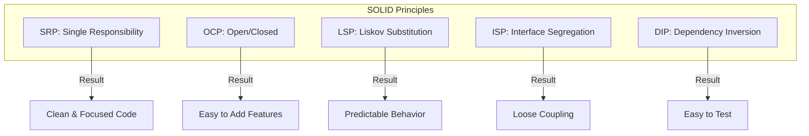

# SOLID Principles in Go

SOLID represents five design principles that enable maintainable, scalable, and testable code. Go's implicit interfaces and composition naturally align with these principles, making SOLID a practical guide rather than strict rules.

## Prerequisites

- Basic understanding of Go structs and interfaces.
- Familiarity with methods and composition (embedding).

## Key Concepts

- **Single Responsibility (SRP)**: Each type has one reason to change.
- **Open/Closed (OCP)**: Open for extension, closed for modification.
- **Liskov Substitution (LSP)**: Implementations are interchangeable without breaking contracts.
- **Interface Segregation (ISP)**: Clients shouldn't depend on interfaces they don't use.
- **Dependency Inversion (DIP)**: Depend on abstractions, not concrete types.

## Visual Explanation



## Practical Implementation

### 1. Single Responsibility (SRP)

**Bad**: A `User` struct that handles data, validation, and database saving.
**Good**: Separate concerns.

```go
type User struct {
    Name string
}

type UserRepository struct{} // Handles DB
func (r *UserRepository) Save(u *User) error { return nil }

type EmailService struct{} // Handles Email
func (s *EmailService) SendWelcome(u *User) error { return nil }
```

### 2. Open/Closed (OCP)

**Bad**: A switch statement for payment methods.
**Good**: Use an interface.

```go
type PaymentMethod interface {
    Pay(amount float64) error
}

type CreditCard struct{}
func (c *CreditCard) Pay(amount float64) error { return nil }

type PayPal struct{}
func (p *PayPal) Pay(amount float64) error { return nil }

func Process(p PaymentMethod, amount float64) error {
    return p.Pay(amount) // Works for any new method without changing this function
}
```

### 3. Interface Segregation (ISP)

**Bad**: One huge interface.
**Good**: Small, focused interfaces.

```go
// Bad: Robot can't Eat
type Worker interface {
    Work()
    Eat()
}

// Good: Segregated
type Workable interface { Work() }
type Eatable interface { Eat() }

type Robot struct{}
func (r *Robot) Work() {} // Robot only implements Workable
```

### 4. Dependency Inversion (DIP)

**Bad**: Depending on concrete types.
**Good**: Injecting interfaces.

```go
type Database interface {
    Save(data string) error
}

type Service struct {
    db Database // Depend on interface
}

func NewService(db Database) *Service {
    return &Service{db: db}
}
```

## Trade-offs

| Principle | Pros | Cons |
| :--- | :--- | :--- |
| **SRP** | High cohesion, easy testing | More files/structs |
| **OCP** | Safe extensibility | Requires upfront design |
| **LSP** | Predictable behavior | Strict contracts |
| **ISP** | Loose coupling | Interface proliferation |
| **DIP** | Testability, flexibility | Initialization complexity |

## Next Steps

- Learn about **Clean Architecture** to see SOLID applied at a system level.
- Explore **Hexagonal Architecture (Ports and Adapters)**.

## Tags

#golang #solid-principles #clean-code #design-patterns #architecture
