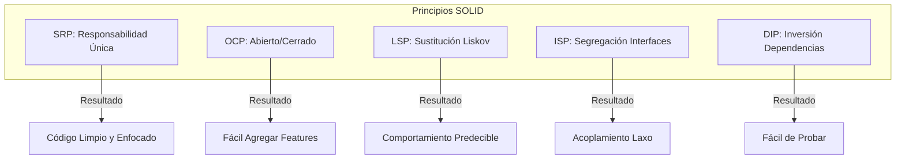

# Principios SOLID en Go

SOLID representa cinco principios de diseño que permiten código mantenible, escalable y verificable. Las interfaces implícitas y composición de Go se alinean naturalmente con estos principios, haciendo SOLID una guía práctica más que reglas estrictas.

## Prerrequisitos

- Entendimiento básico de structs e interfaces en Go.
- Familiaridad con métodos y composición (embedding).

## Conceptos Clave

- **Responsabilidad Única (SRP)**: Cada tipo tiene una única razón para cambiar.
- **Abierto/Cerrado (OCP)**: Abierto para extensión, cerrado para modificación.
- **Sustitución de Liskov (LSP)**: Las implementaciones son intercambiables sin romper contratos.
- **Segregación de Interfaces (ISP)**: Los clientes no deben depender de interfaces que no usan.
- **Inversión de Dependencias (DIP)**: Depender de abstracciones, no de tipos concretos.

## Explicación Visual



## Implementación Práctica

### 1. Responsabilidad Única (SRP)

**Mal**: Un struct `User` que maneja datos, validación y guardado en DB.
**Bien**: Separar preocupaciones.

```go
type User struct {
    Name string
}

type UserRepository struct{} // Maneja DB
func (r *UserRepository) Save(u *User) error { return nil }

type EmailService struct{} // Maneja Email
func (s *EmailService) SendWelcome(u *User) error { return nil }
```

### 2. Abierto/Cerrado (OCP)

**Mal**: Un switch statement para métodos de pago.
**Bien**: Usar una interfaz.

```go
type PaymentMethod interface {
    Pay(amount float64) error
}

type CreditCard struct{}
func (c *CreditCard) Pay(amount float64) error { return nil }

type PayPal struct{}
func (p *PayPal) Pay(amount float64) error { return nil }

func Process(p PaymentMethod, amount float64) error {
    return p.Pay(amount) // Funciona para cualquier método nuevo sin cambiar esta función
}
```

### 3. Segregación de Interfaces (ISP)

**Mal**: Una interfaz gigante.
**Bien**: Interfaces pequeñas y enfocadas.

```go
// Mal: Robot no puede Comer
type Worker interface {
    Work()
    Eat()
}

// Bien: Segregado
type Workable interface { Work() }
type Eatable interface { Eat() }

type Robot struct{}
func (r *Robot) Work() {} // Robot solo implementa Workable
```

### 4. Inversión de Dependencias (DIP)

**Mal**: Depender de tipos concretos.
**Bien**: Inyectar interfaces.

```go
type Database interface {
    Save(data string) error
}

type Service struct {
    db Database // Depende de interfaz
}

func NewService(db Database) *Service {
    return &Service{db: db}
}
```

## Trade-offs

| Principio | Pros | Contras |
| :--- | :--- | :--- |
| **SRP** | Alta cohesión, fácil testing | Más archivos/structs |
| **OCP** | Extensibilidad segura | Requiere diseño previo |
| **LSP** | Comportamiento predecible | Contratos estrictos |
| **ISP** | Acoplamiento laxo | Proliferación de interfaces |
| **DIP** | Testeabilidad, flexibilidad | Complejidad de inicialización |

## Siguientes Pasos

- Aprender sobre **Clean Architecture** para ver SOLID aplicado a nivel de sistema.
- Explorar **Arquitectura Hexagonal (Puertos y Adaptadores)**.

## Etiquetas

#golang #solid-principles #clean-code #design-patterns #architecture
