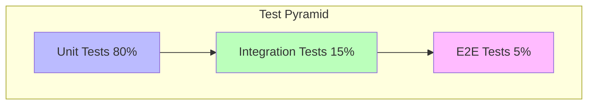

# Test Patterns in Go

Go testing follows a hierarchy from isolated unit tests to full system integration. Each pattern serves different purposes: verify individual functions, isolate dependencies, test with realistic behavior, or validate complete workflows.

## Prerequisites

- Basic knowledge of Go's `testing` package.
- Understanding of interfaces for mocking.

## Key Concepts

- **Unit Tests**: Test individual functions with mocks.
- **Mocks**: Simulate dependencies with predetermined responses (Strict).
- **Fakes**: Working implementations with simplified behavior (Stateful).
- **Integration Tests**: Multiple components together.
- **Table-Driven Tests**: A data-driven approach to testing multiple scenarios.

## Visual Explanation



## Practical Implementation

### Table-Driven Tests (The Go Way)

```go
func Add(a, b int) int { return a + b }

func TestAdd(t *testing.T) {
    tests := []struct {
        name     string
        a, b     int
        expected int
    }{
        {"positive", 2, 3, 5},
        {"negative", -1, -1, -2},
        {"mixed", -1, 1, 0},
    }

    for _, tt := range tests {
        t.Run(tt.name, func(t *testing.T) {
            result := Add(tt.a, tt.b)
            if result != tt.expected {
                t.Errorf("got %d, want %d", result, tt.expected)
            }
        })
    }
}
```

### Mocking with Interfaces

```go
// Dependency Interface
type Database interface {
    GetUser(id string) (string, error)
}

// Mock Implementation
type MockDB struct {
    MockGetUser func(id string) (string, error)
}

func (m *MockDB) GetUser(id string) (string, error) {
    return m.MockGetUser(id)
}

// Test using Mock
func TestService(t *testing.T) {
    mock := &MockDB{
        MockGetUser: func(id string) (string, error) {
            return "Alice", nil
        },
    }
    
    // Inject mock
    service := NewService(mock)
    user, _ := service.GetUser("1")
    
    if user != "Alice" {
        t.Errorf("got %s, want Alice", user)
    }
}
```

## Trade-offs

| Pattern | Speed | Scope | Maintenance |
| :--- | :--- | :--- | :--- |
| **Unit (Mock)** | Fast | Isolated Function | High (Mock updates) |
| **Integration (Fake)** | Medium | Component Interaction | Medium |
| **E2E (Real)** | Slow | Full System | Low (Black box) |

## Next Steps

- Learn about **Fuzz Testing** (introduced in Go 1.18) to find edge cases automatically.
- Explore **Test Containers** for running real databases in integration tests.

## Tags

golang #testing #unit-testing #mocks #integration-testing
