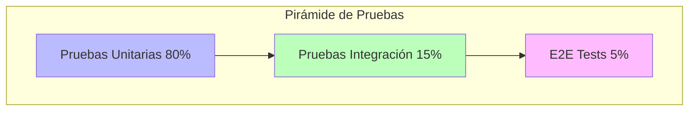

# Patrones de Pruebas en Go

Las pruebas en Go siguen una jerarquía desde pruebas unitarias aisladas hasta integración del sistema completo. Cada patrón sirve propósitos diferentes: verificar funciones individuales, aislar dependencias, probar con comportamiento realista, o validar flujos completos.

## Prerrequisitos

- Conocimiento básico del paquete `testing` de Go.
- Entendimiento de interfaces para mocking.

## Conceptos Clave

- **Pruebas Unitarias**: Pruebas de funciones individuales con mocks.
- **Mocks**: Simulan dependencias con respuestas predeterminadas (Estricto).
- **Fakes**: Implementaciones funcionales con comportamiento simplificado (Con estado).
- **Pruebas de Integración**: Múltiples componentes juntos.
- **Pruebas Orientadas a Tabla**: Enfoque data-driven para probar múltiples escenarios.

## Explicación Visual



## Implementación Práctica

### Pruebas Orientadas a Tabla (The Go Way)

```go
func Add(a, b int) int { return a + b }

func TestAdd(t *testing.T) {
    tests := []struct {
        name     string
        a, b     int
        expected int
    }{
        {"positivo", 2, 3, 5},
        {"negativo", -1, -1, -2},
        {"mixto", -1, 1, 0},
    }

    for _, tt := range tests {
        t.Run(tt.name, func(t *testing.T) {
            result := Add(tt.a, tt.b)
            if result != tt.expected {
                t.Errorf("obtenido %d, esperado %d", result, tt.expected)
            }
        })
    }
}
```

### Mocking con Interfaces

```go
// Interfaz de Dependencia
type Database interface {
    GetUser(id string) (string, error)
}

// Implementación Mock
type MockDB struct {
    MockGetUser func(id string) (string, error)
}

func (m *MockDB) GetUser(id string) (string, error) {
    return m.MockGetUser(id)
}

// Prueba usando Mock
func TestService(t *testing.T) {
    mock := &MockDB{
        MockGetUser: func(id string) (string, error) {
            return "Alice", nil
        },
    }
    
    // Inyectar mock
    service := NewService(mock)
    user, _ := service.GetUser("1")
    
    if user != "Alice" {
        t.Errorf("obtenido %s, esperado Alice", user)
    }
}
```

## Trade-offs

| Patrón | Velocidad | Alcance | Mantenimiento |
| :--- | :--- | :--- | :--- |
| **Unitario (Mock)** | Rápido | Función Aislada | Alto (Actualizar mocks) |
| **Integración (Fake)** | Medio | Interacción Componentes | Medio |
| **E2E (Real)** | Lento | Sistema Completo | Bajo (Caja negra) |

## Siguientes Pasos

- Aprender sobre **Fuzz Testing** (introducido en Go 1.18) para encontrar casos borde automáticamente.
- Explorar **Test Containers** para ejecutar bases de datos reales en pruebas de integración.

## Etiquetas

#golang #testing #unit-testing #mocks #integration-testing
